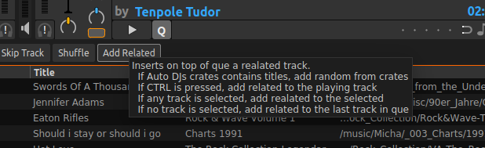
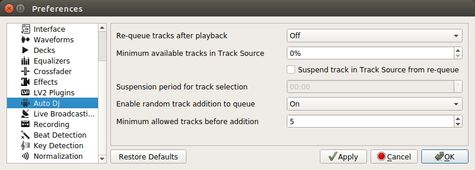

# Mixxx 
[Mixxx] is Free DJ software that gives you everything you need to perform live
DJ mixes. Mixxx works on GNU/Linux, Windows, and macOS.

## About this Fork
See this [comment](https://github.com/mixxxdj/mixxx/pull/1214#issuecomment-474120338).

This fork replaces the Mixxx AutoDj "Add Random" function with more usable "Add Related"  function.
It uses https://www.last.fm/api/show/artist.getSimilar to do this task. 
Nearly all function code is borrowed from https://sayonara-player.com/ its "Dynamic playback" feature, thank you for the good work!

There are 4 operation modes at ONE Button:

To have constantly 5 tracks in the DJ que, set up it in this way. After every deck loading, a new title, related to the last one in que will be added.

Note:

The call to last.fm and the following database operations stopping the GUI for a second.

--Limag
