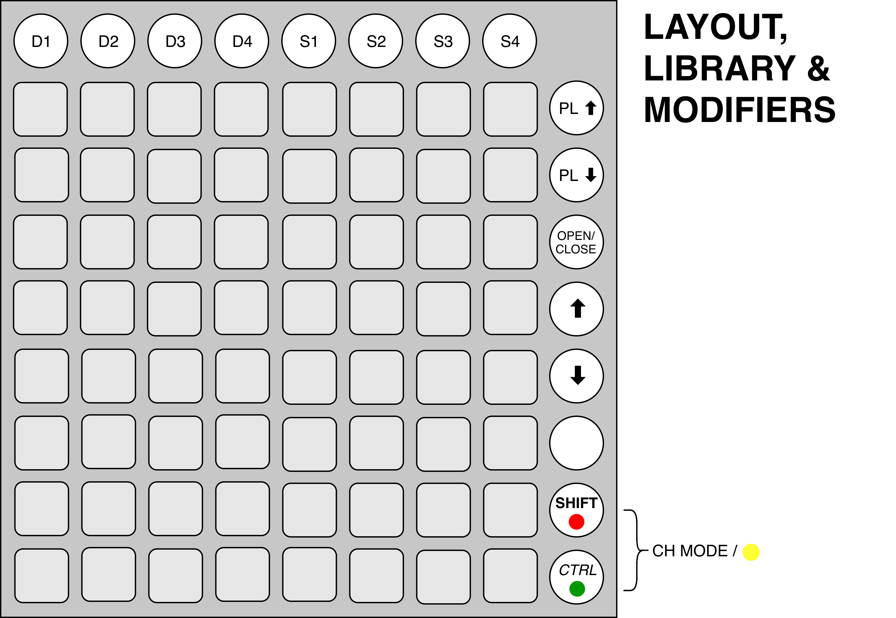

# Mixxx mapping for Novation Launchpad 🦄

**Flexible and (soon) customizable controller mapping for Launchpad. Make DJing
with Mixxx fun on Launchpad!**

[](https://circleci.com/gh/dszakallas/mixxx-launchpad)

There's already a Launchpad mapping shipping with Mixxx however it
has several quirks and limitations:

- it has a single hardcoded layout, supporting only the first 2 decks.
  You can't e.g. change to decks 3 and 4, or sampler decks. This painfully
  limits usability especially if you have multiple Launchpads (as I do!) and
  want to control more decks.
- It would be better if the deck layout was customizable. This is a problem
  that crops up as you add support for sampler decks. E.g. when you play samplers, a small 4x4 interface with only hotcues is ideal.
- Some of the controls are broken on recent Mixxx.
- It has a mixer interface, but why? Launchpad is really not fit for mixing.
- 8 of the buttons have no mapping, what a waste of resources!

So I decided to make one that is more stable, flexible and customizable!

## Features ✨

 - map from 1 up to 4 channels (decks or samplers) on a single Launchpad at the same time ✨
 - utilize presets with multiple sizes and features, change between them with ease 🦄
 - x5 different deck presets in 3 sizes created for you and ready to use ✨, make it easy for the user to create new presets for their own needs (coming soon!)
 - rich arsenal of controls 🦄
   - play, cue, hotcues
   - loop controls, beatloop, beatjump
   - sync/master, tap, pitch shift
   - custom controls like bouncy jumps
   - and much more...
 - trigger-like controls are favored - no clumsy mixers and faders ✨
 - library navigation 🦄
 - LED lights mimic Mixxx UI ✨

## Supported controllers

 - Launchpad Pro (Experimental)
 - Launchpad Mk2
 - Launchpad Mk1

## How to get started

 💾 Download the [latest release from here](https://github.com/szdavid92/mixxx-launchpad/releases/latest).

 💾 Follow the [instructions in the Mixxx User Manual](https://www.mixxx.org/manual/latest/chapters/controlling_mixxx.html#installing-a-preset-from-the-forum) to install the preset.

 Alternatively, see [Build](#build) the build it from source

## User guide

### Global controls

Global controls consist of **Deck selectors**, **Library controls** and
**Modifier keys**.

**Deck selectors** are located on the top bar. They are used to select decks and
samplers to be laid out on the main grid. *D1-D4* are mapped to corresponding
*decks*, *S1-S4* to *samplers*.

**Library controls** are located on the sidebar to the right. They occupy the
upper 5 buttons. Their functions from top to bottom:

 - up in the library sidebar
 - down in the library sidebar
 - expand/close selected library sidebar entry
 - up a track
 - down a track

> Note: The up/down controls are autoscrolled. If you hold them down for longer,
the scrolling activates. This comes in handy when navigating lengthy playlists.



**Modifier keys** are located on the lower 2 buttons of the sidebar, and used
for the same purpose as you would expect on a computer keyboard.

The figures show  Shift in **bold**,  Ctrl in *italic*, Ctrl+Shift
in ***bold italic***.

> Note: For some controls the modifier keys will act like toggles, but the modifier keys themselves are never toggled globally.

### Using the deck selectors

The deck selector is an essential feature of this Launchpad mapping. With it you
can map multiple presets in multiple layouts on the main grid. The main grid is
the inner 8x8 grid on the Launchpad. You have to memorize the layout patterns,
but don't worry, there are only 4 of them.

To select a single channel, simply press the button corresponding to the
channel. This will remove all existing selections, and find the largest default
preset that can be fit on the main grid.

Presets come in 3 different sizes: *short* (4x4), *tall* (4x8) and *grande*
(8x8)<sup>1</sup>. Multiple presets can have the same size, but only one preset
can be default per size.

To select multiple channels to be laid out, press the corresponding buttons
in a *chord*. This way you can select to 4 channels.

So what is a chord? In a chord you press buttons so you only release the first
after you pressed the last one. The order of presses matter, however the order
of releases does not. Now, instead of writing down how the exact layout
algorithm works, I just show you the four different layouts that is generated
for 1 (single channel), 2, 3 and 4 note chords. Once more the algorithm will
fill out the spaces with the largest default preset.

| ![1] | ![2] |
|------|------|
| ![3] | ![4] |

[1]: docs/lp-1.png
[2]: docs/lp-2.png
[3]: docs/lp-3.png
[4]: docs/lp-4.png

This means that e.g. if you press down D3-D2-S1 in this chord sequence,
- D3 will be mapped to block 1 with the default tall preset,
- D2 will be mapped to block 2 with the default short preset and
- S1 will be mapped to block 3 with the default short preset.

Now you might ask: "But what if I don't want to use the largest default preset?"

After a channel has been laid out you can cycle between all the presets that can
fit into its space. This won't reflow the layout, even if you end up using a
smaller preset. To cycle between presets
  - press Ctrl + Channel Selector to cycle forward,
  - press Shift + Channel Selector to cycle backward or
  - press Ctrl + Shift + Channel Selector to revert to default.

The cycling order is the following:
  - primary: large to small
  - secondary: default then all others in fixed but not specified order.

See, not that complicated after all. Let's see the actual presets that are
featured out of the box:

|        | default                                                   |                                                                    |
|--------|-----------------------------------------------------------|--------------------------------------------------------------------|
| grande | ![grande]  **GRANDE** is currently the only grande layout.|                                                                    |
| tall   | ![tall]    **TALL** is the default tall layout.           |![juggler] **JUGGLER** is a tall layout optimized for beat jumping. |
| short  | ![short]  **SHORT** is the default short layout.          |![sampler]  **SAMPLER** is an all-cue short layout for samplers.    |


[grande]: docs/lp-mki-grande.png
[tall]: docs/lp-mki-tall.png
[juggler]: docs/lp-mki-juggler.png
[short]: docs/lp-mki-short.png
[sampler]: docs/lp-mki-sampler.png

<sup>1</sup> No identification with actual persons (living or deceased), places, buildings, and products is intended or should be inferred.

### Deck controls

Now that you are familiar with the presets, let's check the controls the make
up these!

#### PLAY

Controls

 - **normal**: toggles playing (if track is playable, starts playing; if track is playing, stops playing)
 - **ctrl**: seeks to start of track
 - **shift**: seeks to start of track and stops

Feedback

 - **bright red**: track is playing
 - **bright red blinking**: track is stopped, playable
 - **blank**: track is stopped, not playable

#### SYNC / MASTER

Controls

 - **normal**: toggles sync:
  - if deck is synced (follower or master) it becomes  not synced
  - if track is not synced it becomes a sync follower
 - **ctrl**: toggles master sync:
  - if track is sync master, it becomes sync follower
  - if track is not synced or sync follower, it becomes sync master

Feedback

 - **bright red**: track is sync master
 - **bright orange**: track is sync follower
 - **blank**: track is not synced

#### NUDGE / PITCH

2 button for down/up.

Controls

 - **normal**: nudges (temporarily alters pitch) in direction by primary value. See *Preferences > Interface > Temporary Speed Adjustment Buttons > Left click*
 - **ctrl**: permanently changes pitch in direction by primary value. See *Preferences > Interface > Permanent Speed Adjustment Buttons > Left click*
 - **shift**: nudges (temporarily alters pitch) in direction by secondary value. See *Preferences > Interface > Temporary Speed Adjustment Buttons > Right click*
 - **ctrl+shift**: permanently changes pitch in direction by secondary value. See *Preferences > Interface > Permanent Speed Adjustment Buttons > Right click*
 - **normal (both buttons simultaneously)**: reset pitch to original value

Feedback

  - **bright yellow**: while nudging with primary speed
  - **dim yellow**: while nudging with secondary speed
  - **bright red**: while permanently changing pitch with primary speed
  - **dim red**: while permanently changing pitch with secondary speed
  - **dim orange**: while not pressing, and pitch has been altered in that direction

#### CUE

Controls

- **normal**: behaves like the default cue method set in *Preferences > Interface > Cue mode*
- **ctrl**: sets cue at cursor

Feedback

- **bright red**: display dictated by your Cue mode

#### TAP

tap tempo for playback or beatgrid.

- **normal**: tapping adjusts song playback tempo. You should have correctly detected BPM and beatgrid.

- **ctrl**: ~~instead of altering the playback tempo, tapping adjusts the beatgrid.~~ Not implemented. *Why?*
- **shift**: sets the gridlines so the nearest beat aligns to current play position
- **ctrl+shift**: second button: sets the gridlines so the nearest beat lines up with the other track's nearest beat

Feedback

- **bright red**: flashes up on gridline

#### GRID MANIPULATORS

2 controls for

- **normal**: translating the grid backwards / forwards
- **ctrl**: scaling the grid up (slower) / down (faster).

#### PFL

Controls

- **normal**: toggle pre-fade listening (headphone)

Feedback

- **bright green**: PFL on
- **blank**: PFL off

#### QUANTIZE

Controls

- **normal**: toggle quantization (magnet)

Feedback

- **bright orange**: quantization on
- **blank**: quantization off

#### KEY SHIFTS

Buttons for temporarily chaning pitch, bound left to right, bottom to top. While pressed, they modify the key of
the track. When pressing multiple, the one later pressed *steals* the modification.

#### LOAD/EJECT

Controls

- **normal**: load the selected library track on deck. To prevent accidentally hitting, only works when the deck is empty.
- **ctrl**: load the selected library track on deck. Works when the deck is not playing.
- **shift**: eject deck. Works when the deck is not playing.

Feedback

- **dim red**: deck loaded, playing
- **dim amber**: deck loaded, not playing
- **dim green**: deck empty

#### KEY

Controls

- **normal**: toggles keylock
- **ctrl**: lowers key by semitone
- **shift**: raises key by semitone

Feedback

- **hi red**: keylock on
- **blank**: keylock off

#### HOTCUES

Hotcues are bound from left to right, bottom to top.

Controls

- **normal**: activates the hotcue:
  - if the hotcue is set, seeks the player to hotcue's position.
  - if the hotcue is not set, sets the hotcue to the current play position
- **ctrl**:
  - if the hotcue is set, deletes the hotcue
  - if the hotcue is not set, sets the hotcue to the current play position

Feedback

- **bright yellow**: hotcue enabled
- **blank**: hotcue disabled

#### BEATJUMPS

Controls for jumping backward (lower lane) and forward (upper lane).
Supports two modes:
 - the **normal mode** is represented with bright color. Jumping works as you would expect.
 - the **rebouncing mode** is shown with dim color. It jumps on attack, then jumps back on release. Jumping legato works and uses the same stealing algorithm as key shifting.
 Modes are switched with the CH MODE control (pressing `ctrl` and `shift` at the same time)

You can change modes by pressing **ctrl+shift+[any beatjump key]**.

There are two sets of jumps, switchable with the `ctrl` and `shift` keys, and shown in their corresponding colors. This means that pressing **ctrl+[any beatjump key]** will switch to the first set, while pressing **shift+[any beatjump key]** will switch to the second set.

#### BEATLOOPS

Controls for setting beatloops.

Controls

- **normal**: toggles beatloop

Feedback

- **bright red**: beatloop enabled
- **dim red**: beatloop disabled

#### LOOPJUMPS

Almost the same as beatjumps, only instead of changing the current play position, they translate the position of the loop markers. As beatjumps, they support two modes and two sets. On how to use these, see [Beatjumps](#beatjumps)

#### HALVE / DOUBLE

They halve / double the current loop length, modifying the  position of the end marker.

#### LOOPJUMP SMALL

They translate the loop markers by a small amount backward/forward.

Controls

- **normal**: translates loop backward/forward

#### LOOP

Works the same way as the LOOP button on the GUI, ie. it toggles the current loop on or off.

Controls

- **normal**: toggles loop on/off

Feedback

- **bright green**: loop on
- **dim green**: loop off

## For developers

### Build

To build you need to have a make, Node (>=8), bash (>=4.0) and `jq`. Watch tasks require `fswatch`.

The multi-project build is managed with [lerna.js]. You need to  install it
globally to make it available on the command line.  First clone the repo and
install the dependencies:

```
git clone https://github.com/szdavid92/mixxx-launchpad
cd mixxx-launchpad
npm install
```
You can also invoke lerna commands through npm like `npm run lerna -- --version`.
To compile the sources run

```
make -j 4
```

(`-j 4` will enable 4 jobs to be executed in parallel which makes the build significantly faster)

Afterward the `dist` folder will contain the files that need to be
copied the Mixxx's controller folder.

```
make -j 4 install
```
does this for you on macOS and Linux.

These two tasks have watch counterparts making them rerun automatically on file changes. This is handy during development:

```
make watch
make watch_install
```

### JavaScript

The code is written according to the [ES2015] specification. This is
incompatible with the runtime running in Mixxx so it has to be transpiled back
to ES5, which is done with [Babel] using the es2015 preset. Sadly due to the interpreter's only partial compatibility with the standard [even some ES3 transforms have to be enabled](bad-interpreter). The transpiled code
is then bundled with [browserify] into a so called [standalone] module with the
name `NovationLaunchpad`. Due to the lack of module loading system in the
environment, the bundled code is placed on the global object with the above
name. This works, because the same name is specified in the MIDI mapping XML file, so Mixxx will look for this name, and will call its `init` method upon loading.

### MIDI mapping

The controller mapping is generated from a template like
[this][mapping-template] with [ejs]. The mapping reuses config from the package
description and [buttons.js].

### Known Issues

#### No Windows build recipes
Sorry, but building anything on Windows is pain.

#### Lingering ES3 future reserved keywords

Due to parser discrepancies, ES3 keywords and future reserved words that have been removed from ES5 can't be used as *(1) identifiers*, *(2) property literals* and *(3) member expression literals*. In ES5 you can use keywords and future reserved words in the last two cases.
We have [transforms](.babelrc) for these two cases, however you still **can't use ES3 keywords and future reserved words as identifiers**, even if some of the latter was removed from ES5, for example `public`, `private` or `final`.


[ES2015]:https://github.com/lukehoban/es6features#readme
[Babel]:https://babeljs.io/
[browserify]:http://browserify.org/
[standalone]:https://github.com/substack/node-browserify#usage
[mapping-template]:src/Launchpad/Launchpad.midi.xml.ejs
[ejs]:http://ejs.co/
[buttons.js]:src/Launchpad/buttons.js
[lerna.js]: https://lernajs.io/
