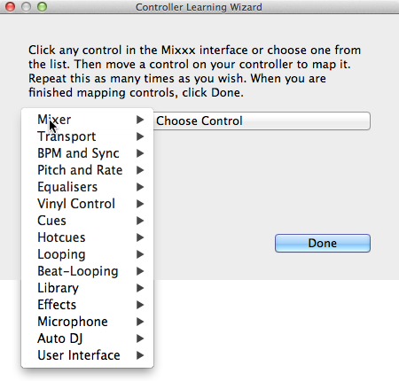
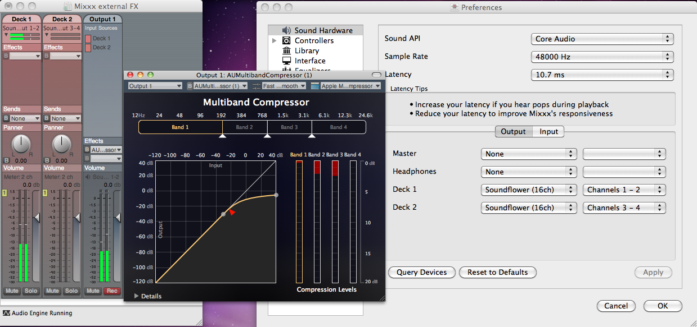
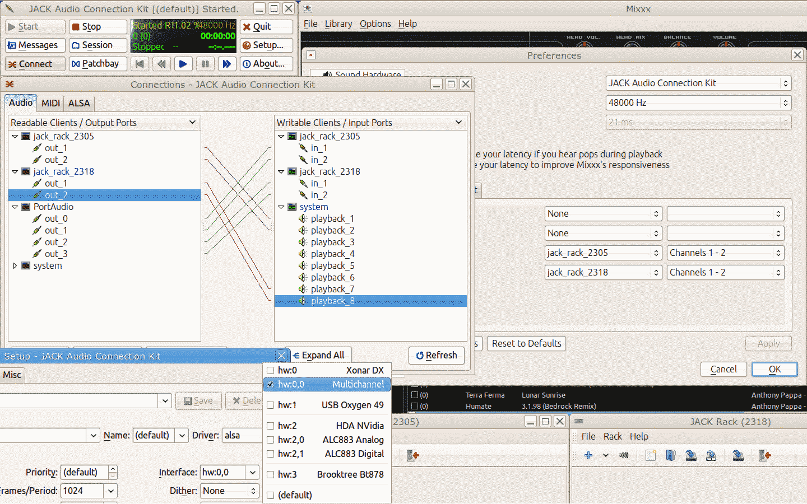

.. include:: /shortcuts.rstext

Advanced Topics
***************

.. _advanced-controller:

Adding support for your MIDI/HID Controller
===========================================

.. _advanced-controller-midiscript:

MIDI Scripting
--------------

In order to support the advanced features of many :term:`MIDI` / :term:`HID`
controllers, Mixxx offers what we call MIDI Scripting.

It enables MIDI controls to be mapped to `QtScript
<https://en.wikipedia.org/wiki/QtScript>`_ (aka Javascript/EMCAScript) functions
stored in function library files, freeing Mixxx from a one-to-one MIDI mapping
ideology. These user-created functions can then do anything desired with the
MIDI event info such as have a single controller button simultaneously affect
two or more Mixxx properties (“controls”,) adjust incoming control values to
work better with Mixxx (scratching,) display a complex LED sequence, or even
send messages to text displays on the controller.

For more information, go to `<http://mixxx.org/wiki/doku.php/midi_scripting>`_ .

.. _advanced-controller-wizard:

Controller Wizard
-----------------

   Mixxx Controller Wizard -  Mapping a control

.. todo:: Add intro and proofread

#. Connect your controller(s) to your computer
#. Start Mixxx
#. Go to :menuselection:`Preferences --> Controllers`
#. Select your device from the list of available devices on the left, and the
   right pane will change
#. Activate the :guilabel:`Enabled` checkbox
#. Click on :guilabel:`Learning Wizard` to open the selection dialog
#. Click any control in the Mixxx :term:`GUI`
#. Alternatively, click the :guilabel:`Choose Control` button and choose one
   from the selection list
#. Move a control on your controller to map it. Repeat this as many times as you
   wish.
#. When you are finished mapping controls, click :guilabel:`Done`

The Controller Wizard works only for :term:`MIDI` devices. Currently you can't
map modifier (shift) keys and platter rotations. Use :ref:`MIDI Scripting
<advanced-controller-midiscript>` instead.

.. _advanced-keyboard:

Making a Custom Keyboard Mapping
================================

The :ref:`default keyboard mappings<appendix-keyboard>` are defined in a text
file which can be found at the following location:

* Linux: :file:`/usr/local/share/mixxx/keyboard/en_US.kbd.cfg`
* Mac OS X: :file:`/Applications/Mixxx.app/Contents/Resources/keyboard/en_US.kbd.cfg`
* Windows: :file:`<Mixxx installation directory>\\keyboard\\en_US.kbd.cfg`

Depending on your systems language settings, Mixxx might use a different
file as default, e.g. :file:`de_DE.kbd.cfg` for German or :file:`es_ES.kbd.cfg`
for Spanish.

There are two ways to customize the default Mixxx keyboard mapping:

1. Edit your system's default mapping file directly, e.g. :file:`en_US.kbd.cfg`.
2. Copy the default mapping file to the following location:

* Linux: :file:`~/.mixxx/Custom.kbd.cfg`
* Mac OS X: :file:`~/Library/Application\ Support/Mixxx/Custom.kbd.cfg`
* Windows: :file:`%USERPROFILE%\\Local Settings\\Application Data\\Mixxx\\Custom.kbd.cfg`

Then edit this file and save the changes. On the next startup, Mixxx will check
if :file:`Custom.kbd.cfg` is present and load that file instead of the default
mapping file. This has the advantage, that you can always revert back to the
default mapping, just by deleting :file:`Custom.kbd.cfg`.

For a list of controls that can be used in a keyboard mapping, see the
`Controls <http://www.mixxx.org/wiki/doku.php/mixxxcontrols>`_ topic on the
Mixxx Wiki.

You can download and share custom keyboard mappings in the
`Mixxx User customizations forum`_.

.. _Mixxx User customizations forum: http://mixxx.org/forums/viewforum.php?f=6

.. _advanced-external-fx:

Additional Effects via external Mixer Mode
==========================================

Mixxx does not have an effects engine yet (work on one is in progress).
To hold you over you can use some external tools. Using the
:ref:`external mixer mode <configuring-mixer-mode>` you route each deck
directly to 3rd party effect hosts.

The following examples are only intended to encourage experimentation, they are
no definitive guidance.

Effects via AU Lab on Mac OS X
-------------------------------

   The Au Lab routing for external effects on Mac OS X

On Mac OS X there is a pretty simple and free way to give Mixxx access to the
collection of AU/VST/MAS plugins that are installed on your system.

* Install the free `Soundflower <https://code.google.com/p/soundflower/>`_,
  a system extension for inter-application audio routing.
* Download AU Lab.app standalone from Apple (you will need an free Apple
  Developer Login though), go to the
  `Downloads for Developers <https://developer.apple.com/downloads/index.action>`_
  page and search for “AU Lab” to get it.

**In Mixxx**

* Go to :menuselection:`Preferences --> Sound Hardware--> Output`
* Select for :guilabel:`Deck 1` the :guilabel:`Soundflower 16` device with
  :guilabel:`Channel 1-2`
* Select for :guilabel:`Deck 2` the :guilabel:`Soundflower 16` device with
  :guilabel:`Channel 3-4`
* Click the :guilabel:`Apply` button

**In AU Lab**

* Click on the :guilabel:`+` button to create a new configuration
* Add 2 stereo inputs tracks in the :guilabel:`Audio Input Tab`
* Add 2 stereo output tracks in the :guilabel:`Audio Output Tab`
* Click :guilabel:`OK`
* Change the audio input device to :guilabel:`Soundflower 16`
* Changethe audio output device for example to :guilabel:`Built-in Output`
* Click :guilabel:`Create document`
* In the :guilabel:`Output 1` channel, select an effect from the drop-down
  menu, for example :guilabel:`Apple > AUCompressor`

The effect should now react if you play a track in Mixxx.

Effects via JACK Rack on GNU/Linux
----------------------------------

   The Jack routing for external effects on GNU/Linux

Use `Jack <http://en.wikipedia.org/wiki/JACK_Audio_Connection_Kit>`_ to route
each deck directly through `JACK Rack <http://jack-rack.sourceforge.net/>`_
effect racks, or for more control you can use Ardour (or other DAW) using sends
for effects. This gives Mixxx access to the extensive collection of LADSPA
plugins.

Make sure the correct multichannel sound card has been selected in Jack
(Jack settings visible bottom left). Note that Mixxx possibly labels it's Jack
ports as “Portaudio”.

Deleting Your Library
=====================

The library file is stored in the following places depending on your
:term:`operating system`:

**Windows**
  The Mixxx library is stored in the
  :file:`%USERPROFILE%\\Local Settings\\Application Data\\Mixxx\\` folder.
  To delete your library on Windows, delete the :file:`mixxxdb.sqlite` file in
  this folder.

**Mac OS X**
  The Mixxx library is stored in the :file:`Library/Application Support/Mixxx`
  folder in your home directory. To delete your library on Mac OS X type the
  following command into a terminal: ::

       rm ~/Library/Application\ Support/Mixxx/mixxxdb.sqlite

**GNU/Linux**
  The Mixxx library is stored in the ``.mixxx`` folder in your home directory.
  To delete your library on GNU/Linux type the following command into a terminal: ::

       rm ~/.mixxx/mixxxdb.sqlite

.. warning:: Deleting your library will lose all of your :term:`metadata`. This
             includes saved hotcues, loops, comments, ratings, and other library
             related metadata. Only delete your library if you are fine with
             losing these.
