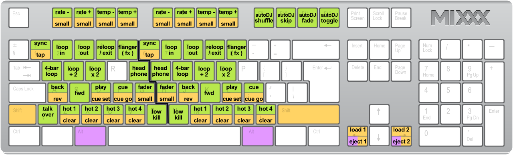
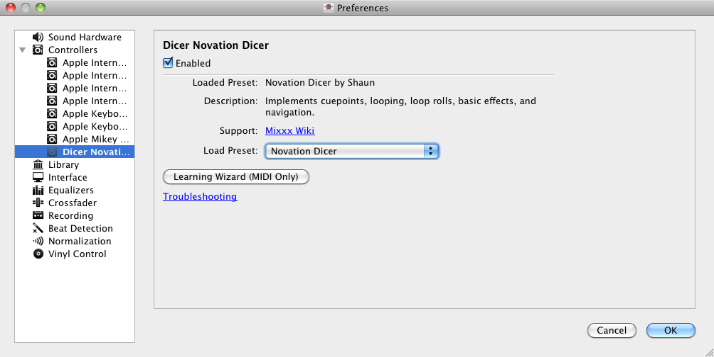

.. _controlling mixxx:

Controlling Mixxx
*****************

Mixxx can be controlled with a keyboard, a mouse, :term:`MIDI`/:term:`HID`
controllers, time-code records/CDs, or a combination of these. The choice
usually depends on your budget or style of DJing.

.. _control-mouse:

Using a Mouse and Trackpad
==========================

Use your mouse to interact with the controls in the
:ref:`Mixxx User Interface <interface-overview>` on your computer screen. You
can perform actions by pointing and clicking with your mouse.

* **Single Left Click**: Performing a left mouse click on buttons triggers the
  default action for that control. Moreover if you click on a value in the track
  list of the Mixxx :ref:`library <interface-library>`, you can change the
  value. For example the year of a track.
* **Single Right Click**: On most buttons, performing a right click triggers a
  different action than a left click. You can return any knob or fader to its
  default value by right-clicking that control.
* **Mouse Drag**: Click on a knob or fader, hold the left mouse button and move
  your cursor to change the value of the control. Use mouse drag to drop tracks
  from the file list to the decks, crates, playlists, etc.
* **Mouse Wheel**: Just like Mouse Drag, you can change knob and fader values
  by placing the cursor over the control and moving the mouse wheel.

.. hint::  If you hover with the mouse over a control (e.g the crossfader) in
           the Mixxx user interface, the tooltip lists the left- and right-click
           action respectively.

.. hint::  On a Macbook or a computer with a touchpad that lacks mouse buttons,
           a two-finger click gesture is often treated as a right click.

.. seealso:: Using the Mouse drag/wheel on the waveforms you can adjust zoom and
             playback rate of the tracks. For more informations, go to
             :ref:`interface-waveform`.

.. _control-keyboard:

Using a Keyboard
================

   Mixxx Keyboard shortcuts (for en-us keyboard layout)

   :download:`Download the image <../_static/Mixxx-111-Keyboard-Mapping.png>`

Controlling Mixxx with a keyboard is handy. Unlike mouse control, the keyboard
allows you to manage things simultaneously. For example, you can start playing
a track on deck 1 whilst stopping deck 2 at the same time.

The default mapping for English keyboards is depicted in the figure above. It is
divided into a left-hand side for deck 1 and right-hand side for deck 2. Please
note that you can also access the functions through Mixxx's interface.

For some user groups, like those using :term:`MIDI <MIDI Controller>`/:term:`HID
<HID Controller>` controllers or vinyl control, it might be useful to
enable/disable the keyboard mappings at runtime. You can do so by clicking
:menuselection:`Options --> Enable Keyboard Shortcuts`.

.. hint::  If you hover with the mouse over a control (e.g. the crossfader) in
           the Mixxx user interface, the tooltip lists the keyboard shortcuts of
           the control among a description of the control.

.. seealso:: For a list of default shortcuts, go to: :ref:`appendix-keyboard`

Customizing the keyboard mapping
--------------------------------

Mixxx allows you to customize the keyboard control. For more informations, go to:

* :ref:`advanced-keyboard`

.. _control-midi:

Using MIDI/HID Controllers
==========================

Mixxx supports :term:`MIDI <MIDI Controller>` and :term:`HID <HID controller>`
controller which are external hardware devices used to control audio
applications. Many DJs prefer the hands-on feel of a controller with Mixxx
because it can feel similar to using a real mixer and turntables or :term:`CDJ`.

Loading a controller preset
---------------------------

   Mixxx Preferences - Loading a controller preset

Without loading the correct preset, your controller does not work with Mixxx.

#. Connect your controller(s) to your computer
#. Start Mixxx
#. Go to :menuselection:`Preferences --> Controllers`
#. Select your device from the list of available devices on the left, and the
   right pane will change
#. Activate the :guilabel:`Enabled` checkbox
#. Select the mapping for your controller from the :guilabel:`Presets`
   drop-down menu
#. Click :guilabel:`OK` and Mixxx can now be controlled by your controller(s).
#. Repeat step 4-7 for any of the controllers you want to use

.. hint:: If you do not find a connected device in the list, make sure to
          install any necessary drivers for that device.

Supported controllers
---------------------

Mixxx can use any :term:`MIDI`/:term:`HID` controller that is recognized by your
:term:`OS <operating system>` (some may require drivers), as long as there is a
MIDI/HID mapping file to tell Mixxx how to understand it. Mixxx comes bundled
with a number of mappings for various devices. There are two levels of
controller mappings:

* **Mixxx Certified Mappings**: These mappings are verified by the Mixxx
  Development Team.
* **Community Supported Mappings**: These mappings are provided and have been
  verified as working by the Mixxx community, but the Mixxx Development Team is
  unable to verify their quality because we don't have the devices ourselves.
  They might have bugs or rough edges.

If you run into issues with any of these mappings, please file a :term:`bug
report` on our `Bug Tracker`_ or tell us about it on our mailing list, forums,
or :term:`IRC` channel. Device support varies for each supported :term:`OS
<operating system>`, so make sure to consult the documentation of the device.

.. hint::  Additional mappings are available in the `Controller presets forum`_.

.. seealso:: Before purchasing a controller to use with Mixxx, consult our
             `Hardware Compatibility wiki page`_. It contains the most
             up-to-date information about which controllers work with Mixxx and
             the details of each.

.. _Hardware Compatibility wiki page: http://www.mixxx.org/wiki/doku.php/hardware_compatibility
.. _Bug Tracker: http://bugs.launchpad.net/mixxx
.. _Controller presets forum: http://mixxx.org/forums/viewforum.php?f=7

Map your own your controller
----------------------------

There is no mapping available for your controller or you want to change an
existing mapping? You can map your controller by using the Controller Wizard or
take full control with the MIDI Scripting support in Mixxx.

.. seealso:: Go to the chapter :ref:`advanced-controller` for detailed informations.

.. _control-timecode:

Using Timecode Vinyl Records and CDs
====================================

:term:`Vinyl control` allows a user to manipulate the playback of a track in
Mixxx using a turntable or :term:`CDJ` as an interface. In effect, it simulates
the sound and feel of having your digital music collection on vinyl. Many DJs
prefer the tactile feel of vinyl, and vinyl control allows that feel to be
preserved while retaining the benefits of using digital audio.

.. seealso:: Go to the chapter :ref:`vinyl-control` for detailed informations.

