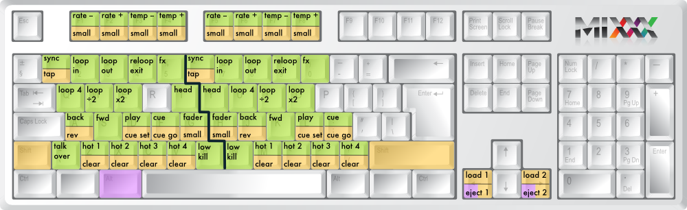

.. _controlling mixxx:

Controlling Mixxx
*****************

Mixxx can be controlled with a keyboard, a mouse, MIDI controllers, time-code
records/CDs, or a combination of these. The choice usually depends on your
budget or style of DJing.

.. _control-keyboard:

Using a Keyboard
================

If you cannot afford a MIDI controller, controlling Mixxx with a keyboard
is handy. Unlike mouse control, the keyboard allows you to manage things
simultaneously. For example, you can start playing a track on deck 1 whilst
stopping deck 2 at the same time.

The default mapping for English keyboards is depicted in the figure below. It's
divided into a left-hand side for deck 1 and right-hand side for deck 2. Please
note that you can also access the functions through Mixxx's interface.

   Keyboard shortcuts (for en-us keyboard layout) 

+----------------------------------------+---------------------+---------------------+--------------+
| Function                               | Deck 1              | Deck 2              | Master       |
+========================================+=====================+=====================+==============+
| Microphone Talkover                    |                     |                     | \`           |
+----------------------------------------+---------------------+---------------------+--------------+
| Crossfade Left                         |                     |                     | G            |
+----------------------------------------+---------------------+---------------------+--------------+
| Crossfade Right                        |                     |                     | H            |
+----------------------------------------+---------------------+---------------------+--------------+
| Small Crossfade Left                   |                     |                     | Shift + G    |
+----------------------------------------+---------------------+---------------------+--------------+
| Small Crossfade Right                  |                     |                     | Shift + H    |
+----------------------------------------+---------------------+---------------------+--------------+
| Playback                               | D                   | L                   |              |
+----------------------------------------+---------------------+---------------------+--------------+
| Set Cuepoint                           | Shift + D           | Shift + L           |              |
+----------------------------------------+---------------------+---------------------+--------------+
| Cue                                    | F                   | ;                   |              |
+----------------------------------------+---------------------+---------------------+--------------+
| Cue Go-to-and-stop                     | Shift + F           | Shift + :           |              |
+----------------------------------------+---------------------+---------------------+--------------+
| Seek Backwards                         | A                   | J                   |              |
+----------------------------------------+---------------------+---------------------+--------------+
| Reverse Playback                       | Shift + A           | Shift + J           |              |
+----------------------------------------+---------------------+---------------------+--------------+
| Seek Forwards                          | S                   | K                   |              |
+----------------------------------------+---------------------+---------------------+--------------+
| Bass Kill                              | B                   | N                   |              |
+----------------------------------------+---------------------+---------------------+--------------+
| Activate 4 Beat Loop                   | Q                   | U                   |              |
+----------------------------------------+---------------------+---------------------+--------------+
| Halve Beat Loop Size                   | W                   | I                   |              |
+----------------------------------------+---------------------+---------------------+--------------+
| Double Beat Loop Size                  | E                   | O                   |              |
+----------------------------------------+---------------------+---------------------+--------------+
| Set Loop In Point                      | 2                   | 7                   |              |
+----------------------------------------+---------------------+---------------------+--------------+
| Set Loop Out Point (Activates Loop)    | 3                   | 8                   |              |
+----------------------------------------+---------------------+---------------------+--------------+
| Toggle Loop On/Off                     | 4                   | 9                   |              |
+----------------------------------------+---------------------+---------------------+--------------+
| Activate/Disable Effects Unit          | 5                   | 0                   |              |
+----------------------------------------+---------------------+---------------------+--------------+
| Headphone Cue (Pre-fader listen)       | T                   | Y                   |              |
+----------------------------------------+---------------------+---------------------+--------------+
| Tempo Adjust Down                      | F1                  | F5                  |              |
+----------------------------------------+---------------------+---------------------+--------------+
| Tempo Adjust Up                        | F2                  | F6                  |              |
+----------------------------------------+---------------------+---------------------+--------------+
| Small Tempo Adjust Down                | Shift + F1          | Shift + F5          |              |
+----------------------------------------+---------------------+---------------------+--------------+
| Small Tempo Adjust Up                  | Shift + F2          | Shift + F6          |              |
+----------------------------------------+---------------------+---------------------+--------------+
| Temporary Tempo Adjust Down            | F3                  | F7                  |              |
+----------------------------------------+---------------------+---------------------+--------------+
| Temporary Tempo Adjust Up              | F4                  | F8                  |              |
+----------------------------------------+---------------------+---------------------+--------------+
| Small Temporary Tempo Adjust Down      | Shift + F3          | Shift + F7          |              |
+----------------------------------------+---------------------+---------------------+--------------+
| Small Temporary Tempo Adjust Up        | Shift + F4          | Shift + F8          |              |
+----------------------------------------+---------------------+---------------------+--------------+
| Tempo (BPM) Sync                       | 1                   | 6                   |              |
+----------------------------------------+---------------------+---------------------+--------------+
| BPM Tap Tempo Adjust                   | Shift + !           | Shift + ^           |              |
+----------------------------------------+---------------------+---------------------+--------------+
| Set Hot cue 1                          | Z                   | M                   |              |
+----------------------------------------+---------------------+---------------------+--------------+
| Set Hot cue 2                          | X                   | ,                   |              |
+----------------------------------------+---------------------+---------------------+--------------+
| Set Hot cue 3                          | C                   | .                   |              |
+----------------------------------------+---------------------+---------------------+--------------+
| Set Hot cue 4                          | V                   | /                   |              |
+----------------------------------------+---------------------+---------------------+--------------+
| Clear Hot cue 1                        | Shift + Z           | Shift + M           |              |
+----------------------------------------+---------------------+---------------------+--------------+
| Clear Hot cue 2                        | Shift + X           | Shift + <           |              |
+----------------------------------------+---------------------+---------------------+--------------+
| Clear Hot cue 3                        | Shift + C           | Shift + >           |              |
+----------------------------------------+---------------------+---------------------+--------------+
| Clear Hot cue 4                        | Shift + V           | Shift + ?           |              |
+----------------------------------------+---------------------+---------------------+--------------+
| Load selected track to deck            | Shift + left arrow  | Shift + right arrow |              |
+----------------------------------------+---------------------+---------------------+--------------+
| Unload track from deck                 | Alt + Shift + left  | Alt + Shift + right |              |
+----------------------------------------+---------------------+---------------------+--------------+

.. note:: For some user groups, i.e. those using midi controllers or vinyl control 
		  it might be useful to enable/disable the keyboard mapping at runtime. 
		  You can do so by clicking ``Options`` -> ``Enable keyboard shortcuts`` 
		  in the menu. 

Customizing
-----------

You can also customize the keyboard mapping. For more information, please refer to 
the chapter :ref:`advanced-keyboard` .

.. _control-midi:

Using a MIDI Controller
=======================

:term:`MIDI controllers <MIDI Controller>` are external hardware devices used
that can be used to control audio applications.  Many DJs prefer the hands-on
feel of a MIDI controller with Mixxx because it can feel similar to using a real
mixer and turntables.

Here are the steps for using one:

#. Connect your controller(s) to your computer
#. Open Preferences and click *MIDI Controllers*
#. Select your controller on the left and the right pane will change
#. Click *Enable* and choose the appropriate mapping from the *presets* combobox
#. Click OK and Mixxx can now be controlled by your controller(s).

Mixxx can use any MIDI controller that is recognized by your :term:`OS <operating system>` (some may
require drivers), as long as there is a MIDI mapping file to tell Mixxx how to
understand it.  Mixxx comes bundled with a number of mappings for the devices
listed below.

Often times these mappings are contributed by users and the Mixxx team has no
way of judging the quality of the mappings because we do not own the devices
ourselves. There are two different levels of support for controllers in Mixxx:
Mixxx Certified Support and Community Support. Mixxx Certified mappings are
verified by the Mixxx Team. Community Supported mappings are mappings provided
by the Mixxx Community, but the Mixxx team is unable the verify their quality.

Mixxx Certified Mappings
------------------------

* American Audio VMS4
* DJ TechTools MIDIFighter
* Hercules DJ Console RMX
* Hercules DJ Console MK2
* Hercules DJ Control MP3 e2
* M-Audio X-Session Pro
* Reloop Digital Jockey 2 (Interface/Controller)
* Stanton SCS.3d
* Stanton SCS.3m
* Stanton SCS.1m
* Stanton SCS.1d

Community Supported Mappings
----------------------------

These mappings have been verified as working by the Mixxx community. However,
they might have bugs or rough edges. If you run into issues with these mappings,
please file a bug on our `bug tracker`_ or tell us about it on our mailing list,
forums, or :term:`IRC` channel.

* Akai MPD24
* Behringer BCD3000
* Ecler NUO4
* Evolution X-Session
* FaderFox DJ2
* Hercules DJ Console Mac Edition
* Hercules DJ Console Mk4
* Hercules DJ Console MP3
* Hercules DJ Control Steel
* Ion Discover
* M-Audio Xponent
* Mixman DM2
* Numark MixTrack
* Numark NS7
* Numark Total Control
* Pioneer CDJ-350
* Pioneer CDJ-850
* Pioneer CDJ-2000
* Tascam US-428
* Vestax Spin
* Vestax Typhoon
* Vestax VCI-100
* Wireless DJ App (iOS)

Before purchasing a controller to use with Mixxx, please consult our `Hardware
Compatibility wiki page`_. It contains the most up-to-date information about
which controllers work with Mixxx and the details of each.  Device support
varies for each supported :term:`OS <operating system>`, so please make sure to consult the documentation.

.. _Hardware Compatibility wiki page: http://www.mixxx.org/wiki/doku.php/hardware_compatibility
.. _bug tracker: http://bugs.launchpad.net/mixxx

.. _control-timecode:

Using Timecode Vinyl Records and CDs
====================================

:term:`Vinyl control` allows a user to manipulate the playback of a track in
Mixxx using a turntable or DJ CD player as an interface.  In effect, it
simulates the sound and feel of having your music collection on vinyl.

How does it work?
-----------------

Vinyl control uses special timecode records which are placed on real
turntables. The audio output of the turntables is plugged into a computer on
which Mixxx is running. When a record is played on one of the attached
turntables, Mixxx reads the timecode from the record and uses the information to
manipulate whatever track is loaded.

What do I need to use it?
-------------------------

It is possible to use Mixxx's vinyl control with several hardware setups, but
the basic ones are:

**Setup 1: Vinyl DJ** Two timecode vinyls, two turntables with phono
pre-amplifiers (or line-out), and two sound inputs.  You can try skipping the
phono pre-amps if you use the software pre-amp in Mixxx on the Vinyl Control
preferences pane.  *This may not work for everyone - line-level signals are
preferred and recommended.*

**Setup 2: CDJ** Two timecode CDs, two CD decks, and two sound inputs.

For the sound inputs, you have two options: You can either use a proper DJ sound card that has multiple
stereo line inputs on it, or can use two sound cards (each with a single stereo line in).
A single multi-channel sound card is recommended.

.. note:: For best scratch performance with vinyl control, we recommend using a
          system capable of :term:`latencies <latency>` of 10ms. With higher
          latencies the scratch sound will start to become distorted.

For timecode records or CDs, you can use any of the records supported by Mixxx:

Timecode Support
----------------

+----------------------------------------+---------------------+
| Type                                   | Responsiveness      |
+========================================+=====================+
| Serato CV02 Vinyl                      | Very high           |
+----------------------------------------+---------------------+
| Serato CV02 CD                         | Very high           |
+----------------------------------------+---------------------+
| Traktor Scratch Vinyl MK1              | Very high           |
+----------------------------------------+---------------------+
| FinalScratch (Standard)                | Not supported       |
+----------------------------------------+---------------------+
| FinalScratch (Scratch)                 | Not supported       |
+----------------------------------------+---------------------+
| MixVibes DVS CD                        | Not supported       |
+----------------------------------------+---------------------+
| MixVibes DVS Vinyl                     | Not supported       |
+----------------------------------------+---------------------+

At the present time, Serato records are recommended if you are looking to buy vinyl. If you want
to use CDs, you can download a free copy from `Serato`_.

.. _Serato: http://serato.com/downloads/scratchlive-controlcd/

