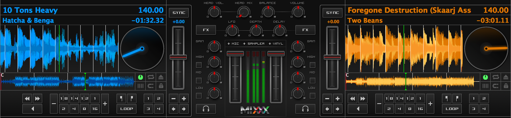
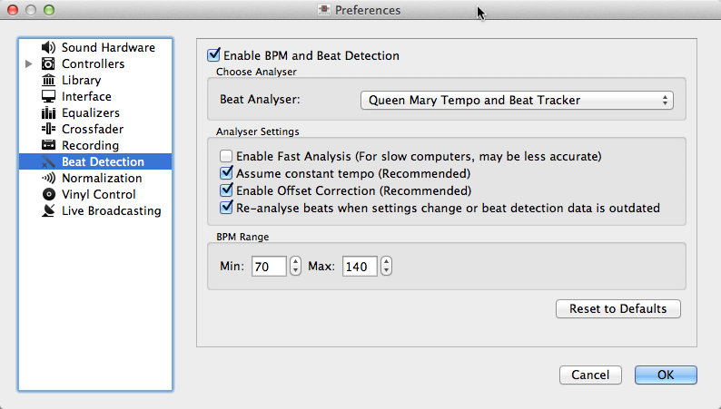
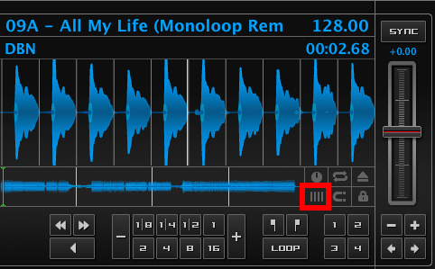
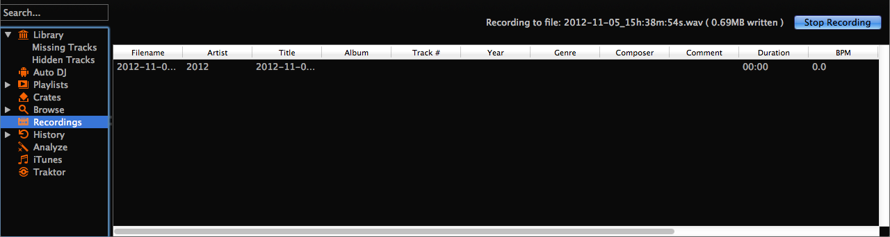
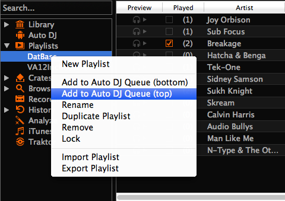

DJing With Mixxx
****************

Mixxx was designed to be easy to learn for both novice and experienced DJs. The
user interface mimics a hardware DJ mixer, but also includes several extra
elements to gives DJs a better user experience, such as the optional parallel
waveform displays.

.. _djing-loading-tracks:

Loading Tracks
==============

Tracks can be loaded into a deck in several ways:

* Right-click the library track table: Right-clicking on a track in the table
  will present the options ``Load in Deck 1`` and ``Load in Deck 2``, among
  others. Making either selection will load a track into a deck.
* By :ref:`control-keyboard` to load the selected track from library track table.
* Drag-and-drop from library track table: Dragging-and-dropping a track from the
  track table onto a waveform display will load a track into a deck.
* Drag-and-drop from external file browser: Dragging-and-dropping a track from
  an external file browser directly onto a waveform display in Mixxx will load
  that track. This function is also known to work on some platforms with other
  applications. For example, on Mac OS X, dragging-and-dropping a track from
  iTunes onto one of Mixxx's waveform displays will load that track into a deck.

.. _djing-finding-tracks:

Finding Tracks (Search)
=======================

The search function searches for a match only in the current selected list ( e.g
a playlist, a crate or even the whole library).

* Hit ``CTRL+F`` (Windows/Linux) or ``CMD+F`` (Mac) to activate the search input
  field.
* Type in your search term, as soon as you type Mixxx filters the tracks and
  retains only the ones that match with the search term. Search terms can
  include an artist’s name, a song title, BPM, etc.
* To clear the search string hit ``ESC`` or click the clear button right next to
  the input field.
* Hit ``TAB`` to circle between the search and the list of results in the
  library. Use the ``ARROW UP`` and ``ARROW DOWN`` keys to scroll in the list of
  results.

.. note:: If the search input field has focus the Mixxx keyboard shortcuts do
          not work, see :ref:`control-keyboard`.

Using search operators
----------------------

.. versionadded:: 1.11

A search operator is an instruction that joins terms to form a new, more complex
query. It enables you to look for several terms at once.

Mixxx supports the following filters:

* Text filtering for artist, album, genre, title, composer, comment
* Numeric (exact number or range) filtering for year, track, bpm, duration,
  played, rating, bitrate

+--------------------------------------+---------------------------------------+
| Examples for text filtering          | Examples for numeric filtering        |
+======================================+=======================================+
| artist: "com truise"                 | bpm:140                               |
+--------------------------------------+---------------------------------------+
| album:Danger                         | bpm: >140                             |
+--------------------------------------+---------------------------------------+
| genre: Trance                        | year: <2010                           |
+--------------------------------------+---------------------------------------+
| title: foo                           | bpm: >=140                            |
+--------------------------------------+---------------------------------------+
| composer: foo                        | rating: <=4                           |
+--------------------------------------+---------------------------------------+
| comment: foo                         | bpm: 140-150                          |
+--------------------------------------+---------------------------------------+
|                                      | played: >10                           |
+--------------------------------------+---------------------------------------+
| Note it doesn't matter if you have   | Note that you can put a space between |
| space between the colon and the      | the colon but currently there must be |
| argument or not.                     | no space between the operator and the |
|                                      | number.                               |
+--------------------------------------+---------------------------------------+
| Of course you can combine these operators.                                   |
| The following example list all Danger tracks that are rated 4 or 5.          |
| There's no way to do an OR right now.                                        |
+--------------------------------------+---------------------------------------+
| artist:Danger rating:>=4                                                     |
+--------------------------------------+---------------------------------------+

Previewing Tracks
=================

.. versionadded:: 1.11

To prelisten to a track activate the 'Preview' column in a library view
and then click on the play Icon. The track will then start playing in a
special preview deck that will only output sound in the headphones channel.
clicking the button again will stop the playback. Some skins support the
preview deck (show/hide with CTRL+P) to manual search in the track.

.. _waveform-displays:

Waveform displays
=================

There are two main waveform displays in Mixxx that are used to display the
waveform of the tracks you are mixing. These are useful because they allow you
to see features in a track (like a breakdown) before you hear them.

Depending on the skin Mixxx displays either separate waveforms (default) or
parallel waveforms.

   Mixxx default skin (Deere) - Separate waveforms

With some skins the waveform displays are aligned parallel to each other in
order to make beat matching easier, as it is possible to beatmatch visually by
aligning the beats that appear in each waveform.

.. figure:: ../_static/Mixxx-111-Latenight-parallel-waveform.png
   :align: center
   :width: 100%
   :figwidth: 100%
   :alt: Mixxx alternative skin (Latenight) - Parallel waveforms
   :figclass: pretty-figures

   Mixxx alternative skin (Latenight) - Parallel waveforms

The mouse can be used on the waveforms to scratch, spin-back or throw the tracks.
Right-click on the waveforms allows to drag with the mouse to make temporary
pitch adjustments. Using the mouse-wheel everywhere in the waveform will zoom
the waveform in or out. You can choose whether or not to synchronize the zoom
level between the decks in the preferences. The waveform display is updated in
realtime upon seeking.

There are two smaller waveform summary displays located adjacent to the main
waveform displays. Clicking somewhere on a waveform summary allows you to seek
through a track. These smaller displays show the waveform envelope of the entire
track, and are useful because they allow DJs to see breakdowns far in advance.
Vinyl DJs will find this  familiar because quiet sections of tracks can be
visually distinguished when looking at a vinyl record, and this is a useful tool
when planning your mixes on-the-fly.

.. _beatmatching-and-mixing:

Beatmatching and Mixing
=======================

Beatmatching is the process of adjusting the playback rate of a track so that it
matches the tempo of another track. Beatmatching also involves adjusting the
phase of the beats in a track so that they are aligned with the beats in the
other track. Matching the tempo and aligning the beats are the two things a DJ
must do to beatmatch.

Mixxx can match the tempo and align the beats for you. This, however, requires
an accurately detected BPM value and a proper beat grid for both tracks. In this
case all you need to do is hit the ``SYNC`` button.
To beatmatch manually the tempo of the two tracks  must be synchronized by
adjusting the playback rate sliders. You can adjust the phase of the beats by
right-clicking and dragging on either waveform display to temporarily speed up
or slow down one of the tracks until the beats are aligned.
The temporary pitch bend buttons can also be used to momentarily adjust the
playback rate, allowing you to “shuffle” the beats in a track forwards or
backwards, so they can be aligned with another track. See the chapter
:ref:`interface-rate`.

Once the tempos are matched and the beats aligned between two tracks, they are
said to be beatmatched. A “perfect” beatmatch is near impossible - there will
always be some tiny difference in the playback rates. A keen DJ will keep his or
her ears open and listen for the beats drifting out of alignment. This has a
distinct “double bass kick” sound which is often preceded by the kick weakening
in intensity (as the two kicks drift out of phase). When this happens, the beats
can be realigned by simply tapping one of the temporary pitch bend buttons a few
times in the appropriate direction.

Headphone Cueing
================

Headphone cueing is a technique DJs use to listen to the next track they want to
play in their headphones before playing it out the main speakers. Headphone
cueing is useful because it allows a DJ to beatmatch the next track in their
headphones before bringing it into their mix by sliding the crossfader.

Mixxx allows a DJ to route audio from either deck to their headphones by
toggling either of the ``HEADPHONE`` buttons in the mixer section of Mixxx's
interface. See the chapter :ref:`interface-mixer`.

.. _djing-bpm-detection:

BPM and Beat Detection
======================

Previous versions of Mixxx were able to detect BPM values but unable to
determine where the beats are. Consequently, the beat grids often looked
unaligned. The DJ had to adjust the beat grid unless he or she did not make use
of auto-beatmatching via ``SYNC`` button .

.. versionchanged:: 1.11
   Mixxx comes with a new ultra-precise BPM and beat detector.

The beat grid gets adjusted after track analysis has finished. Manual
adjustments are redundant in many cases because Mixxx knows where the beats are.

Analyser Settings
-------------------

BPM and beat detection is a complex operation. Depending on your computer, the
track's bitrate and duration this may take some time. By default Mixxx analyzes
the complete track, however, it will not analyze more than 10 minutes of audio.
To accelerate BPM detection on slower computers, a "Fast Analysis" option is
available. If enabled, the BPM is computed by analyzing the first minute of the
track. In most cases this does not affect the BPM detection negatively because
most of today's dance music is written in a 4/4 signature, i.e., the distances
between the beats are constant.

   Mixxx preferences - BPM settings

The table below summarizes the beat detection settings:

+---------------------------------------+--------------------------------------+
| Option                                | Description                          |
+=======================================+======================================+
| Enable Fast Analysis                  | If enabled, BPM detection results    |
|                                       | from the first minute of audio.      |
+---------------------------------------+--------------------------------------+
| Assume constant tempo                 | If enabled, Mixxx assumes that the   |
|                                       | distances between the beats are      |
|                                       | constant. If disabled, the raw beat  |
|                                       | grid obtained by the analyzer is     |
|                                       | presented. The latter is appropriate |
|                                       | for tracks with variable BPMs        |
+---------------------------------------+--------------------------------------+
| Enable Offset Correction              | Prevents beat markers from being     |
|                                       | placed incorrectly.                  |
+---------------------------------------+--------------------------------------+
| Re-analyse beats when settings        | If enabled, Mixxx over-write old     |
| change or beats already present       | beat grids from Mixxx 1.10.0 and     |
|                                       | earlier. Moreover, it will           |
|                                       | re-analyze the BPM if your beat      |
|                                       | detection preference change          |
+---------------------------------------+--------------------------------------+

Correcting Beat Grids
---------------------

There may be situations where BPM and beat detection do not result in a proper
beat grid. This does not necessarily originate from a false computed BPM value.
In most cases, the BPM value is correct but the analyzer has failed to find the
first "real" beat. Consequently, the beat markers are shifted, i.e., they are
placed somewhere between two correct beats. To re-adjust the beat grid cue the
track before a real beat and click the "gate" button illustrated in the
figure below.

   Correcting beat grids

If the detected BPM value is not sufficiently accurate, the corresponding beat
grid is not accurate, too. A deviation of 0.02 BPM units is enough -- compared
to the correct BPM -- to notice an unaligned beat grid for long tracks
(e.g., a club mix). In other words, your beat grid may look aligned for the
first one or two minutes but you will notice the tiny error in placing the beat
markers soon. Finding the correct BPM, however, is easy in many cases. Just
follow the note below.

.. note:: If the detected BPM value is not sufficiently accurate but very close
          to an integer value, try to set the BPM value manually to the integer.

.. _djing-recording-your-mix:

Recording your Mix
==================

With the integrated recording feature you can record your mix as an audio file
and listen to it later, distribute it as :term:`Podcast` or burn it to CD.
Mixxx records the master output - the audio you hear from the speakers including
the microphone.

   Mixxx library - Recordings view

.. versionchanged:: 1.11
   Allows to save file in a custom recording directory.

Mixxx can record your mix in various audio formats and quality settings. You can
split your recordings, generate :term:`cue files <cue sheet>`, choose a custom
recording directory and even set you own :term:`metadata`. By default, Mixxx
saves your recordings as lossless :term:`wav` files to a ``Mixxx/Recordings``
sub-folder in the Mixxx music directory. Before you start recording, it is
recommended to adjust the settings according to your requirements in the
recording preferences.

If you click on the *Recordings* icon in the sidebar of the Mixxx library, the
track table to the right displays the content of your recordings directory. New
recordings are automatically saved to this directory as well as CUE files if you
choose to create them in the preferences.

Record your mix to disk
-----------------------

* Click on the ``Recordings`` icon in the sidebar to switch to the *Recordings*
  view
* Click the ``Start Recording`` button. Alternatively, click
  ``Options → Record Mix`` in the menu on top of the Mixxx application window.
* The display above the track table shows how much data has already been
  recorded.
* Perform your mix
* Click the ``Stop Recording`` button to stop the recording when the mix has
  finished.

.. hint:: You can instantly use your recording as track in Mixxx. Simply
          drag'n drop the track to a deck.

Burn you recorded mix to a CD/DVD
---------------------------------

* Select your recording in the *Recordings* view
* Right-click and select ``Open in File Browser`` to locate the file on your
  disk
* Now burn the recording to a CD/DVD using a 3rd party program, for example
  `CDBurnerXP <http://www.cdburnerxp.se/>`_ for Windows or
  `Burn <http://burn-osx.sourceforge.net/>`_ for Mac OS X.

.. note:: Due to licensing restrictions, :term:`MP3` recording is not enabled
          per default. In order to enable MP3 streaming you must install the
          :term:`LAME` MP3 :term:`codec` yourself. Go to the chapter
          :ref:`MP3 Streaming` for more informations.

.. _djing-auto-dj:

Using automatic mixing (Auto DJ)
================================

Auto DJ allows you to automatically load the next track from the Auto DJ
playlist when the current track is nearly finished, and crossfade into it.

.. figure:: ../_static/Mixxx-111-Library-Auto-DJ.png
   :align: center
   :width: 100%
   :figwidth: 100%
   :alt: Mixxx library - Auto DJ view
   :figclass: pretty-figures

   Mixxx library - Auto DJ view

.. versionchanged:: 1.11
   New Shuffle, Skip track, Fade now and Transition time features

The Auto DJ features in detail:

* Shuffle button - Shuffles the content of the Auto DJ playlist.
* Skip track button - Skips the next track in the Auto DJ playlist.
* Fade now button - Triggers the transition to the next track.
* Transition time spin-box - Determines the duration of the transition.
* Enable Auto DJ button - Toggles the Auto DJ mode on or off.

The ``Skip track`` and ``Fade now`` buttons are only accessible if the Auto DJ
mode is enabled. The Search field in the upper left corner is disable in Auto DJ.

.. hint:: You can put a pause between two tracks that are automatically mixed by
          using a negative value in the ``Transition time`` spin-box.

Loading tracks into Auto DJ
---------------------------

To be able to play tracks automatically, they must first be loaded into the Auto
DJ playlist. The Auto DJ playlist is empty per default.

   Mixxx library - Adding a playlist to Auto DJ

There are several ways to load tracks into the Auto DJ:

* Select single or multiple tracks from the library, a regular playlist or crate
  and drag them to the Auto DJ icon on the left.
* Select a regular playlist or crate, right-click with the mouse and select
  ``Add to Auto DJ`` from the mouse menu. This adds all tracks to Auto DJ.
* While being in Auto DJ view, drag tracks from external file managers to the
  Auto DJ icon in the sidebar.

Playing tracks in Auto DJ
-------------------------

Now that you have loaded tracks into the Auto DJ playlist, you can activate
Auto DJ as follows:

* Click on the ``Auto DJ`` icon in the sidebar to switch to the *Auto DJ* view
* Click the ``Enable Auto DJ`` button
* The first tracks from your list are loaded into the decks and the playback
  starts.
* Mixxx will continue to automatically  mix until the Auto DJ playlist
  is empty.
* Click the ``Disable Auto DJ`` button to stop the automatic mixing.

