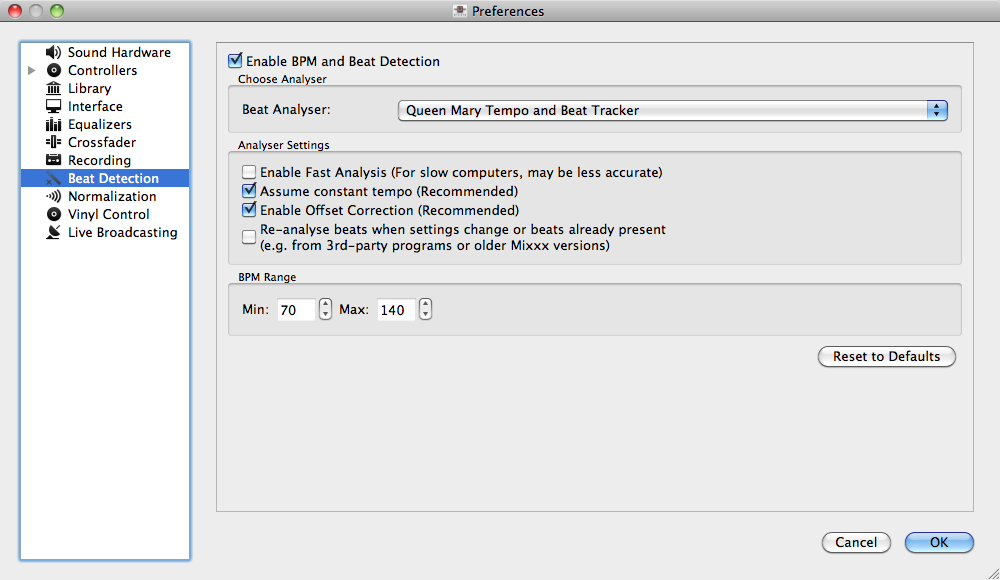
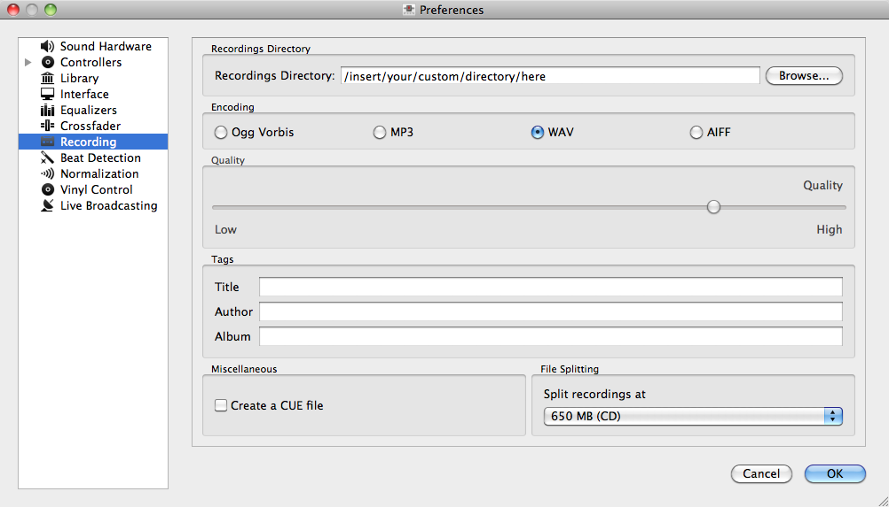
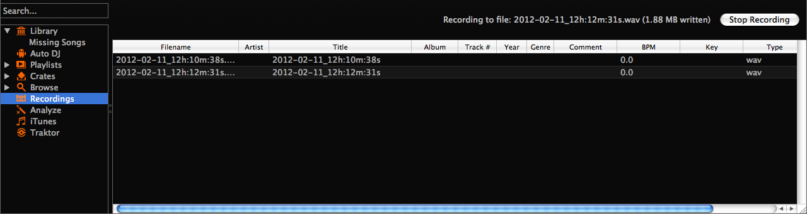

DJing With Mixxx
****************

Mixxx was designed to be easy to learn for both novice and experienced DJs. The
user interface mimics a hardware DJ mixer, but also includes several extra
elements to gives DJs a better user experience, such as the parallel waveform
displays.

Loading Tracks
==============

Tracks can be loaded into a deck in several ways:

* Right-click the library track table: Right-clicking on a track in the table
  will present the options “Load in Deck 1” and “Load in Deck 2”, among
  others. Making either selection will load a track into a deck.
* Drag-and-drop from library track table: Dragging-and-dropping a track from the
  track table onto a waveform display will load a track into a deck.
* Drag-and-drop from external file browser: Dragging-and-dropping a track from an
  external file browser directly onto a waveform display in Mixxx will load that
  track. This function is also known to work on some platforms with other
  applications. For example, on Mac OS X, dragging-and-dropping a track from iTunes
  onto one of Mixxx's waveform displays will load that track into a deck.

Waveform displays
=================

There are two main waveform displays in Mixxx that are used to display the
waveform of the tracks you are mixing. These are useful because they allow you to
see features in a track (like a breakdown) before you hear them. The waveform
displays are aligned parallel to each other in order to make beat matching
easier, as it is possible to beatmatch visually by aligning the beats that
appear in each waveform.

Clicking and dragging on a waveform allows you to seek through a track in both
directions. The waveform display is updated in realtime upon seeking. There are
two smaller waveform summary displays located adjacent to the main waveform
displays. These smaller displays show the waveform envelope of the entire track,
and are useful because they allow DJs to see breakdowns far in advance. Vinyl
DJs will find this familiar because quiet sections of tracks can be visually
distinguished when looking at a vinyl record, and this is a useful tool when
planning your mixes on-the-fly.

Beatmatching and Mixing
=======================

Beatmatching is the process of adjusting the playback rate of a track so that it
matches the tempo of another track. Beatmatching also involves adjusting the
phase of the beats in a track so that they are aligned with the beats in the
other track. Matching the tempo and aligning the beats are the two things a DJ
must do to beatmatch.

Mixxx can match the tempo and align the beats for you. This, however, requires
an accurately detected BPM value and a proper beat grid for both tracks. In this 
case all you need to do is hit SYNC. To beatmatch manually the tempo of the two tracks 
must be synchronized by adjusting the playback rate sliders on left and right side 
of the user interface. You can adjust the phase of the beats by 
clicking-and-dragging on either waveform display to temporarily
slow down one of the tracks until the beats are aligned. The temporary pitch bend
buttons can also be used to momentarily adjust the playback rate, allowing you
to “shuffle” the beats in a track forwards or backwards, so they can be aligned
with another track. 

Once the tempos are matched and the beats aligned between two tracks, they are
said to be beatmatched. A “perfect” beatmatch is near impossible - there will
always be some tiny difference in the playback rates. A keen DJ will keep his or
her ears open and listen for the beats drifting out of alignment. This has a
distinct “double bass kick” sound which is often preceded by the kick weakening
in intensity (as the two kicks drift out of phase). When this happens, the beats
can be realigned by simply tapping one of the temporary pitch bend buttons a few
times in the appropriate direction. Now get out there and make Tiesto jealous!

BPM and Beat Detection
======================

Previous versions of Mixxx were able to detect BPM values but unable to determine
where the beats are. Consequently, the beat grids often looked unaligned. 
The DJ had to adjust the beat grid unless he or she did not make use of auto-beatmatching 
via SYNC button .   

Starting with version 1.11, Mixxx comes with a new ultra-precise BPM and beat detector.
The beat grid gets adjusted after track analysis has finished. Manual 
adjustments are redundant in many cases because Mixxx knows where the beats are.

Analyser Settings
-------------------

BPM and beat detection is a complex operation. Depending on your computer, the track's bitrate and duration
this may take some time. By default Mixxx analyzes the complete track, however, it will not analyze more than
10 minutes of audio. To accelerate BPM detection on slower computers, a "Fast Analysis" option is available. 
If enabled, the BPM is computed by analyzing the first minute of the track. In most 
cases this does not affect the BPM detection negatively because most of today's dance music is written
in a 4/4 signature, i.e., the distances between the beats are constant. 
 

The table below summarizes the beat detection settings:

+----------------------------------------+-------------------------------------------------------+
| Option                                 | Description                                           |
+========================================+=======================================================+
| Enable Fast Analysis                   | If enabled, BPM detection results from the first      |
|                                        | minute of audio.                                      |
+----------------------------------------+-------------------------------------------------------+
| Assume constant tempo                  | If enabled, Mixxx assumes that the distances between  |
|                                        | the beats are constant. If disabled, the raw beat grid| 
|                                        | obtained by the analyzer is presented. The latter is  | 
|                                        | appropriate for tracks with variable BPMs             |   
+----------------------------------------+-------------------------------------------------------+
| Enable Offset Correction               | Prevents beat markers from being placed incorrectly.  |
+----------------------------------------+-------------------------------------------------------+
| Re-analyse beats when settings         | If enabled, Mixxx over-write old beat grids from      |
| change or beats already present        | Mixxx 1.10.0 and earlier. Moreover, it will re-analyze|
|                                        | the BPM if your beat detection preference change.     |
|                                        |                                                       |
+----------------------------------------+-------------------------------------------------------+

Correcting Beat Grids
---------------------

There may be situations where BPM and beat detection do not result in a proper beat grid. This
does not necessarily originate from a false computed BPM value. In most cases, the BPM value 
is correct but the analyzer has failed to find the first "real" beat. Consequently, the beat markers 
are shifted, i.e., they are placed somewhere between two correct beats. To re-adjust the beat grid
cue the track before a real beat and click the "gate" button illustrated in the figure below.

.. figure:: ../_static/correcting_beat_grid.png
   :align: center
   :width: 70%
   :figwidth: 100%
   :alt: Mixxx preferences - Correcting beat grids
   :figclass: pretty-figures

If the detected BPM value is not sufficiently accurate, the corresponding beat grid is not accurate, too. A deviation of
0.02 BPM units is enough -- compared to the correct BPM --  to notice an unaligned beat grid for long tracks (e.g., a club mix).
In other words, your beat grid may look aligned for the first one or two minutes but you will notice the tiny error in placing
the beat markers soon. Finding the correct BPM, however, is easy in many cases. Just follow the note below.

.. note:: If the detected BPM value is not sufficiently accurate but very close to an integer value,
          try to set the BPM value manually to the integer. 

Headphone Cueing
================

Headphone cueing is a technique DJs use to listen to the next track they want to
play in their headphones before playing it out the main speakers. Mixxx allows a
DJ to route audio from either deck to their headphones by toggling either of
the “HEADPHONE” buttons located on the far left/right sides of Mixxx's
interface. Headphone cueing is useful because it allows a DJ to beatmatch the
next track in their headphones before bringing it into their mix by sliding the
crossfader.

Recording your Mix
==================

You can record Mixxx's master output in WAV, AIFF, OGG or MP3.
The recordings settings can be changed in Mixxx Preferences->Recording.

.. note:: MP3 recordings are not supported out of the box in Mixxx since we do not
          license the MP3 encoding patents. In order to enable MP3 recording you must
          install the LAME MP3 encoding tool yourself.
          For information how to do this, see :ref:`MP3 streaming` .

If you click on the recording sidebar item, the right track table view displays the content
of your recordings directory which can be changed in the preferences. New recordings are automatically 
saved in this folder as well as CUE files if you choose to create them in the recording preferences.

Switch to the "Recording" sidebar item, then click the "Start Recording" button. Alternatively
you can click “Options” on the menu bar and click “Record Mix”. Mixxx records the audio you hear
from the speakers including the microphone. While recording, a text displays how much data
has been recorded. If your mix is done, click the "Stop recording" button.
