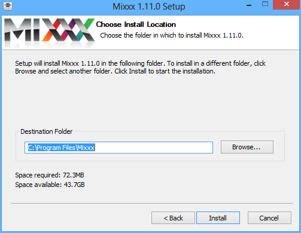
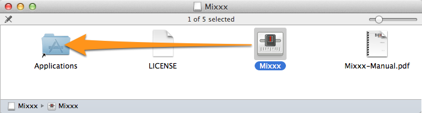
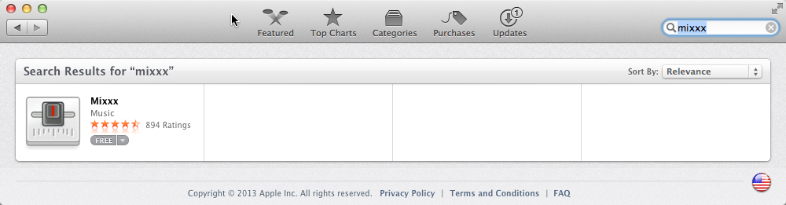
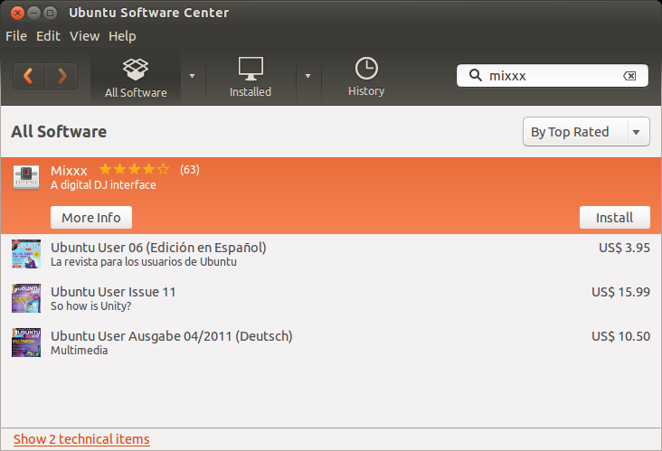

.. include:: /shortcuts.rstext

.. _installing-mixxx:

Installing Mixxx
****************

This part of the manual provides step-by-step directions for installing Mixxx on
your computer.

Installation on Windows
=======================

   Mixxx Installation - Ready to install the application

* Download Mixxx for Windows from `<http://mixxx.org/download.php>`_ .
* Using :file:`Windows Explorer` browse to the location where the Mixxx download
  was saved, usually the :file:`Desktop` or :file:`Downloads` folder.
* Double-click the Mixxx installer .EXE to open it up.
* Follow the step-by-step instructions in the installer.
* If the installation is complete, a confirmation screen will appear.
* Close the installer screen.

Mixxx is supported on Windows 8, Windows 7, Windows Vista or Windows XP, with
native 32 and 64-bit versions.

.. note:: If you are not sure about 32-bit versus 64-bit, pick the 32-bit
          version when downloading the Mixxx installer.

.. warning:: You may encounter a warning message similar to “Security Warning -
             Publisher could not be verified”. This is because the Mixxx
             installer is not digitally signed. Ignore the message and continue
             the installation. It does not indicate a security risk, if you
             can trust the source website such as `www.mixxx.org
             <http://mixxx.org/download.php>`_ .

Installation on Mac OS X
========================

Method A: Direct Download
-------------------------

         folder
   :figclass: pretty-figures

   Mixxx Installation - Ready to drop the Mixxx icon to the Applications folder

* Download Mixxx for Mac OS X from `<http://mixxx.org/download.php>`_ .
* Using :file:`Finder` browse to the location where the Mixxx download
  was saved, usually the :file:`Desktop` or :file:`Downloads` folder.
* Double-click the the Mixxx installer .DMG file, a new Finder window appears.
* Locate the *Mixxx* icon within this new Finder window. Drag-and-drop it into
  your :file:`Applications` folder.
* Eject the Mixxx installation volume from the Finder by clicking on the icon
  right next to *Mixxx* volume name.

Mixxx requires an Intel Mac running Mac OS X 10.5 or newer.

Method B: The Mac App Store
---------------------------

   Mixxx Installation from the Mac App Store

The Mac App Store makes getting new apps easier than ever.

* Start the Mac :file:`App Store.app` on your computer.
* Search for *mixxx* in the App Store, alternatively
  `click this direct link
  <http://itunes.apple.com/us/app/mixxx/id413756578?mt=12>`_ .
* Select Mixxx and click the :guilabel:`Install` button.
* Type in your administrator password if asked.
* Mixxx will be installed to your :file:`Applications` folder.

The App Store version of Mixxx is under some circumstances out of date,
therefore using `Method A: Direct Download`_ is preferable.

.. note:: Due to licensing restrictions, :term:`vinyl control` is not available
          in Mixxx from the Mac App Store.

Installation on GNU/Linux
=========================

Official packages of Mixxx are only offered for Ubuntu Linux. However, Mixxx can
build on almost any Linux distribution.

Installation on Ubuntu
----------------------

Method A: Personal Package Archive (ppa)
^^^^^^^^^^^^^^^^^^^^^^^^^^^^^^^^^^^^^^^^
* Open a terminal and type the following commands. Type in your administrator
  password if asked for. ::

    sudo apt-add-repository ppa:mixxx
    sudo apt-get update
    sudo apt-get install libportaudio2 mixxx

* Start Mixxx by simply typing :file:`mixxx` into the terminal, then hit return.

Method B: The Ubuntu Software Center
^^^^^^^^^^^^^^^^^^^^^^^^^^^^^^^^^^^^

   Mixxx Installation from the Ubuntu Software Center

The Ubuntu Software Center provides the easiest and safest way to install
software on Ubuntu.

* Start the :file:`Ubuntu Software Center` on your computer.
* Search for *mixxx* in the Software center.
* Select Mixxx and click the :guilabel:`Install` button.
* Type in your administrator password if asked for.
* Mixxx will be installed and an icon is added to the frequently-used program
  icons on the launcher.

The Software Center version of Mixxx is under some circumstances out of date,
therefore using `Method A: Personal Package Archive (ppa)`_ is preferable.

.. todo:: Proof-read Ubuntu install instructions.

Installation on Other Distributions
-----------------------------------

Your distribution may maintain a non-official build that you may use.
Alternatively, you can build Mixxx from source. This should be a pretty
straight forward process, and it's certainly easiest on GNU/Linux. For more
information, go to:

* `<http://mixxx.org/wiki/doku.php/compiling_on_linux>`_

Building Mixxx from Source
==========================

If your operating system isn't listed here, then it's likely you're going to
have to build Mixxx from the source code. For more information, go to:

* `<http://mixxx.org/wiki/doku.php#build_mixxx>`_

Where to go from here?
======================

* :doc:`Set up your audio devices and controllers <setup>`
* :doc:`Open Mixxx and start importing your audio file <djing_with_mixxx>`
* :doc:`Get familiar with the Mixxx user interface <user_interface>`

