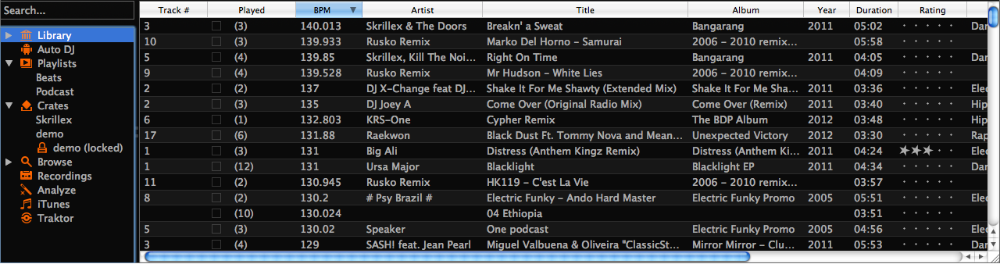

The Library
***********

   The Mixxx Library

The library manages all your music files. This is where you can find the tracks
you want to play and load them into a channel. Alternatively, you can also use
your external file-manager and drop files onto the waveform display. The sidebar
on the left contains different collections of music. The view on the right
displays the tracks in those collections.

The Library displays a sortable list of all the tracks in your music
library. Mixxx imports your music library automatically when it is run for the
first time, and automatically detects newly added tracks on each subsequent
run. If you want to manually refresh your library without exiting (for example
because you added or moved files) you can do this with
:menuselection:`Library --> Rescan Library` in the menu.

To load a track into a deck, you can either simply drag it to the waveform
display or use the context menu (right-click on a track). The right-click
context menu also allows you to add a track to the Auto DJ queue, playlists, or
crates. Also see the chapter :ref:`djing-loading-tracks`.

Search
======

The Search box in the top-left filters the current library view for tracks that
match your search query. The library search include some nice search features,
see the chapter :ref:`djing-finding-tracks` for details.

Missing Tracks
==============

.. sectionauthor::
   M.Linke <n.n.>
   S.Brandt <s.brandt@mixxx.org>

.. versionadded:: 1.11

The Missing Tracks view is accessible by expanding the Library tree item in the
sidebar. Any tracks that were previously loaded into your library, but were
later detected to be missing from your hard disk by Mixxx will appear here.
Mixxx does not automatically delete records of missing tracks so that extra
metadata Mixxx might have (such as hot cues and the BPM) will not be lost if
the file is replaced.

The features in detail:

* **Select All button**: Selects all tracks in the current view.
* **Purge button**: Purges the selected tracks from the Mixxx library, but does
  not remove them from your computer. This will delete all :term:`metadata`
  Mixxx has for a track.

Hidden Tracks
=============

.. sectionauthor::
   M.Linke <n.n.>
   S.Brandt <s.brandt@mixxx.org>

.. versionadded:: 1.11

The Hidden Tracks view is also accessible by expanding the Library tree item in
the sidebar. Any tracks that were previously loaded into your library, but were
later set to be hidden from the library will appear here. Use the
:guilabel:`Hide from Library` context menu item in the
:ref:`library <library-root>` view to temporarily hide selected tracks.

The features in detail:

* **Select All button**: Selects all tracks in the current view.
* **Purge Button**: Purges the selected tracks from the Mixxx library, but does
  not remove them from your computer. This will delete all :term:`metadata`
  Mixxx has for a track.
* **Unhide Button**: Removes the selected tracks from the
  :guilabel:`Hidden Tracks` view and makes them available in the regular track
  list again. The tracks appears again in every playlist or crate they were
  listed before they were hidden.

Auto DJ
=======

The Auto DJ queue is a special playlist that contains extra controls for
enabling automatic mixing. This is useful for taking a break from live mixing
or for using Mixxx as media player. Also see the chapter :ref:`djing-auto-dj`.

Playlists
=========

Playlists can be created by right-clicking on the :guilabel:`Playlists` sidebar
item, and selecting :guilabel:`New Playlist`. Tracks can be added to a playlist
by finding them in the Library, and drag-and-dropping them onto the name of a
playlist in the sidebar, or by selecting a track in the library and
right-clicking on it. Playlists are not directly loadable into Mixxx's decks as
Mixxx is primarily intended for live, attended performance use. However, you can
add the contents of a playlist to the Auto DJ queue, and use automatic mixing.

Crates
======

Crates are unordered collections of tracks, and are similar to playlists. Unlike
playlist they cannot contain duplicate entries and do not support drag-and-drop
within them. Crates can be created by right-clicking on :guilabel:`Crates` in
the sidebar and selecting :guilabel:`New Crate`.

Browse
======

Browse mode works like a file-manager and allows you to load tracks that are not
necessarily already in your Mixxx library.

Recordings
==========

In this section of the library you can start and stop recordings well as view
previous recordings and the dates they were made. Also see the chapter
:ref:`djing-recording-your-mix`.

History - Keep track of your last sessions
==========================================

.. sectionauthor::
   S.Brandt <s.brandt@mixxx.org>

.. versionadded:: 1.11

The history section automatically keeps a list of tracks you play in your DJ
sets. This is handy for remembering what worked in your DJ sets, posting
set-lists, or reporting your plays to licensing organizations. Every time you
start Mixxx, a new history section is created. If you don't play a track during
the current session, it will be discarded.

The "arrow" icon indicates the current session.

Click on the *History* icon in the sidebar to switch to the :guilabel:`History`
view, then right-click on a sessions name to access the different features:

* **Add to Auto DJ**: Adds the content of the session to the
  :ref:`Auto DJ <djing-auto-dj>` queue for automatic mixing.
* **Rename**: Rename a session, default is the calendar date (YYYY-MM-DD).
* **Remove**: Remove a previous session, but not the locked sessions or even the
  current session.
* **Lock**: Protect a previous session against accidental merge and deletion.
  An icon indicates a locked session.
* **Join with previous**: Join the current history session with a previous one.
* **Export playlist**: Export a session in various file formats, ideal for
  processing the data in other applications.

Analyze
=======

The Analyze view allows you to see a list of either all tracks in the library or
tracks added to the library within the last 7 days. You can select certain
tracks and run BPM and beatgrid detection on them in advance. Waveforms will be
generated as part of a analysis as well. Also see the chapter
:ref:`djing-bpm-detection`.

iTunes, Traktor, Rhythmbox - Using external Libraries
=====================================================

.. sectionauthor::
   S.Brandt <s.brandt@mixxx.org>

The iTunes (Windows/Mac OS X), Traktor (Windows/Mac OS X), and Rhythmbox
(GNU/Linux) views allow you to use the music libraries you have created in these
applications. You can access music and playlists. If available, Mixxx
automatically loads the external librarys from their default locations on your
hard drive.

Right-click on the iTunes icon in the Library tree and select
:guilabel:`Choose Library` to load the *iTunes Music Library.xml* from a
different location. Select :guilabel:`Use Default Library` to reset.

.. versionadded:: 1.11

* Right-click on a iTunes/Rhythmbox/Traktor playlist and choose
  :guilabel:`Import Playlist` to import it to be a regular Mixxx playlist.
* If you have an iTunes configuration file (*.xml) from a Windows or Mac
  partition mounted in Linux, you can load it and use your iTunes tracks and
  playlists.

.. seealso:: You can disable external libraries in
             :menuselection:`Prefences --> Library`.
