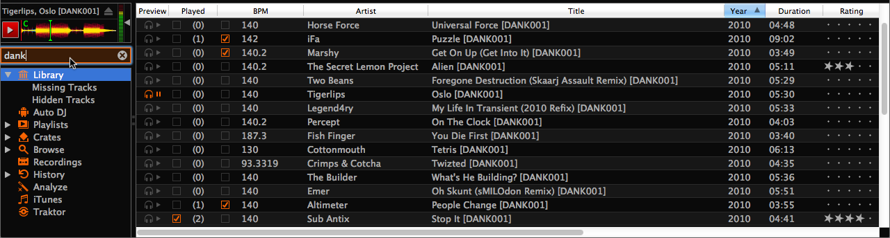
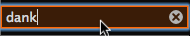

.. include:: /shortcuts.rstext

.. _interface-library:

The Mixxx Library
*****************

Overview of the Library features
================================

.. sectionauthor::
   S.Brandt <s.brandt@mixxx.org>

   The Mixxx Library

The library manages all of your music files. This is where you can find the
tracks you want to play and load them into a :ref:`deck <interface-decks>` or
:ref:`sampler <interface-sampler>`, see :ref:`djing-loading-tracks`.  Mixxx
imports your music library automatically when it is run for the first time, and
automatically detects newly added tracks on each subsequent run, see
:ref:`djing-import`.

The sidebar on the left contains different collections of music. The track list
view on the right displays the tracks in those collections.

**Sidebar**:

* **Search**: Search for tracks in your Mixxx library.
* **Library**: View and edit your whole collection.
* **Auto DJ**: Automatically load and crossfade tracks for unattended mixing.
* **Playlists**: Organize your tracks in sortable lists.
* **Crates**: Manage your files in unordered track collections.
* **Browse**: Browse and load tracks from your filesystem and connected devices.
* **Recordings**: Record your mix and view previous recordings.
* **History**: Browse lists of tracks you played in past mixing sessions.
* **Analyze**: Prepare your tracks for optimal mixing experience.
* **External Libraries**: Access your existing iTunes, Traktor and Rhythmbox
  libraries.

**Track List**:

* **Sort**: Display and sort track collections by different criteria.
* **Load**: Drag tracks you want to play to the waveform display.
* **Edit**: Rate tracks and edit track properties.

.. _library-search:

Search - Find your tracks
=========================

   The Search box - Has focus and a search term entered

The Search box above the sidebar filters the current library view for tracks
that match your search query. The library search include some nice search
features, go to the chapter :ref:`djing-finding-tracks` for details.

.. _library-root:

Library - View and edit your whole collection
=============================================

.. sectionauthor::
   S.Brandt <s.brandt@mixxx.org>

|ic_lib_library| The Library displays a sortable list of all the tracks in your
music library.

**Customizing the view**
  Move columns by clicking in a column header and dragging it to another
  position. Right-click on a column header to show and hide particular
  columns. Adjust the column width to fit the contents of the rows by
  double-clicking on the separator between two column headers.

**Sorting Tracks**
  Tracks are automatically sorted by the active column. Click on the active
  column header to reverse the sort order. Click on another column header to
  change the active column.

**Rating tracks**
  Make sure the :guilabel:`Rating` column is not hidden. Rate tracks by hovering
  over the rating field and clicking the stars.

**Track Inline editing**
  Mixxx reads :term:`metadata` from the tracks to fill the columns of the
  library. To edit this data, double-click on a field. If the field is editable
  it will become an editable text box. When you are done, hit :kbd:`Enter`. The
  data will be saved to the Mixxx library, but **not** to the tracks metadata
  itself.

**Loading tracks**
  To load a track into a :ref:`deck <interface-decks>`, you can either drag it
  to the waveform display or use the context menu. Go to the chapter
  :ref:`djing-loading-tracks` for detailed informations.

**Importing tracks**
  Mixxx imports your music library automatically when it is run for the first
  time, and automatically detects newly added tracks on each subsequent
  run. Go to the chapter :ref:`djing-import` for detailed informations.

**Previewing Tracks**
  To pre-listen to tracks in your headphones without loading them to a regular
  deck, click the |ic_lib_preview_play| icon in the :guilabel:`Preview` column.
  Go to the chapter :ref:`djing-previewing-tracks` for detailed informations.

**Rescan Library**
  If you want to manually refresh your library without exiting (for example
  because you added or moved files) you can do this with
  :menuselection:`Library --> Rescan Library` in the menu on top of the
  application window. You can prompt an automatic rescan in
  :menuselection:`Preferences --> Library --> Rescan on startup`.

Track list context menu
-----------------------

Right-clicking on selected tracks in the track list reveals the context menu:

* **Add to Auto DJ**: Adds the content of the session to the
  :ref:`Auto DJ <library-auto-dj>` playlist for automatic mixing.
* **Load to Deck/Sampler**: Loads a selected file to a
  :ref:`deck <interface-decks>`, :ref:`sampler <interface-sampler>` or
  :ref:`previewdeck <interface-preview-deck>`. Alternatively
  simply drag it to the :ref:`interface-waveform`. Note that you can't load
  multiple files at ones.
* **Add to playlist/crate**: Add selected tracks to the playlists or
  crates that you have created before. Alternatively, drag the selection to the
  playlist or crate in the sidebar.
* **Lock/Unlock BPM**: Locks/Unlocks the :term:`BPM` of selected tracks so you
  can't edit them in the track properties. If a BPM is locked, a “lock” icon
  appears next to the tracks BPM.
* **Clear BPM and Beatgrid**: Removes :term:`BPM` and :term:`beatgrid` data of
  selected tracks from the Mixxx libary. After doing this we recommended you
  :ref:`analyze <library-analyze>` the tracks again.
* **Reload Track Metadata**: If the track's metadata changes, e.g. if you used
  iTunes to edit them, this option lets you load the new values to the Mixxx
  library.
* **Hide from Library**: Temporarily hides selected tracks from the track list.
  Hidden tracks are listed in the :guilabel:`Hidden Tracks` menu item which is
  explained below.
* **Reset Play Count**: Marks selected tracks as not played in the current
  session and set their play counter to zero. The icon in the :guilabel:`Played`
  column changes.
* **Open in File Browser**: Browse for the selected files in your file manager.
* **Properties**: Similar to inline editing explained above the properties
  dialog allows you to view and edit metadata such as title, artist, album, and
  view the full file name and path. Note that you can not edit multiple files at
  once.

.. note:: Most of the context menu items are available in file lists of other
          views like Auto DJ, Playlists, and Crates as well.

Missing Tracks
--------------

.. sectionauthor::
   M.Linke <n.n.>
   S.Brandt <s.brandt@mixxx.org>

.. versionadded:: 1.11

The Missing Tracks view is accessible by expanding the Library tree item in the
sidebar. Any tracks that were previously loaded into your library, but were
later detected to be missing from your hard disk by Mixxx will appear here.
Mixxx does not automatically delete records of missing tracks so that extra
metadata Mixxx might have (such as hotcues and the beatgrids) will not be lost
if the file is replaced.

The features in detail:

* **Select All button**: Selects all tracks in the current view.
* **Purge button**: Purges the selected tracks from the Mixxx library, but does
  not remove them from your computer. This will delete all :term:`metadata`
  Mixxx has for a track.

Hidden Tracks
-------------

.. sectionauthor::
   M.Linke <n.n.>
   S.Brandt <s.brandt@mixxx.org>

.. versionadded:: 1.11

The Hidden Tracks view is also accessible by expanding the Library tree item in
the sidebar. Any tracks that were previously loaded into your library, but were
later set to be hidden from the library will appear here. Use the
:guilabel:`Hide from Library` context menu item in the
:ref:`library <library-root>` view to temporarily hide selected tracks.

The features in detail:

* **Select All button**: Selects all tracks in the current view.
* **Purge Button**: Purges the selected tracks from the Mixxx library, but does
  not remove them from your computer. This will delete all :term:`metadata`
  Mixxx has for a track.
* **Unhide Button**: Removes the selected tracks from the
  :guilabel:`Hidden Tracks` view and makes them available in the regular track
  list again. The tracks appears again in every playlist or crate they were
  listed before they were hidden.

.. _library-auto-dj:

Auto DJ - Automate your mix
===========================

.. sectionauthor::
   S.Brandt <s.brandt@mixxx.org>

|ic_lib_autodj| The Auto DJ queue is a special playlist that contains extra
controls for automatic mixing. This is useful for taking a break from live
mixing or for using Mixxx as media player.

.. versionadded:: 1.11
   Shuffle, Skip track, Fade now, Transition time, and Auto DJ Requeue

The Auto DJ features in detail:

* **Shuffle button**: Shuffles the content of the Auto DJ playlist.
* **Skip track button**: Skips the next track in the Auto DJ playlist.
* **Fade now button**: Triggers the transition to the next track.
* **Transition time spin-box**: Determines the duration of the transition.
* **Enable Auto DJ button**: Toggles the Auto DJ mode on or off.

The :guilabel:`Skip track` and :guilabel:`Fade now` buttons are only accessible
if the Auto DJ mode is enabled. The Search field in the upper left corner is
disabled in Auto DJ. By default, Auto DJ removes tracks after playing them but
you have the choice of telling it not to by activating the :guilabel:`Auto DJ
Requeue` option in :menuselection:`Preferences --> Interface`.

.. hint:: Put a pause between tracks that are automatically mixed by using a
          negative value in the :guilabel:`Transition time` spin-box.

.. seealso:: For more informations , go to the chapter :ref:`djing-auto-dj`.

.. _library-playlists:

Playlists - Organizing your tracks
==================================

.. sectionauthor::
   S.Brandt <s.brandt@mixxx.org>

|ic_lib_playlist| Playlists are ordered lists of tracks that allow you to plan
your DJ sets. Some DJs construct playlists before they perform live, but others
prefer to build them on-the-fly.

Playlists are not directly loadable into the decks as Mixxx is primarily
intended for live, attended performance use. However, you can use the
:ref:`Auto DJ <library-auto-dj>` explained below.

* **Create a playlist**:  Right-click on the :guilabel:`Playlists` sidebar item
  and select :guilabel:`New playlist`. Name the playlist and click
  :guilabel:`OK`.
* **Add Tracks**: Add tracks to a previously created playlist by
  drag-and-dropping a selection of tracks from the library or playlists onto the
  name of a playlist in the sidebar. Alternatively use the right-click context
  menu in the library`s :ref:`track list<library-root>`.

Right-click on an existing playlist's name to access the different features in
the context menu:

* **Add to Auto DJ**: Adds the content of the playlist to the
  :ref:`Auto DJ <library-auto-dj>` queue for automatic mixing.
* **Rename**: To rename a playlist, just put in a new playlist name and click
  :guilabel:`OK`.
* **Duplicate**: Sometimes you want to build a playlist based on an existing one.
  Select the playlist you would like to duplicate, choose
  :guilabel:`Duplicate Playlist`, name the new playlist and click :guilabel:`OK`.
* **Lock**: |ic_lib_locked| This icon indicates a locked playlist. If a playlist
  is locked, you cannot add tracks, rename or delete the playlist. Choose
  :guilabel:`Unlock` from the context menu to unlock the playlist.
* **Remove**: Removes an unlocked playlist. Tracks in the playlist are still
  available in the library for later use.
* **Import playlist**: Import tracks from external playlists to a playlist in
  various file formats. For informations on how to import
  iTunes/Rhythmbox/Traktor playlists, see :ref:`library-3rd-party`.
* **Export playlist**: Export a playlist to an external playlist in various file
  formats. Ideal for processing the data in other applications.

.. _library-crates:

Crates - Working with track collections
=======================================

.. sectionauthor::
   S.Brandt <s.brandt@mixxx.org>

|ic_lib_crates|  Crates are unordered collections of tracks, and are similar to
playlists. Think of it like a DJ case to organize your favorite vinyls into.

* **Create a crate**: Right-click on the :guilabel:`Crates` sidebar item and
  select :guilabel:`New Crate`. Name the crate and click :guilabel:`OK`.
* **Add Tracks**: Add tracks to a previously created crate by drag-and-dropping
  a selection of tracks from the library or playlists onto the name of a crate
  in the sidebar. Alternatively use the context menu in the library's
  :ref:`track list<library-root>`.

Right-click on a existing crate's name to access the different features in the
context menu:

* **Rename**: To rename a crate, enter the new crate name and click
  :guilabel:`OK`.
* **Duplicate**: Just like playlists you can duplicate an existing crate.
  Select the crate you would like to duplicate, choose
  :guilabel:`Duplicate Crate`, name the new crate and click :guilabel:`OK`.
* **Lock**: |ic_lib_locked| This icon indicates a locked crate. If a crate is
  locked, you cannot add tracks, rename or delete the crate. Choose
  :guilabel:`Unlock` from the context menu to unlock the crate.
* **Remove**: Removes an unlocked crate. Tracks in the crate are still available
  in the library for later use.
* **Import crate**: Import tracks from an external playlist to a crate in various
  file formats.
* **Export crate**: Export a crate as playlist in various file formats. Ideal
  for processing the data in other applications.

Crates vs. Playlists
--------------------

.. sectionauthor::
   RJ Ryan <rryan@mixxx.org>
   S.Brandt <s.brandt@mixxx.org>

Crates are unordered collections of tracks. Unlike playlists, they cannot
contain duplicate entries and do not support drack-and-drop within them.

Playlists serve a limited purpose of keeping an ordered list of tracks.
You can right-click a playlist to queue it to :ref:`Auto DJ <library-auto-dj>`,
so in a sense you can “play” it.

Often DJ's keep a playlist of favorites or plan a list of tracks they want to
play at a party. In these cases they rarely care about the order since they will
likely choose the order at the party based on the dance floor and mood and they
certainly don't want duplicates. This is where crates come in. You can think of
them like labels in GMail or Web 2.0 tags for your music.

On the other hand, if you want to specifically plan out a set and practice the
transitions you might want to keep an ordering of tracks or repeat them (if you
plan to mix a track back in later on) so in that situation you could use a
playlist.

.. _library-browse:

Browse - Loading remote tracks
==============================

.. sectionauthor::
   S.Brandt <s.brandt@mixxx.org>

|ic_lib_browse| Browse mode works like a file-manager and allows you to load
tracks that are not necessarily already in your Mixxx library.

Click the :guilabel:`Browse` sidebar item to navigate the computer and find your
music. Depending on your :term:`operating system`, the music will usually be
found in the “My Music” or “Music” folder. Drag the files you want to import to
the :ref:`Library <library-root>` icon or directly to the
:ref:`interface-waveform`.

.. note:: Currently you can drag only files but not folders to the Mixxx
          library.

Quick Links - Bookmark your favorite folders
--------------------------------------------

.. versionadded:: 1.11

Using the :guilabel:`Quick Links` sub-menu you can bookmark folders for direct
access. Click the :guilabel:`Browse` sidebar item and navigate to the folder you
would like to bookmark. Right-click and choose :guilabel:`Add to Quick Links`.
The folder is now pinned below the :guilabel:`Quick Links`. To un-pin that
folder, right-click and choose :guilabel:`Remove from Quick Links`.

Recordings
==========

|ic_lib_recordings| In this section of the library you can start and stop
recordings well as view previous recordings and the dates they were made.

.. seealso:: For more informations, go to :ref:`djing-recording-your-mix`.

.. _library-history:

History - Keep track of your last sessions
==========================================

.. sectionauthor::
   S.Brandt <s.brandt@mixxx.org>

.. versionadded:: 1.11

|ic_lib_history| The history section automatically keeps a list of tracks you
play in your DJ sets. This is handy for remembering what worked in your DJ sets,
posting set-lists, or reporting your plays to licensing organizations. Every
time you start Mixxx, a new history section is created. If you don't play a
track during the current session, it will be discarded.

|ic_lib_history_current| This icon indicates the current session.

Click on the *History* icon in the sidebar to switch to the :guilabel:`History`
view, then right-click on a sessions name to access the different features:

* **Add to Auto DJ**: Adds the content of the session to the
  :ref:`Auto DJ <djing-auto-dj>` queue for automatic mixing.
* **Rename**: Rename a session, default is the calendar date (YYYY-MM-DD).
* **Remove**: Remove a previous session, but not the locked sessions or even the
  current session.
* **Lock**: Protect a previous session against accidental merge and deletion.
  An icon indicates a locked session.
* **Join with previous**: Join the current history session with a previous one.
* **Export playlist**: Export a session in various file formats, ideal for
  processing the data in other applications.

.. _library-analyze:

Analyze - Preparing your tracks
===============================

.. sectionauthor::
   RJ Ryan <rryan@mixxx.org>
   S.Brandt <s.brandt@mixxx.org>

|ic_lib_prepare| Mixxx automatically analyzes tracks the first time you load
them in a deck, nevertheless it is recommended that you analyze them before
playing live with them to ensure the beatgrids are correct. Furthermore, track
analysis takes considerable CPU power and might cause skips in the audio; things
you surely don't need while performing.

The Analyze view allows you to run :term:`BPM` and :term:`beatgrid` detection on
tracks in advance. Waveforms are generated as part of the analysis as well.

.. versionchanged:: 1.11
   Shows the progress in percentage and total queue length while analyzing.

The Analyze features in detail:

* **All / New**: Allows you to view a list of either all tracks in the library
  or tracks added to the library within the last 7 days.
* **Select All**: Selects all tracks in the current view.
* **Analyze**: Starts the detection on the selected tracks.

.. seealso:: For more informations, go to :ref:`djing-bpm-detection`.

.. _library-3rd-party:

iTunes, Traktor, Rhythmbox - Using external libraries
=====================================================

.. sectionauthor::
   S.Brandt <s.brandt@mixxx.org>

|ic_lib_itunes| The iTunes (Windows/Mac OS X),
|ic_lib_traktor| Traktor (Windows/Mac OS X), and
|ic_lib_rhythmbox| Rhythmbox (GNU/Linux) views allow you to use the music
libraries you have created in these applications. You can access music and
playlists. If available, Mixxx automatically loads the external libraries from
their default locations on your hard drive.

Right-click on the iTunes icon in the Library tree and select
:guilabel:`Choose Library` to load the *iTunes Music Library.xml* from a
different location. Select :guilabel:`Use Default Library` to reset.

.. versionadded:: 1.11

* Right-click on a iTunes/Rhythmbox/Traktor playlist and choose
  :guilabel:`Import Playlist` to import it to be a regular Mixxx playlist.
* If you have an iTunes configuration file (\*.xml) from a Windows or Mac
  partition mounted in Linux, you can load it and use your iTunes tracks and
  playlists.

.. seealso:: You can disable external libraries in
             :menuselection:`Prefences --> Library`.
