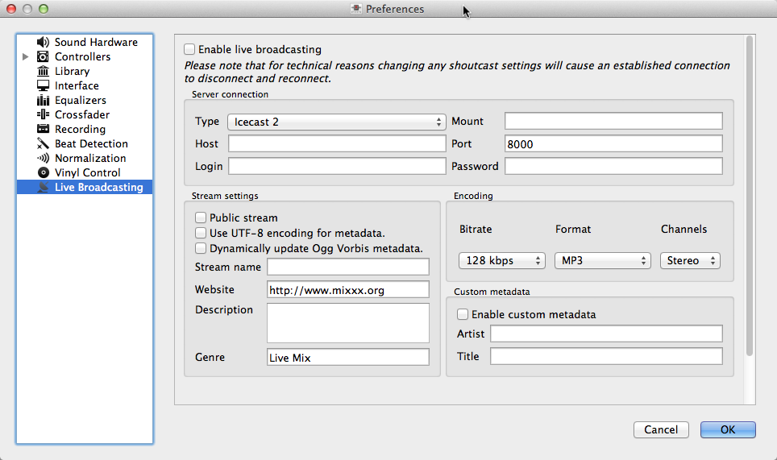

.. _live-broadcasting:

Live Broadcasting - Start your own Internet radio
*************************************************

.. sectionauthor::
   S.Brandt <s.brandt@mixxx.org>

Live Broadcasting in Mixxx allow you to stream your mix over the Internet to
listeners around the world.

Streaming Servers
=================

**Remote streaming server**
  Mixxx allows you to feed your audio stream directly to
  :term:`Shoutcast <shoutcast>` and :term:`Icecast <icecast>` streaming servers.
  Depending on the number of listeners, streaming audio requires a significant
  amount of bandwidth. Streaming servers provide the required bandwidth and
  broadcast the stream to your listeners. A popular free streaming service is
  `Caster.fm <http://www.caster.fm>`_, a review of several free and paid stream
  hosts is available at
  `broadcastingworld.net <http://www.broadcastingworld.net/reviews/stream-hosting>`_.

      .. digraph:: remote_streaming
         :caption: Mixxx as client-side streaming source broadcasting to an
                   remote streaming server
         :alt: Mixxx as client-side streaming source broadcasting to an
               remote streaming server

         rankdir=LR;
         size="6,6";
         StreamingServer [shape = rectangle, style=filled, fillcolor=gainsboro];
         Router [shape = box, style=dashed] ;
         node [shape = box];
         Mixxx -> Router [ label = "Lan" ];
         Router -> StreamingServer [ label = "Internet" ];
         StreamingServer -> Listener1 [ dir=left, label = "Internet" ];
         StreamingServer -> Listener2 [ dir=left, label = "Internet" ];
         StreamingServer -> Listener3 [ dir=left, label = "Internet" ];

**Local streaming server**
  For experienced users, it may be interesting to set up an own local streaming
  server. This turns you personal computer into a radio station and listeners
  connect directly to your server. Mixxx as streaming source does not need to
  run on the same computer as your streaming local server. However, professional
  stations often run the streaming source on the same computer as the streaming
  server for stability and reliability reasons. Keep in mind that if want to
  stream audio to a significant number of listeners, you'll need enough
  bandwidth. Read the
  `Shoutcast documentation <http://wiki.winamp.com/wiki/SHOUTcast_Getting_Started_Guide>`_
  or
  `Icecast documentation <http://www.icecast.org/docs.php>`_ for server setup
  instructions.

      .. digraph:: local_streaming
         :caption: Mixxx as client-side streaming source broadcasting to an
                   local streaming server
         :alt: Mixxx as client-side streaming source broadcasting to an
               remote streaming server

         rankdir=LR;
         size="5.5,6";
         Router [shape = box, style=dashed] ;
         StreamingServer [shape = rectangle, style=filled, fillcolor=gainsboro];
         node [shape = box];
         Mixxx -> StreamingServer [ label = "" ];
         StreamingServer -> Router [ dir=left, label = "Lan" ];
         Router -> Listener1 [ dir=left, label = "Internet" ];
         Router -> Listener2 [ dir=left, label = "Internet" ];
         Router -> Listener3 [ dir=left, label = "Internet" ];

Configuring Mixxx
=================

Start by suppling Mixxx with all information needed to establish a connection
to the streaming server:

* Open :menuselection:`Preferences --> Live Broadcasting`.
* Insert the settings following the descriptions in the
  :ref:`live-broadcasting-preferences`
* Click :guilabel:`OK`
* Go to :menuselection:`Options --> Enable Live Broadcasting` or use
  the :ref:`appendix-shortcuts` to start broadcasting.

.. _live-broadcasting-preferences:

Live Broadcasting Preferences
=============================

   Mixxx preferences - Setting up live broadcasting

**Server Connection**

* **Type**: Select the type of streaming server you want to connect with.
* **Host**: You can enter the host as either a host name or an IP address.
* **Login**: As provided by your streaming server provider. Without this, you
  will not connect successfully to the server. The default password for
  *Icecast* is ``source`` while the default password for Shoutcast is ``admin``.
* **Mount**: A mount point is a unique name identifying a particular stream.
  For *Shoutcast* it is not necessary to specify a mount point. The setting must
  not be blank if you are using *Icecast*. Try the default ``/mount`` or
  ``/live``. If you haven't been given a specific mount point you can usually
  make one up. It always begins with a ``/`` (slash) followed by a text without
  any special characters in it.
* **Port**: As provided by your streaming server provider. Most servers use the
  default port 8000.
* **Password**: As provided by your streaming server provider, unless you run
  your own radio server. It is required to establish the connection to the
  server and to start the broadcast.

.. warning:: Do not enter a :term:`URL` as the host! ``http://example.com:8000``
             does not work. Use ``example.com`` in the :guilabel:`Host` field
             and ``8000`` in the :guilabel:`Port` field instead.

**Stream Setting**

* **Public stream**: If enabled, this option adds your radio station to the
  Shoutcast/Icecast directory.
* **Enable UTF-8 metadata**: If enabled, this option fixes broken accented and
  foreign language symbols in :term:`metadata`, assuming the streaming provider
  has configured the server to support utf-8 metadata.
* **Stream name**: So, whats the name of your show?
* **Website**: The website you would like your listeners to visit.
* **Description**: Enter your DJ name and a short tagline.
* **Genre**: List the main genres you play. This attracts search hits on stream
  directories. Genre must not be blank.

**Encoding**

* **Bitrate**: Selecting a :term:`bitrate` of 128 or 160 :term:`kbps` is common
  and provide sufficient quality to your listeners. Higher bitrates will use a
  larger chunk in your Internet connection bandwidth to stream and for your
  listeners to receive the stream.
* **Format**: Mixxx supports streaming to Icecast servers either in :term:`MP3`
  or :term:`Ogg Vorbis` format, streaming to Shoutcast servers is supported in
  :term:`MP3` format.

**Custom metadata**

 By default, Mixxx broadcasts any artist and track title information of the
 files that you play. You can disable this feature and use your own custom
 metadata. For technical reasons, broadcasting artist and title information is
 not supported for OGG streams.

* **Enable custom metadata**: Toggles custom metadata on and off.
* **Artist**: Insert your custom artist metadata here, your DJ name for example.
* **Title**: Insert your custom title metadata here.

.. note:: Due to licensing restrictions, MP3 streaming is not enabled per
          default. For informations on how to enable MP3 streaming, go to
          the chapter :ref:`MP3 streaming`.

Icecast vs. Shoutcast
---------------------

Both essentially serve the same purpose. An Icecast server can stream either
:term:`MP3` or :term:`Ogg Vorbis`. However, although Ogg is more efficient and
effective - you get a better sound than MP3 at a lower data rate - not all
players can play Ogg streams. As a result MP3 is probably a save choice unless
you know your listeners can hear an Ogg stream successfully.

Broadcast directories
---------------------

Generally your streaming server host adds your radio station to the
Shoutcast/Icecast directory, if you enable the :guilabel:`Public Stream` option
in :menuselection:`Preferences --> Live Broadcasting --> Stream Settings`.

* **Shoutcast radio directory**: `www.shoutcast.com <http://www.shoutcast.com/>`_
* **Icecast radio directory**: `dir.xiph.org <http://dir.xiph.org/>`_

Often your streaming host runs its own directory, look after in its FAQ.
If you want to promote your streaming radio station even more, register at
services like `streamfinder.com <http://streamfinder.com>`_. A overview
of different internet radio directories is available at
`shoutcheap.com <http://www.shoutcheap.com/internet-radio-directories-submitting-and-promoting/>`_

Troubleshooting
===============

* If you have trouble connecting to your streaming server, check the
  configuration in the :ref:`live-broadcasting-preferences`.
* You may need the :term:`LAME` libraries to stream in MP3. See
  :ref:`MP3 Streaming`.
* You may have selected the :term:`Ogg Vorbis` format that is unsupported by
  Shoutcast servers.
* You may need to check your firewall settings. Both Icecast and Shoutcast use
  two ports. If you are streaming on ex. port 8000 then you need to open up the
  next port also.
* You may need to configure port forwarding if you are behind a router or your
  router will block requests to ex. port 8000.

By default, Mixxx broadcasts artist and title information to your listeners. You
can disable this behavior by selecting :guilabel:`Enable custom metadata` in the
:ref:`live-broadcasting-preferences`.

.. _MP3 Streaming:

Activate MP3 streaming support
==============================

Due to licensing restrictions, :term:`MP3` streaming is not enabled per default.
In order to enable MP3 streaming you must install the :term:`LAME` MP3
:term:`codec` yourself. The following section explains how you can do that.

.. hint:: If you have activated MP3 streaming support, you'll be also able to
          record your mixes in MP3 format. Go to the chapter
          :ref:`djing-recording-your-mix` for more informations.

Activate MP3 streaming support on Windows
-----------------------------------------

.. sectionauthor::
   RJ Ryan <rryan@mixxx.org>
   S.Brandt <s.brandt@mixxx.org>

To activate MP3 streaming on Windows, follow these steps:

  1. Download LAME 3.98.4 :term:`binaries` from http://lame.bakerweb.biz/.
     The download includes versions for 32-bit and 64-bit Windows
  #. Unpack the downloaded archive. You need a utility for manipulating archives
     like the free `7zip <http://www.7-zip.org/>`_.
  #. If you have the 32-bit version of Mixxx, copy the file
     :file:`libmp3lame.dll` from the :file:`x86` folder to the location you have
     installed Mixxx, for example :file:`C:\\Program Files\\Mixxx\\`
  #. Alternatively, if you have the 64-bit version of Mixxx, copy the file
     :file:`libmp3lame.dll` from the :file:`x64` folder to the location you have
     installed Mixxx
  #. Rename :file:`libmp3lame.dll` to :file:`lame_enc.dll` in the folder where
     you have installed Mixxx
  #. Restart Mixxx

.. hint:: A common mistake when going through the process is not copying only
          :file:`libmp3lame.dll` from the LAME zip file and then renaming that
          file to :file:`lame_enc.dll`. It's deceiving but there is a file named
          :file:`lame_enc.dll` in the LAME zip file. You don't want that file!
          Also, make sure the version of LAME you use (x86=32-bit vs. x64=64-bit)
          matches the version of Mixxx you use. Select :menuselection:`Help -->
          About` to find out whether you have installed the 32 bit or 64 bit
          version of Mixxx.

.. warning:: Some websites like `Audacity <http://audacity.sourceforge.net/>`_
             provide lame :term:`binaries` too. Do not use these versions or
             Mixxx will show an error when activating live broadcasting and your
             stream will fail.

Activate MP3 streaming support on Mac OS X
------------------------------------------

.. todo:: Add better links to Lame, mir.cr sucks. Best would be self-hosted.

Method A: Download
^^^^^^^^^^^^^^^^^^
To activate MP3 streaming on Mac OS X, follow these steps:

  1. Download `LAME 3.98.4 <http://mir.cr/IOTD7VBU>`_ Intel
     (Mac OS X 10.5+ 32-bit & 64-bit)
  #. Double-click on the downloaded zip file to unpack the file and you'll get
     an installer package file
  #. Double-click on the installer package file and follow the step-by-step
     instructions in the installer
  #. Restart Mixxx

Method B: Macports
^^^^^^^^^^^^^^^^^^
Another easy way to activate MP3 streaming is to use `MacPorts
<http://www.macports.org/>`_ which is a repository manager (like apt on
Debian/Ubuntu) for Open Source software. Having installed this piece of
software, installing MP3 support is rather simple.

  1. Open a terminal and type the following commands::

      sudo port install lame

  #. Restart Mixxx

Activate MP3 streaming support on Linux
---------------------------------------

On Ubuntu and GNU/Linux-based operating systems MP3 streams can be activated by
installing the package :file:`libmp3lame`. Dependent on your Linux distribution
the package might be slightly named different such as :file:`lame`.

  1. Open a terminal and type the following commands::

       sudo apt-get install libmp3lame0

  #. Restart Mixxx