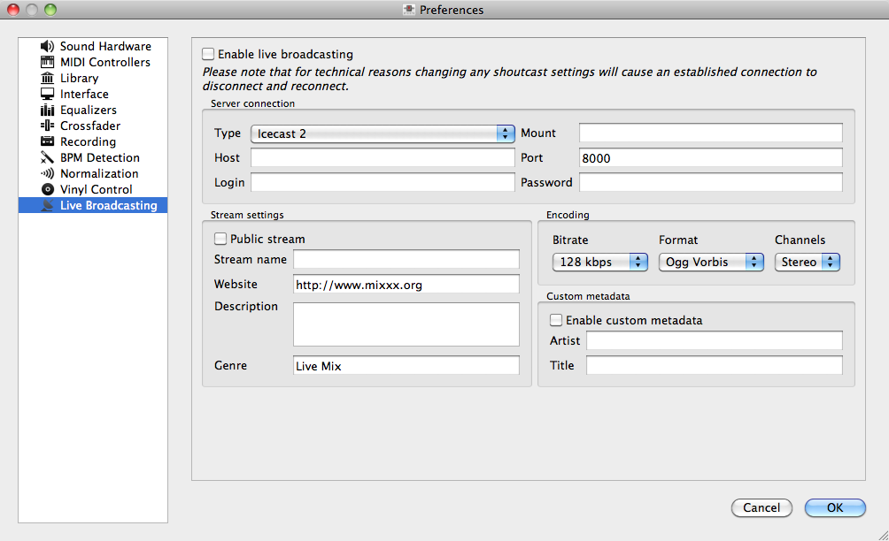

.. _live-broadcasting:

Live Broadcasting
*****************

.. versionadded:: 1.9

Mixxx directly supports live broadcasting. This allows you to connect directly
to Shoutcast and Icecast servers. Using the preferences dialogue, you can simply
supply Mixxx with all information needed to establish a server connection. To
enable live broadcasting you can either use the options menu or the checkbox
within the preference dialogue.

   Mixxx preferences - Setting up live broadcasting

By default, Mixxx broadcasts artist and title information to your listeners. You
can disable this behavior by selecting “enable custom metadata”.

.. note:: For technical reasons, broadcasting artist and title information is
          not supported for OGG streams.

Icecast
=======

For an Icecast server, you'll need to provide the mount point (of the form
”/mount”).  You can enter the host as either a host name or an IP address. In
the “login” field, the default is to enter “source” – without this, you will not
connect successfully to the server. The password will be provided by your
streaming server provider, unless you run your own radio server.

.. note:: Do not enter a URL as the host! "http://example.com:8000" does not
          work. Use "example.com" in the host field and "8000" in the port field
          instead.

An Icecast server can stream either MP3 or Ogg. However, although Ogg is more
efficient and effective - you get a better sound than mp3 at a lower data rate -
not all players can play Ogg streams, so as a result MP3 is probably a better
choice unless you know your listeners can hear an Ogg stream successfully. You
may need the LAME libraries to stream in MP3. Go to the chapter
:ref:`MP3 Streaming` for more informations.

Shoutcast
=========

If you connect to an Shoutcast server the default login name is “admin”. It is
not necessary to specify a mount point. The password will be provided by your
streaming server provider.

.. _MP3 Streaming:

Activate MP3 streaming support
==============================

Due to licensing restrictions, :term:`MP3` streaming is not enabled per default.
In order to enable MP3 streaming you must install the :term:`LAME` MP3
:term:`codec` yourself. The following section explains how you can do that.

.. hint:: If you have activated MP3 streaming support, you'll be also able to
          record your mixes in MP3 format. Go to the chapter
          :ref:`recording-your-mix` for more informations.

Activate MP3 streaming support on Windows
-----------------------------------------

To activate MP3 streaming on Windows, follow these steps:

  1. Download LAME 3.98.4 :term:`binaries` from http://lame.bakerweb.biz/.
     The download includes versions for 32-bit and 64-bit Windows
  #. Unpack the downloaded archive. You need a utility for manipulating archives
     like the free `7zip <http://www.7-zip.org/>`_.
  #. If you have the 32-bit version of Mixxx, copy the file libmp3lame.dll from
     the x86 folder to the location you have installed Mixxx, for example
     ``C:\Program Files\Mixxx\``
  #. Alternatively, if you have the 64-bit version of Mixxx, copy
     the file libmp3lame.dll from the x64 folder to the location you have
     installed Mixxx
  #. Rename *libmp3lame.dll* to *lame_enc.dll* in the folder where you have
     installed Mixxx
  #. Restart Mixxx

.. hint:: Select ``Help → About`` from the menu on top of Mixxx application
          window to find out what version of Mixxx you have installed, 32-bit or
          64-bit.

.. warning:: Some websites like `Audacity <http://audacity.sourceforge.net/>`_
             provide lame :term:`binaries` too. Do not use these versions or
             Mixxx will show an error when activating live broadcasting and your
             stream will fail.

Activate MP3 streaming support on Mac OS X
------------------------------------------

Method A: Download
^^^^^^^^^^^^^^^^^^
To activate MP3 streaming on Mac OS X, follow these steps:

  1. Download `LAME 3.98.4 <http://mir.cr/IOTD7VBU>`_ Intel
     (Mac OS X 10.5+ 32-bit & 64-bit) or `LAME 3.98.4 <http://mir.cr/YIBEU5R4>`_
     PowerPC (Mac OS X 10.5 32-bit)
  #. Double-click on the downloaded zip file to unpack the file and you'll get
     an installer package file
  #. Double-click on the installer package file and follow the step-by-step
     instructions in the installer
  #. Restart Mixxx

Method B: Macports
^^^^^^^^^^^^^^^^^^
Another easy way to activate MP3 streaming is to use `MacPorts
<http://www.macports.org/>`_ which is a repository manager (like apt on
Debian/Ubuntu) for Open Source software. Having installed this piece of
software, installing MP3 support is rather simple.

  1. Open a terminal and type the following commands::

      sudo port install lame

  #. Restart Mixxx

Activate MP3 streaming support on Linux
---------------------------------------

On Ubuntu and GNU/Linux-based operating systems MP3 streams can be activated by
installing the package *libmp3lame*. Dependent on your Linux distribution the
package might be slightly named different such as *lame*.

  1. Open a terminal and type the following commands::

       sudo apt-get install libmp3lame0

  #. Restart Mixxx