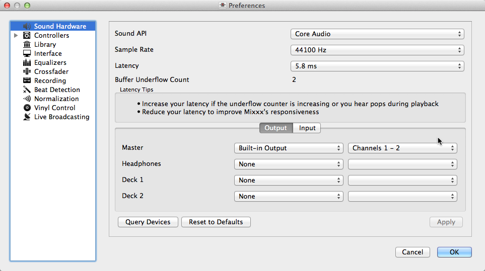
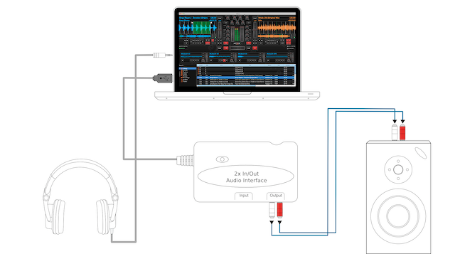
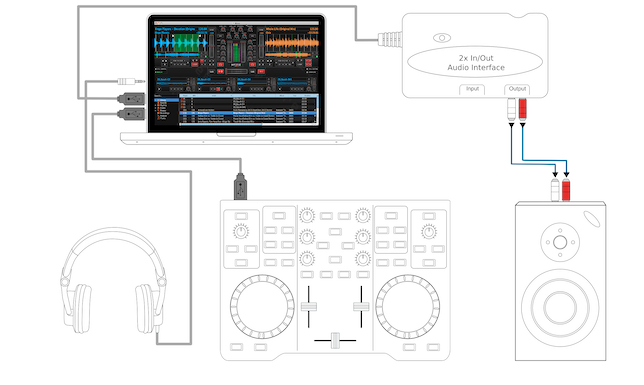
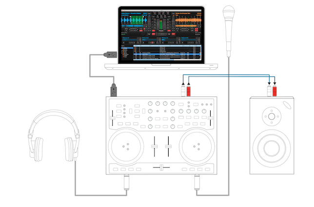

Hardware Setup
**************

.. sectionauthor::
   T.Rafreider <trafreider@mixxx.org>
   S.Brandt <s.brandt@mixxx.org>

This chapter describes the most common hardware setups to serve as examples. We
will go over the setup of timecode records/CDs, MIDI control and keyboard
control.

Audio Output
============

Headphone cueing, or just cueing, is previewing the next track you would like to
mix in your headphones. The audience will not hear what you are cueing in your
headphones. Being able to cue is a crucial aspect of DJing.

In order to cue with your computer, you will need **at least 2 separate audio
outputs**. Traditionally, a headphone jack on most laptops **is not a second
audio output**. Rather, plugging headphones into the jack simply redirects the
laptop's main output to your headphones. **Having a headphone jack alone will
not allow you to cue.**

Common Configurations
=====================

Unlike some commercial DJ systems, Mixxx can control multiple audio devices
simultaneously.  Depending on your budget and application area your sound setup
and requirements may vary.  This section provides useful information for club,
hobby and radio DJs alike.

.. _setup-laptop-only:

Laptop Only
-----------

   Using Mixxx with your built-in sound card

There is absolutely no need to buy an additional, expensive sound card **if you
do not require headphone cueing**. The built-in soundcard on most computers and
laptops comes with a single line-out and microphone input.

The figure above depicts how the sound configuration might look. The stereo
output of your soundcard (channels 1-2) will be connected to the **master
out**.

#. Open :menuselection:`Preferences --> Sound Hardware`
#. Select the :guilabel:`Output` tab
#. From the :guilabel:`Master` drop-down menus, select your build-in soundcard,
   then :guilabel:`Channels 1-2`
#. Depending on your soundcard, you can specify a
   :ref:`microphone <interface-mic>`

   a. Use your build-in microphone or connect a microphone to your computer
   b. Is it detected by your :term:`OS <operating system>`, open the
      :guilabel:`Input` tab
   c. From the :guilabel:`Microphone` drop-down menu, select the input your
      microphone is connected to
#. Click :guilabel:`Apply` to save the changes.

This minimal configuration may be suitable for **radio DJs** that do not need
headphone :term:`cueing`.

.. _setup-laptop-and-external-card:

Laptop and an External USB Soundcard
------------------------------------

   Using Mixxx together with an external soundcard

The most common setup for DJing is a laptop and a soundcard with 2 stereo
outputs (4 channels). The first stereo output (channels 1-2) is used as the
**Master out** and supplies the main mix to the room. With the 2nd stereo output
(channels 3-4) you can :term:`cue <cueing>` and
:ref:`preview <djing-previewing-tracks>` the next track in your headphones. If
your soundcard does not have 2 stereo outputs, you can use multiple soundcards
to achieve the same setup.

The depicted configuration above uses two soundcards. This setup is the bare
minimum for serious DJing. Without any extra gear, the DJ can control Mixxx via
mouse and keyboard. For more information see :ref:`controlling mixxx`.

**Using external multi-channel soundcard**

#. Open :menuselection:`Preferences --> Sound Hardware`
#. Select the :guilabel:`Output` tab
#. From the :guilabel:`Master` drop-down menus, select the external soundcard,
   then :guilabel:`Channels 1-2`
#. From the :guilabel:`Headphones` drop-down menus, select the external
   soundcard, then :guilabel:`Channels 3-4`
#. Click :guilabel:`Apply` to save the changes.

**Using two soundcards (build-in + external)**

#. Open :menuselection:`Preferences --> Sound Hardware`
#. Select the :guilabel:`Output` tab
#. From the :guilabel:`Master` drop-down menus, select the external soundcard,
   then :guilabel:`Channels 1-2`
#. From the :guilabel:`Headphones` drop-down menus, select the build-in
   soundcard, then :guilabel:`Channels 1-2`
#. Click :guilabel:`Apply` to save the changes.

.. _setup-controller-and-external-card:

Laptop, MIDI Controller, and External USB Soundcard
---------------------------------------------------

Mixxx can work with any :term:`MIDI controller` that has drivers for your
:term:`OS <operating system>`, as long as there is a MIDI mapping file to tell
Mixxx how to understand it. Mixxx comes bundled with a number of MIDI mapping
presets. To see the full list, see :ref:`control-midi`.

   Using Mixxx together with a MIDI controller and external soundcard

**Using a controller without integrated multi-channel soundcard**

#. Open :menuselection:`Preferences --> Sound Hardware`
#. Select the :guilabel:`Output` tab
#. From the :guilabel:`Master` drop-down menus, select the external soundcard,
   then :guilabel:`Channels 1-2`
#. From the :guilabel:`Headphones` drop-down menus, select the build-in
   soundcard, then :guilabel:`Channels 1-2`
#. Click :guilabel:`Apply` to save the changes.

Your MIDI controller may have an integrated *multi-channel* soundcard. If yours
does not, your sound setup may look like the figure above. Otherwise, an
alternative sound setup may look like the figure below:

   Using Mixxx together with a MIDI controller and integrated soundcard

**Using a controller with integrated multi-channel soundcard**

#. Open :menuselection:`Preferences --> Sound Hardware`
#. Select the :guilabel:`Output` tab
#. From the :guilabel:`Master` drop-down menus, select your controllers
   soundcard, then :guilabel:`Channels 1-2`
#. From the :guilabel:`Headphones` drop-down menus, select your controllers
   soundcard, then :guilabel:`Channels 3-4`
#. Click :guilabel:`Apply` to save the changes.

.. note:: You can connect as many MIDI controllers as you have ports on your
          computer. Just follow the steps in :ref:`control-midi` for each
          controller you want to use.

.. raw:: pdf

   PageBreak

.. _setup-vinyl-control:

Laptop, External Hardware Mixer and Vinyl Control
-------------------------------------------------

This setup is usually preferred by DJs who work in clubs. Instead of carrying
large and heavy CD bags or a MIDI controller, all you need to have is a
professional soundcard together with a pair of timecode records and
headphones.

For best results, when using this setup you should ensure your system is capable
of latencies under 10ms. Otherwise scratching may sound distorted. For more
information about latency and how to improve it, see :ref:`configuration-latency`.

.. seealso:: Go to the chapter :ref:`vinyl-control` for detailed informations.
