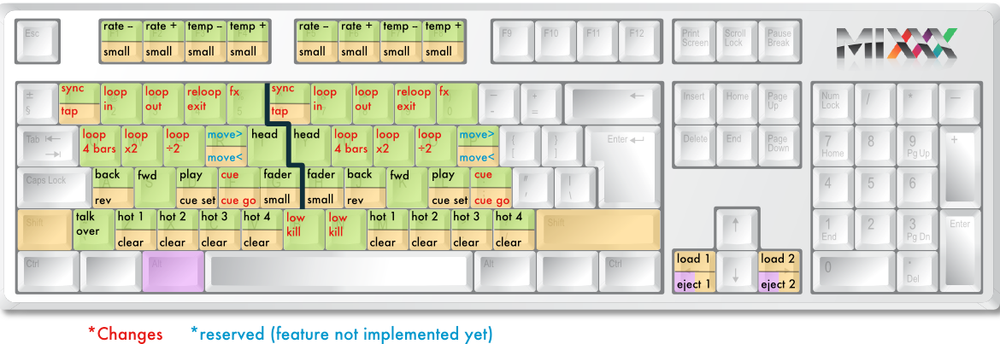

Hardware set-up
***************

This chapter describes the most common hardware setups to serve as examples as you
prepare yours. We provide a few options including time-code records/CDs, MIDI control and keyboard.

Audio output
============

Headphone cueing, or just cueing, is previewing the next track you would like to mix
in your headphones. The audience will not hear what you are cueing in your
headphones. Being able to cue is a crucial aspect of DJing.

In order to cue with your computer, you will need **at least 2 separate audio
outputs**. Traditionally, a headphone jack on most laptops **is not a second
audio output**. Rather, plugging headphones into the jack simply redirects the
laptop's main output to your headphones. **Having a headphone jack alone will not allow you to cue.**

Controlling Mixxx
=================

Mixxx can be controlled with keyboard, mouse, MIDI controllers, time-code records/CDs,
or a combination of these. The choice usually depends on your budget or area of 
application.  

.. _using a keyboard:

Using a keyboard
----------------

If you cannot afford a MIDI controller, controlling Mixxx with a keyboard
is handy. Unlike mouse control, the keyboard allows you to manage things
simultaneously. For example, you can start playing a track on deck 1 whilst 
stopping deck 2 at the same time.

The default mapping for English keyboards is depicted in the figure below. It's divided 
into a left-hand side for deck 1 and right-hand side for deck 2. Please note that you can also 
access the functions through Mixxx's interface.

   
+----------------------------------------+---------------------+---------------------+--------------+
| Function                               | Deck 1              | Deck 2              | Master       |
+========================================+=====================+=====================+==============+
| Microphone Talkover                    |                     |                     | \`           |
+----------------------------------------+---------------------+---------------------+--------------+
| Crossfade Left                         |                     |                     | G            |
+----------------------------------------+---------------------+---------------------+--------------+
| Crossfade Right                        |                     |                     | H            |
+----------------------------------------+---------------------+---------------------+--------------+
| Small Crossfade Left                   |                     |                     | Shift + G    |
+----------------------------------------+---------------------+---------------------+--------------+
| Small Crossfade Right                  |                     |                     | Shift + H    |
+----------------------------------------+---------------------+---------------------+--------------+
| Playback                               | D                   | L                   |              |
+----------------------------------------+---------------------+---------------------+--------------+
| Set Cuepoint                           | Shift + D           | Shift + L           |              |
+----------------------------------------+---------------------+---------------------+--------------+
| Cue                                    | F                   | ;                   |              |
+----------------------------------------+---------------------+---------------------+--------------+
| Cue Go-to-and-stop                     | Shift + F           | Shift + ;           |              |
+----------------------------------------+---------------------+---------------------+--------------+
| Seek Backwards                         | A                   | J                   |              |
+----------------------------------------+---------------------+---------------------+--------------+
| Reverse Playback                       | Shift + A           | Shift + J           |              |
+----------------------------------------+---------------------+---------------------+--------------+
| Seek Forwards                          | S                   | K                   |              |
+----------------------------------------+---------------------+---------------------+--------------+
| Bass Kill                              | B                   | N                   |              |
+----------------------------------------+---------------------+---------------------+--------------+
| Activate 4 Beat Loop                   | Q                   | U                   |              |
+----------------------------------------+---------------------+---------------------+--------------+
| Halve Beat Loop Size                   | W                   | I                   |              |
+----------------------------------------+---------------------+---------------------+--------------+
| Double Beat Loop Size                  | E                   | O                   |              |
+----------------------------------------+---------------------+---------------------+--------------+
| Set Loop In Point                      | 2                   | 7                   |              |
+----------------------------------------+---------------------+---------------------+--------------+
| Set Loop Out Point (Activates Loop)    | 3                   | 8                   |              |
+----------------------------------------+---------------------+---------------------+--------------+
| Toggle Loop On/Off                     | 4                   | 9                   |              |
+----------------------------------------+---------------------+---------------------+--------------+
| Activate/Disable Effects Unit          | 5                   | 0                   |              |
+----------------------------------------+---------------------+---------------------+--------------+
| Headphone Cue (Pre-fader listen)       | T                   | Y                   |              |
+----------------------------------------+---------------------+---------------------+--------------+
| Tempo Adjust Dow                       | F1                  | F5                  |              |
+----------------------------------------+---------------------+---------------------+--------------+
| Tempo Adjust Up                        | F2                  | F6                  |              |
+----------------------------------------+---------------------+---------------------+--------------+
| Small Tempo Adjust Dow                 | Shift + F1          | Shift + F5          |              |
+----------------------------------------+---------------------+---------------------+--------------+
| Small Tempo Adjust Up                  | Shift + F2          | Shift + F6          |              |
+----------------------------------------+---------------------+---------------------+--------------+
| Temporary Tempo Adjust Down            | F3                  | F7                  |              |
+----------------------------------------+---------------------+---------------------+--------------+
| Temporary Tempo Adjust Up              | F4                  | F8                  |              |
+----------------------------------------+---------------------+---------------------+--------------+
| Small Temporary Tempo Adjust Down      | Shift + F3          | Shift + F7          |              |
+----------------------------------------+---------------------+---------------------+--------------+
| Small Temporary Tempo Adjust Up        | Shift + F4          | Shift + F8          |              |
+----------------------------------------+---------------------+---------------------+--------------+
| Tempo (BPM) Sync                       | 1                   | 0                   |              |
+----------------------------------------+---------------------+---------------------+--------------+
| BPM Tap Tempo Adjust                   | Shift + 1           | Shift + 0           |              |
+----------------------------------------+---------------------+---------------------+--------------+
| Set Hot cue 1                          | Z                   | M                   |              |
+----------------------------------------+---------------------+---------------------+--------------+
| Set Hot cue 2                          | X                   | ,                   |              |
+----------------------------------------+---------------------+---------------------+--------------+
| Set Hot cue 3                          | C                   | .                   |              |
+----------------------------------------+---------------------+---------------------+--------------+
| Set Hot cue 4                          | V                   | /                   |              |
+----------------------------------------+---------------------+---------------------+--------------+
| Clear Hot cue 1                        | Shift + Z           | Shift + M           |              |
+----------------------------------------+---------------------+---------------------+--------------+
| Clear Hot cue 2                        | Shift + X           | Shift + <           |              |
+----------------------------------------+---------------------+---------------------+--------------+
| Clear Hot cue 3                        | Shift + C           | Shift + >           |              |
+----------------------------------------+---------------------+---------------------+--------------+
| Clear Hot cue 4                        | Shift + V           | Shift + ?           |              |
+----------------------------------------+---------------------+---------------------+--------------+
| Load selected track to deck            | Shift + left arrow  | Shift + right arrow |              |
+----------------------------------------+---------------------+---------------------+--------------+
| Unload track from deck                 | Alt + Shift + left  | Alt + Shift + right |              |
+----------------------------------------+---------------------+---------------------+--------------+

**Customizing** 

You can also customize the keyboard mapping. The shortcuts are defined in a text file, and can be changed.
          
* Linux: /usr/share/mixxx/keyboard/Standard.kbd.cfg 
* MacOS X: <Mixxx bundle>/keyboard/Standard.kbd.cfg 
* Windows: <Mixxx dir>\\keyboard\\Standard.kbd.cfg  

You can share custom keyboard mappings in the `Mixxx User customizations forum`_.

.. _Mixxx User customizations forum: http://mixxx.org/forums/viewforum.php?f=6

.. _using midi controllers:

Using a MIDI Controller
-----------------------

MIDI controllers are external hardware devices used that can be used to control audio applications.
Many DJs prefer the hands-on feel of a MIDI controller with Mixxx because it can feel similar to using a real
mixer and turntables.

Here are the steps for using one:

#. Connect your controller(s) to your computer
#. Open Preferences and click *MIDI Controllers*
#. Select your controller on the left and the right pane will change
#. Click *Enable* and choose the appropriate mapping from the *presets* combobox 
#. Click OK and Mixxx can now be controlled by your controller(s).

Mixxx can use any MIDI controller that is recognized by your OS (some may require drivers,)
as long as there is a MIDI mapping file to tell Mixxx how to understand it.
Mixxx comes bundled with a number of mappings for the devices listed below.

Often times these mappings are contributed by users and the Mixxx team has no way of judging the quality of
the mappings because we do not own the devices ourselves. There are two different levels of support for controllers
in Mixxx: Mixxx Certified Support and Community Support. Mixxx Certified mappings are verified by the Mixxx 
Team. Community Supported mappings are mappings provided by the Mixxx Community, but the Mixxx team is unable 
the verify their quality.

**Mixxx Certified Mappings**

* American Audio VMS4 
* DJ TechTools MIDIFighter
* Hercules DJ Console RMX
* Hercules DJ Console MK2
* Hercules DJ Control MP3 e2
* M-Audio X-Session Pro
* Reloop Digital Jockey 2 (Interface/Controller)
* Stanton SCS.3d
* Stanton SCS.3m
* Stanton SCS.1m
* Stanton SCS.1d

**Community Supported Mappings**

These mappings have been verified as working by the Mixxx community. However, they might have bugs or rough 
edges. If you run into issues with these mappings, please file a bug on our bug tracker or tell us about it on 
our mailing list, forums, or IRC channel.

* Akai MPD24
* Behringer BCD3000
* Ecler NUO4
* Evolution X-Session
* FaderFox DJ2
* Hercules DJ Console Mac Edition
* Hercules DJ Console Mk4
* Hercules DJ Console MP3
* Hercules DJ Control Steel
* Ion Discover
* M-Audio Xponent
* Mixman DM2
* Numark MixTrack
* Numark NS7
* Numark Total Control
* Pioneer CDJ-350
* Tascam US-428
* Vestax Spin
* Vestax Typhoon
* Vestax VCI-100
* Wireless DJ App (iOS)

Before purchasing a controller to use with Mixxx, please consult our `Hardware Compatibility wiki page`_. It 
contains the most up-to-date information about which controllers work with Mixxx and the details of each.
Device support varies for each supported OS, so please make sure to consult the documentation.

.. _Hardware Compatibility wiki page: http://www.mixxx.org/wiki/doku.php/hardware_compatibility

.. _using time-code:

Using Vinyl Time-code Records/CDs
---------------------------------

Vinyl control allows a user to manipulate the playback of a track in Mixxx using a turntable or DJ CD player as an interface.
In effect, it simulates the sound and feel of having your music collection on vinyl.

**How does it work?**

Vinyl control uses special time-code records which are placed on real turntables. The audio output of the
turntables is plugged into a computer on which Mixxx is running. When a record is played on one of the attached
turntables, Mixxx reads the time-code from the record and uses the information to manipulate whatever track is loaded.

**What do I need to use it**?

It is possible to use Mixxx's vinyl control with several hardware setups, but the basic ones are:

**Setup 1: Vinyl DJ** Two time-code vinyls, two turntables with phono pre-amplifiers (or line-out), and two sound
inputs.
You can try skipping the phono pre-amps if you use the software pre-amp in Mixxx on the Vinyl Control preferences pane.
*This may not work for everyone - line-level signals are preferred and recommended.*

**Setup 2: CDJ** Two time-code CDs, two CD decks, and two sound inputs.

For the sound inputs, you have two options: You can either use a proper DJ sound card that has multiple
stereo line inputs on it, or can use two sound cards (each with a single stereo line in).
A single multi-channel sound card is recommended.

.. note:: For best scratch performance with vinyl control, your system must be able to handle setting the 
          latency to 10ms or less otherwise the scratch sound will start to become distorted as latencies (and 
          lag time) increase.

For time-code records or CDs, you can use any of the records supported by Mixxx:

**Time-code Support**

+----------------------------------------+---------------------+
| Vinyl                                  | Responsiveness      |
+========================================+=====================+
| Serato CV02                            | Very high           |
+----------------------------------------+---------------------+
| Serato CD                              | Very high           |
+----------------------------------------+---------------------+
| Traktor Scratch                        | Very high           | 
+----------------------------------------+---------------------+
| FinalScratch (Standard)                | Not supported       | 
+----------------------------------------+---------------------+
| FinalScratch (Scratch)                 | Not supported       | 
+----------------------------------------+---------------------+
| MixVibes DVS CD                        | Not supported       | 
+----------------------------------------+---------------------+
| MixVibes DVS Vinyl                     | Not supported       |
+----------------------------------------+---------------------+

At the present time, Serato records are recommended if you are looking to buy vinyl. If you want 
to use CDs, you can download a free copy from `Rane`_. 

.. _Rane: http://serato.com/downloads/scratchlive-controlcd/  

Common Configurations
=====================

Unlike some commercial DJ systems, Mixxx can control up to 2 sound devices simultaneously. 
Depending on your budget and application area your sound setup and requirements may vary. 
This section provides useful information for club, hobby and radio DJs alike.

Laptop Only
-----------

There is absolutely no need to buy an additional, expensive sound card **if you do not require
headphone cueing**. Most computers and laptops   
come with a build-in sound card having a single line-out and microphone input where you can plug
your sound box or headphone. 

 .. image:: ../_static/mixxx_standalone-setup_dlg.png
   :width: 90%
   :alt: Using Mixxx together with your build-in sound card
   :align: center

The figure above depicts how the sound configuration might look. The stereo output of your
sound card (channels 1-2) will be connected to the **master out**. Depending on your sound card
you can specify a microphone under the "Input" tab.

This minimal configuration may be suitable for **radio DJs** that do not need headphone cueing. You
can archive this configuration by simply clicking the "Reset to Defaults" command button.

Laptop and an External USB Sound card
-------------------------------------

The ideal way for any DJ is to have 2 stereo outputs (= 4 channels). The first stereo
output (channels 1-2) is used as **Master out** and supplies the main mix to the room. With channels 3-4 
(2nd stereo output) you can cueing and previewing the next track in your headphones.
This means either having multiple sound cards or a sound card capable of outputting 4 channels of audio.

.. image:: ../_static/mixxx_setup_ext_soundcard.png
   :width: 100%
   :alt: Using Mixxx together with an external sound card
   :align: center
   

The depicted configuration above uses two sound cards. Basically, this setup is sufficient
to start serious DJing. You can control Mixxx with mouse or keyboard. But bear in mind that
a successful mix often requires simultaneous actions where keyboard shortcuts may help as 
stated in `using a keyboard`_. 

Laptop, MIDI Controller, and External USB Sound card
----------------------------------------------------

Mixxx can work with any MIDI controller that has drivers for your OS, as long as there is a MIDI mapping file to
tell Mixxx how to understand it. Mixxx comes bundled with a number of MIDI mapping presets for the devices listed 
in `using midi controllers`_.

.. image:: ../_static/mixxx_setup_midi_with_ext_sound.png
   :width: 100%
   :alt: Using Mixxx together with a MIDI controller and external sound card
   :align: center

Depending on price, a MIDI controller may have an integrated *multi-channel* sound card. If yours
does not, your sound setup may look like the figure above. Otherwise, an alternative sound setup may look like the figure below:

.. image:: ../_static/mixxx_setup_midi_integrated_sound.png
   :width: 100%
   :alt: Using Mixxx together with a MIDI controller and integrated sound card
   :align: center

**Multiple MIDI Controllers**

You can connect as many MIDI controllers as you have ports on your computer.
Just follow the steps in `using midi controllers`_ for each controller you want to use.

Laptop, External Hardware Mixer and Vinyl Control
-------------------------------------------------

This setup is usually preferred by DJs who work in clubs. Instead of carrying large and heavy CD bags
or a MIDI controller, all you need to have is a professional sound card together with a pair of time-code
records and a headphone. But bear in mind that this setup requires your system to handle setting the 
latency to 10ms or less otherwise the scratch sound will start to become distorted. More information on
how to decrease latency is covered in section 6.2.  

.. note:: It is strongly recommended to use a sound card that comes with native low latency drivers
          such as ASIO (Windows) or CoreAudio (Mac). Linux users depend on the quality
          of the corresponding open source driver. 

**Turntables**
  
For turntables a typical setup is depicted in the figure below.
In the first step, you connect the RCA cables from the turntable to an input on your sound card.
Secondly, you connect the outputs of your sound card to the inputs on your mixer.
Please note that you must set the input mode of your sound card to *phono* if you have standard turntables.
(Many modern turntables have a *Line/Phono* select switch.
If yours does, make sure it matches the input and/or switch setting on your sound card.)

.. image:: ../_static/mixxx_setup_timecode_vc.png
   :width: 100%
   :alt: Using Mixxx together with a turntable and external mixer
   :align: center

**CDJs**

Setting up CDJs for use with time-code CDs is similar to setting up turntables. The
figure below outlines a typical configuration. In the first step, you connect the RCA cables of the
CDJ to an input of your sound card. Secondly, you connect the inputs of your mixer to the outputs
of your sound card. Please note that you must set the input mode of your sound card to *Line*.
  
.. image:: ../_static/mixxx_setup_timecode_cdj.png
   :width: 100%
   :alt: Using Mixxx together with a MIDI controller and external sound card
   :align: center

Configuring Mixxx
^^^^^^^^^^^^^^^^^

To complete your setup you must configure Mixxx properly. Make sure you have:

* specified "Deck 1" and "Deck 2" in the preferences under "Sound Hardware" to route Mixxx's output directly to the external mixer,
* specified "Vinyl Control 1" and "Vinyl Control 2" under the "Input" tab in the preferences under "Sound Hardware",
* selected the right vinyl type under "Vinyl Control" in the preferences (see `using time-code`_ for the list of supported control records/CDs,)
* enabled vinyl control via the menu under "Options -> Vinyl Control -> Enable Vinyl Control".
