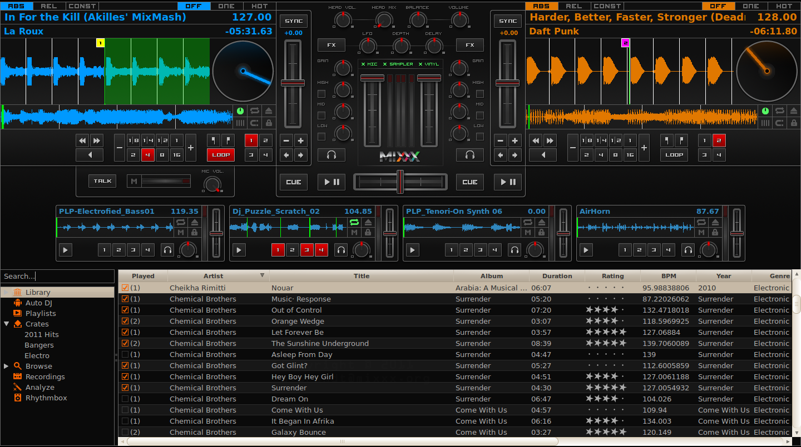
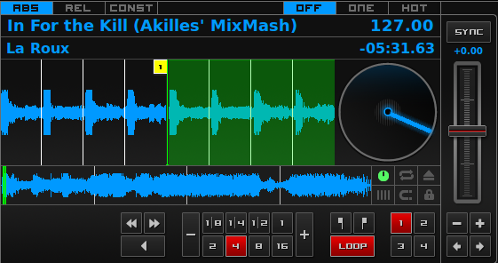
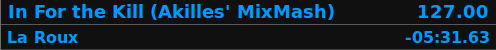
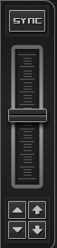
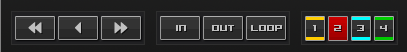
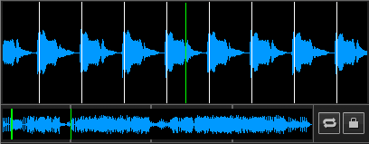
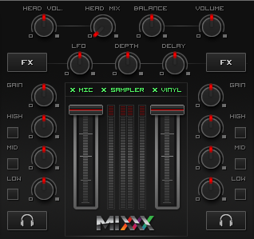
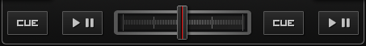

An Overview of the Mixxx Interface
**********************************

Welcome to the Mixxx interface. This is where the magic happens.
You are going to want to get very familiar with this interface because it is
the main way to use Mixxx. In this chapter, we present the default interface of
Mixxx and describe its elements, knobs and faders.

   The Mixxx interface - Deere skin

This is the Deere skin. It is the default skin supplied with Mixxx. There are a
variety of others skins included with Mixxx. You should explore them all to
figure out which one you prefer. This section will focus on Deere only.

The Deck Sections
=================

The :term:`deck` section allows you to control everything relating to a virtual
turntable deck. We are going to break this down into sections.

   A deck

Track Information
-----------------

The name of the loaded track is shown on top of each deck and the artist is
listed below. The number at the top right is the effective :term:`BPM` of the
track. This is the detected :term:`BPM` of the track, adjusted for the playback
rate of the track. For example, if the track is normally 100 BPM, and it is
playing at +5%, then the effective BPM will read 105 BPM. The number in the
bottom right is the total elapsed time in the track or the total remaining time
in the track. You can customize this in the Mixxx Preferences Interface section.

   The track information section of the deck

.. hint:: Tap the BPM to set the BPM to the speed you are tapping.

.. _interface-rate:

Rate Controls
-------------

   Rate control

The rate controls allow you to change the rate at which tracks are played. This
is very useful for :term:`beatmatching` two tracks together in a mix. The slider
adjusts the rate of the track. The percent that the track's rate is sped up or
slowed down is noted above the slider. At the center, it is +0.0%, which
indicates no change. The range of this slider is customizable in the Mixxx
Preferences Interface section.

The :term:`Sync` button changes the :term:`rate` of the track so that the
:term:`BPM` of the track matches that of the other deck. It also adjusts the
:term:`phase` of the track so that the two tracks' beats are aligned.
To sync only the tempo (BPM) to that of the other track, right-click on the
Sync button. The Sync button let you sync to the first deck (in numerical order)
that is playing a track and has a BPM detected. If no deck is playing, it syncs
to the first deck that has a BPM detected. Decks can't sync to samplers and
samplers can only sync to decks.

The plus and minus buttons increase and decrease the rate, respectively. If
right-clicked, they adjust the pitch in smaller steps. Similarly, the left and
right arrow buttons are :term:`pitch bend` buttons, and these adjust the pitch
temporarily. These can act as either a fixed :term:`pitch bend` or a
:term:`ramping pitch bend`. You can configure their functionality in the Mixxx
Preferences Interface section.

.. _interface-looping:
.. _interface-hotcues:

Loop Controls and Hotcues
-------------------------

         deck.
   :figclass: pretty-figures

   The looping, beatloop, hotcue, and fast-forward/rewind controls of the deck.

.. versionadded:: 1.11
   Loop roll feature

In this section, you can control loops, beatloops, hotcues and the playback
speed.  On the far left, you can :term:`fast-rewind`, :term:`fast-forward`, or
:term:`reverse` the deck, respectively.

The eight numbered buttons to the right of these buttons are the beatlooping
controls. Clicking on any numbered button in this section will set a loop of
that number of beats from the beat immediately following the current playback
position. Right-click to temporarily setup a rolling loop over the defined
number of beats. Playback will resume where the track would have been if it had
not entered the loop.

Clicking on the minus or plus button will either halve or double the
length of the loop. Tapping the :term:`loop <reloop>` button toggles whether the
loop is active or not.

Above the :term:`loop <reloop>` button are the :term:`in <loop in>` and
:term:`out <loop out>` buttons, which allow you to manually set the loop-in and
loop-out point. If the :term:`quantize` mode is enabled (see
:ref:`interface-waveform` section), then the loop points will automatically
snap to the nearest beat.

The hotcue section, the 4 numbers on the far right, are used to set and clear
hotcues. Clicking on a numbered button will set a hotcue. A marker with the
corresponding number will appear in the waveform with the same number as the
button and the button will turn red to indicate that the hotcue is set. If the
deck is playing, you can simply tap a hotcue to cause the deck to instantly jump
back to the location of the hotcue. To clear a hotcue, right-click on the
numbered button. If the :term:`quantize` mode is enabled (see
:ref:`interface-waveform` section), then the hotcues will automatically snap to
the nearest beat.

.. _interface-waveform:

The Waveform
------------

The waveform section of a deck allows you to visualize the audio changes that
occur throughout the track. The larger, zoomed-in waveform is called the
:term:`waveform overview`, while the smaller, zoomed-out version of the waveform
is called the :term:`waveform summary`. The white lines on the waveform overview
are called :term:`beat markers`, and they indicate the locations of beats in the
audio. The vertical line in the center of the waveform overview indicates the
playback point of the deck. Clicking on either the waveform or the spinning
vinyl widget allows you to scratch the track as if you were using vinyl or a
MIDI controller.

   The waveform overview and waveform summary of the deck

The six buttons at the bottom right allow you to configure the deck. Starting
from the top-left and moving counterclockwise the buttons are as follows:

* Show/Hide Vinyl Widget
* Toggle Repeat Mode
* Eject Track
* Beat-grid Adjust
* Toggle Quantize Mode
* Toggle Keylock

Repeat Mode
^^^^^^^^^^^

If enabled, repeat mode will jump back to the beginning and continue playing
when the track finishes.

Eject Track
^^^^^^^^^^^

Clicking this button ejects the track from the deck.

Beat-grid Adjust
^^^^^^^^^^^^^^^^

Clicking this button adjusts the track beat-grid so that the current position is
marked as a beat. This is useful if Mixxx was able to accurately detect the
track's :term:`BPM` but failed to align the beat markers on the beats.

.. seealso:: For more informations, go to the chapter :ref:`djing-bpm-detection`.

Toggle Quantize Mode
^^^^^^^^^^^^^^^^^^^^

In this mode, all cues, hotcues, loops, and beatloops will be automatically
adjusted (:term:`quantized`) so that they begin on a beat.

Toggle Keylock
^^^^^^^^^^^^^^
:term:`Keylock <key lock>` locks the track's pitch so that adjustments to its
tempo via the rate slider do not affect its pitch. This is useful if you would
like to speed up or slow down a track and avoid the "chipmunk" affect that
speeding up vocals has.

.. _interface-mixer:

The Mixer Section
=================

The mixer section allows you to control how the different decks and samplers are
mixed together.

   The mixer section

VU Meters and Channel Faders
----------------------------

In the center above the Mixxx logo are 4 :term:`VU meters <vu meter>`. The two
outer-most VU meters are for each deck, while the 2 inner-most VU meters are the
left and right VU meters for the master output. The two large faders on either
side of the VU meters are the deck volume faders. Adjusting these controls the
volume of each deck.

Above the VU meters are the optional section expansion buttons. If you click on
either "MIC", "SAMPLER", or "VINYL" then you will enable control sections for
interacting with the microphone, samplers, and vinyl control respectively.

Headphone and Master Mix Controls
---------------------------------

The top row of buttons control the headphones and master output. The head-mix
knob allows you to customize how much of the master output you hear in your
headphones. The head volume button adjusts your headphone volume. The
:term:`balance` knob allows you to adjust the balance (left / right orientation)
of the master output. Finally, the volume knob adjusts the volume of the master
output.

Equalizers and Gain Knobs
-------------------------

The low, mid, and high knobs allow you to change the filters of the audio. This
allows you to selectively reduce or boost certain frequency ranges of the
audio. The small boxes next to each knob are called :term:`kills <kill switch>`
and allow you to fully remove that frequency range.

Above these knobs, the gain knob allows you to adjust the gain of the deck. In
general, you should adjust this knob so that at full-volume the deck's audio is
just at the peak of the center VU meters. This is so you can achieve the widest
dynamic range for your track.

The PFL Button
--------------

The headphone button below the EQ knobs is called the :term:`pre-fader listen or
PFL <PFL>` button. Selecting this button allows you to listen to the deck in
your headphones.

Crossfader and Channel Volume
-----------------------------

   The crossfader section of the mixer

.. versionadded:: 1.11
   Reverse crossfader (Hamster style)

This section allows you control the playback of each deck and the fraction of
each deck that is mixed into the master output. The play/pause buttons play or
pause each deck. The :term:`cue` button sets or jumps to a cue point. The large
fader in the center is the :term:`crossfader`. This allows you to adjust the
proportion of the master mix which is made up by the decks and samplers on the
left side and the decks and samplers on the right side. With the crossfader all
the way to the left, you will only hear decks and samplers oriented towards the
left. Similarly, with the crossfader all the way to the right you will only hear
decks and samplers oriented towards the right.

You can reverse the configuration of the crossfader in
:menuselection:`Preferences --> Crossfader --> Reverse Crossfader`, so that the
right deck is on the left end of the crossfader and vice versa. This is also
known as *Hamster Style*.

The Sampler Section
===================

.. figure:: ../_static/Mixxx-111-Deere-Samplerdeck.png
   :align: center
   :width: 60%
   :figwidth: 100%
   :alt: A sample deck
   :figclass: pretty-figures

   A sample deck

.. versionadded:: 1.11
   Samplers can sync to decks

Samplers are miniature decks. They allow you to play short samples and jingles
in your mix. They come with a small overview waveform and a limited number of
controls. The title of the track and its BPM are displayed along the top row.

.. hint:: Tap the BPM to set the BPM to the speed you are tapping.

Clicking the Play button starts and pauses playback. Right-clicking on the
button will seek the play position to the beginning of the track.

The Sync button syncs the Sampler deck to a regular deck, as described in
:ref:`interface-rate`.

The numbered buttons are hotcues and work just like deck hotcues as described in
:ref:`interface-hotcues`. The headphone button is a :term:`PFL` button and the
knob to the right of it is a :term:`volume` knob for the sampler. The fader on
the far right controls the playback rate of the sampler, and the :term:`VU
meter` to the left of it visualizes the audio intensity of the sampler, allowing
you to adjust it as necessary.

The 4 configure buttons (in clockwise order from the top left) are:

* Repeat: Enable repeat for the sample.
* Eject: Eject the track from this deck.
* Mix Orientation: M for Middle, L for Left, R for Right. Clicking cycles
  through all the options.
* Keylock: Enable or disable keylock for the sampler.
