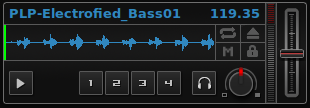
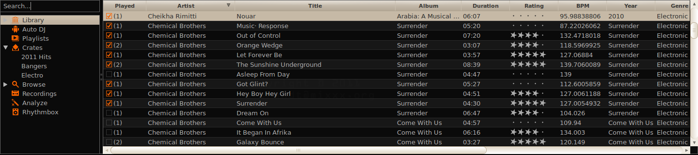

An Overview of the Mixxx Interface
**********************************

Welcome to the Mixxx interface. This is where the magic happens.
You are going to want to get very familiar with this interface because it is
the main way to use Mixxx. In this chapter, we present the default interface of Mixxx
and describe its elements, knobs and faders.

.. image:: ../_static/deere_large.png
   :align: center
   :width: 100%
   :alt: The Mixxx Deere skin

This is the Deere skin. It is the default skin supplied with Mixxx. There are a
variety of others skins included with Mixxx. You should explore them all to
figure out which one you prefer. This section will focus on Deere only.

The Deck Sections
=================

The :term:`deck` section allows you to control everything relating to a virtual
turntable deck. We are going to break this down into sections.

.. image:: ../_static/deere_deck_section.png
   :align: center
   :width: 70%
   :alt: A deck

Track Information
-----------------

The name of the loaded track is shown on top of each deck and the artist is
listed below. The number at the top right is the effective :term:`BPM` of the
track. This is the detected :term:`BPM` of the track, adjusted for the playback
rate of the track. For example, if the track is normally 100 BPM, and it is
playing at +5%, then the effective BPM will read 105 BPM. The number in the
bottom right is the total elapsed time in the track or the total remaining time
in the track. You can customize this in the `Mixxx Preferences` Interface
section.

.. image:: ../_static/deere_deck_track_info.png
   :align: center
   :width: 70%
   :alt: The track information section

Rate Controls
-------------

.. image:: ../_static/deere_deck_rate_control.png
   :align: left
   :width: 10%
   :alt: The rate control section of the deck

The rate controls allow you to change the rate at which tracks are played. This
is very useful for :term:`beatmatching` two tracks together in a mix. The slider
adjusts the rate of the track. The percent that the track's rate is sped up or
slowed down is noted above the slider. At the center, it is +0.0%, which
indicates no change. The range of this slider is customizable in the `Mixxx
Preferences`_ Interface section.

The :term:`Sync` button changes the :term:`rate` of the track so that the
:term:`BPM` of the track matches that of the other deck. It also adjusts the
:term:`phase` of the track so that the two tracks' beats are aligned.

The plus and minus buttons increase and decrease the rate, respectively. If
right-clicked, they adjust the pitch in smaller steps. Similarly, the left and
right arrow buttons are :term:`pitch bend` buttons, and these adjust the pitch
temporarily. These can act as either a fixed :term:`pitch bend` or a
:term:`ramping pitch bend`. You can configure their functionality in the `Mixxx
Preferences` Interface section.

Loop Controls and Hotcues
-------------------------

.. image:: ../_static/deere_deck_loop_hotcue.png
   :align: center
   :width: 70%
   :alt: The looping, beatloop, hotcue, and fast-forward/rewind controls.

In this section, you can control loops, beatloops, hotcues and the playback
speed.  On the far left, you can :term:`fast-rewind`, :term:`fast-forward`, or
:term:`reverse` the deck, respectively.

The eight numbered buttons to the right of these buttons are the beatlooping
controls. Clicking on any numbered button in this section will set a loop of
that number of beats from the beat immediately following the current playback
position. Clicking on the minus or plus button will either halve or double the
length of the loop. Tapping the :term:`loop <reloop>` button toggles whether the
loop is active or not.

Above the :term:`loop <reloop>` button are the :term:`in <loop in>` and
:term:`out <loop out>` buttons, which allow you to manually set the loop-in and
loop-out point. If the :term:`quantize` mode is enabled (see `The Waveform`
section), then the loop points will automatically snap to the nearest beat.

The hotcue section, the 4 numbers on the far right, are used to set and clear
hotcues. Clicking on a numbered button will set a hotcue. A marker with the
corresponding number will appear in the waveform with the same number as the
button and the button will turn red to indicate that the hotcue is set. If the
deck is playing, you can simply tap a hotcue to cause the deck to instantly jump
back to the location of the hotcue. To clear a hotcue, right-click on the
numbered button. If the :term:`quantize` mode is enabled (see `The Waveform`
section), then the hotcues will automatically snap to the nearest beat.

The Waveform
------------

The waveform section of a deck allows you to visualize the
audio changes that occur throughout the track. The larger, zoomed-in waveform is
called the :term:`waveform overview`, while the smaller, zoomed-out version of
the waveform is called the :term:`waveform summary`. The white lines on the
waveform overview are called :term:`beat markers`, and they indicate the
locations of beats in the audio. The vertical line in the center of the waveform
overview indicates the playback point of the deck.

.. image:: ../_static/deere_deck_waveform.png
   :align: center
   :width: 70%
   :alt: The deck waveform overview and waveform summary

The two buttons at the bottom right of this section are the :term:`repeat` and
:term:`key lock` buttons. Clicking the repeat button causes the track to repeat
once reaches its end. Clicking the keylock button enabes :term:`key lock` mode.

The Mixer Section
=================

.. image:: ../_static/deere_mixer.png
   :align: center
   :width: 70%
   :alt: The mixer section

Equalizers
----------

The PFL Button
--------------

Crossfader and Channel Volume
-----------------------------

.. image:: ../_static/deere_mixer_crossfader.png
   :align: center
   :width: 70%
   :alt: The crossfader section of the mixer

Headphone Controls
------------------

The Sampler Section
===================

The Library
===========

