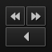
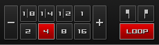
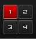

.. _interface-overview:

An Overview of the Mixxx Interface
**********************************

Welcome to the Mixxx interface. This is where the magic happens.
You are going to want to get very familiar with this interface because it is
the main way to use Mixxx. In this chapter, we present the default interface of
Mixxx and describe its elements, knobs and faders.

.. figure:: ../_static/deere_large.png
   :align: center
   :width: 100%
   :figwidth: 100%
   :alt: The Mixxx interface - Deere skin
   :figclass: pretty-figures

   The Mixxx interface - Deere skin

This is the Deere skin. It is the default skin supplied with Mixxx. There are a
variety of others skins included with Mixxx. You should explore them all to
figure out which one you prefer. This section will focus on Deere only.

.. _interface-decks:

The Deck Sections
=================

.. figure:: ../_static/deere_deck_section.png
   :align: center
   :width: 70%
   :figwidth: 100%
   :alt: A deck
   :figclass: pretty-figures

   A deck with a track loaded

The deck section allows you to control everything relating to a virtual
turntable :term:`deck`. We are going to break this down into sections.

.. _interface-track-info:

Track Information Display
-------------------------

.. figure:: ../_static/deere_deck_track_info.png
   :align: center
   :width: 60%
   :figwidth: 100%
   :alt: The track information section of the deck
   :figclass: pretty-figures

   The track information section of the deck

**Track Title**
  The title of the track that was loaded into a deck is displayed on top. This
  is the same as the title listed under the :guilabel:`Title` column heading in
  the Mixxx library. This information is initially loaded from the tracks
  :term:`metadata`.

**Track Artist**
  The title of the track is listed below. It is the same as listed under the
  :guilabel:`Artist` column heading in the Mixxx library.

**BPM (Tempo)**
  The number at the top right is the effective :term:`BPM` of the track. This is
  the detected :term:`BPM` of the track, adjusted for the playback rate of the
  track. For example, if the track is normally 100 BPM, and it is playing at
  +5%, then the effective BPM will read 105 BPM.

  .. hint:: Click directly on the BPM display and tap with the beat to set the
            BPM to the speed you are tapping. You can also use a keyboard
            shortcut, go to :ref:`control-keyboard` for more informations.

**Time Elapsed/Remaining**
  By default it displays the total elapsed time in the track up to the
  millisecond. Clicking on the display switches to the *Time Remaining* view,
  which indicates how much time is left before the track reaches the end.
  You can change the default in :menuselection:`Preferences --> Interface -->
  Position Display`.

.. _interface-waveform:

Waveform Displays
=================

.. figure:: ../_static/deere_deck_waveform.png
   :align: center
   :width: 60%
   :figwidth: 100%
   :alt: The deck waveform summary and waveform overview
   :figclass: pretty-figures

   The waveform summary and waveform overview of the deck

The waveform section of a deck allows you to visualize the audio changes that
occur throughout the track, you can basically "see" your music.

**Waveform summary**
  The big waveform summary shows the waveform envelope of the track near the
  current playback position and is updated in realtime. The mouse can be used on
  the waveform to pause, scratch, spin-back or throw the tracks. Right-clicking
  on the waveforms allows you to drag with the mouse to make temporary pitch
  adjustments.

  .. hint :: You can select from different types of displays for the waveform,
             which differ primarily in the level of detail shown in the
             waveform, in :menuselection:`Preferences --> Interface -->
             Waveform Display --> Display type`.

**Waveform overview**
  The smaller, zoomed-out version of the waveform shows the various markers
  within the track as well as the waveform envelope of the entire track. This is
  useful because they allow DJs to see breakdowns far in advance. Clicking
  somewhere on the waveform allows you to jump to an arbitrary position in the
  track.

**Waveform Zoom**
  Using the mouse-wheel everywhere in the waveform summary will zoom the
  waveform in or out. You can choose whether or not to synchronize the zoom
  level between the decks in :menuselection:`Preferences --> Interface -->
  Waveform Display --> Synchronize`.

**Waveform Marker**
  While mixing, various additional markers can appear on the waveforms:

* **Position marker**: The static vertical line in the center of the waveform
  summary indicates the playback point of the deck.
* **Beat marker**: The regular white lines on the waveform summary indicate the
  locations of beats in the audio, also called the :term:`beatgrid`.
* **Cue marker**: Indicates the position of the :term:`cue point <cue>`.
* **Hotcue marker**: Indicate the position and number of a :term:`hotcue`
  point if set.
* **Loop-in/Out marker**: Indicate the beginning and the end of a loop.
* **Loop overlay**: Is drawn between the Loop-in/Out markers and changes color
  depending on whether a loop is activated or not.
* **Track ending notification**: If the waveform overview flashes red, only 30
  seconds are left before the track reaches the end.

.. seealso:: To learn how to get most out of the waveforms while mixing, go to
             the chapter :ref:`waveform-displays`.

.. warning :: If you have a slower computer and notice performance issues with
              Mixxx, try to lower the frame rate or change the level of detail
              shown in the waveform in in :menuselection:`Preferences -->
              Interface --> Waveform Display`.

.. _interface-button-grid:

Deck Options Button Grid
------------------------

   The Options Button Grid of the deck

The six buttons at the bottom right below the waveform allow you to configure
the deck. Starting from the top-left and moving counterclockwise the buttons
are as follows:

**Show/Hide Vinyl Widget**
  The line on the vinyl widget rotates if the track moves. It is similar to the
  position marker found on scratch records. Use the mouse on the vinyl widget to
  pause, scratch, spin-back or throw tracks - just like a real record. The Vinyl
  Widget is hidden by default.

  If :term:`Vinyl control` is enabled, it can optionally display the time-coded
  vinyl signal quality. Activate the option in :menuselection:`Preferences -->
  Vinyl Control --> Show Signal Quality in Skin`.

**Repeat Mode Toggle**
  If enabled, the repeat mode will jump back to the beginning and continue
  playing when the track finishes.

**Eject Track Button**
  Clicking this button ejects the track from the deck. Alternatively you can use
  a keyboard shortcut, go to the chapter :ref:`control-keyboard` for more
  informations.

**Beat-grid Adjust Button**
  Clicking this button adjusts the track beat-grid so that the current position
  is marked as a beat. This is useful if Mixxx was able to accurately detect the
  track's :term:`BPM` but failed to align the beat markers on the beats. For
  more informations, go to the chapter :ref:`djing-bpm-detection`.

**Quantize Mode Toggle**
  If enabled, all cues, hotcues, loops, and beatloops will be automatically
  :term:`quantized <quantization>` so that they begin on a beat.

**Keylock Toggle**
  :term:`Keylock <key lock>` locks the track's pitch so that adjustments to its
  tempo via the rate slider do not affect its pitch. This is useful if you would
  like to speed up or slow down a track and avoid the "chipmunk" affect that
  speeding up vocals has.

.. _interface-vc-mode:

Vinyl Control Mode and Cueing controls
======================================

   The Vinyl Control Mode and Cueing controls of a deck

The control above the waveforms relay to the :term:`vinyl control` feature in
Mixxx and is **hidden** by default in the Mixxx interface. Click the
:ref:`VINYL section expansion button <interface-expansion-buttons>` in the mixer
section, or use the specific :ref:`appendix-shortcuts`, to unhide the controls.

**Abs/Rel/Const button**

* **Absolute mode**: The track position equals needle position and speed.
* **Relative mode**: The track speed equals needle speed regardless of needle
  position.
* **Constant mode**: The track speed equals last known-steady speed regardless
  of needle input.

**Off/One/Hot button**

This button determines how :term:`cue points <cue>` are treated in vinyl
control relative mode:

* **Off**: Cue points are ignored.
* **One Cue**: If the needle is dropped after the cue point, the track will seek
  to that cue point.
* **Hot Cue**: The track will seek to nearest previous :term:`hotcue` point.

.. seealso :: For more information on how to use Vinyl control in your setup, go
              to the chapter :ref:`vinyl-control`.

.. _interface-rate:

Rate Controls
-------------

.. figure:: ../_static/deere_deck_rate_control.png
   :align: left
   :width: 70%
   :figwidth: 15%
   :alt: The rate control section of the deck
   :figclass: pretty-figures

   Rate control

The rate controls allow you to change the rate at which tracks are played. This
is very useful for :term:`beatmatching` two tracks together in a mix. The slider
adjusts the rate of the track. The percent that the track's rate is sped up or
slowed down is noted above the slider. At the center, it is +0.0%, which
indicates no change. The range of this slider is customizable in the Mixxx
Preferences Interface section.

The :term:`Sync` button changes the :term:`rate` of the track so that the
:term:`BPM` of the track matches that of the other deck. It also adjusts the
:term:`phase` of the track so that the two tracks' beats are aligned.
To sync only the tempo (BPM) to that of the other track, right-click on the
Sync button. The Sync button let you sync to the first deck (in numerical order)
that is playing a track and has a BPM detected. If no deck is playing, it syncs
to the first deck that has a BPM detected. Decks can't sync to samplers and
samplers can only sync to decks.

The plus and minus buttons increase and decrease the rate, respectively. If
right-clicked, they adjust the pitch in smaller steps. Similarly, the left and
right arrow buttons are :term:`pitch bend` buttons, and these adjust the pitch
temporarily. These can act as either a fixed :term:`pitch bend` or a
:term:`ramping pitch bend`. You can configure their functionality in the Mixxx
Preferences Interface section.

.. _interface-transport:

Transport Controls
==================

   The transport controls of the deck

**Fast-Rewind button**
  As long as the button is pressed, the track will play in reverse with
  increased speed. Right-clicking on the button will seek the play position to
  the beginning of the track.

**Fast-Forward button**
  As long as the button is pressed, the track will play with increased speed.
  Right-clicking on the button will seek the play position to the end of the
  track.

**Reverse button**
  As the name suggests, this button plays a track backwards.

.. _interface-looping:

Loop Controls
=============

   The beatloop and looping controls of the deck

In this section of the Mixxx interface you can control (beat-)loops and set the
loop points of a track.

**Beatlooping Buttons**

* **Instant loop**: The numbered buttons represents a different :term:`bar`
  length. Clicking on any of that buttons will set a loop of the defined
  number of beats from the beat immediately following the current playback
  position. If a loop is set, a loop overlay will be drawn on the
  :ref:`waveforms <interface-waveform>`.
* **Loop roll**:

  .. versionadded:: 1.11

  Right-click on any of the numbered loop buttons to temporarily setup a rolling
  loop over the defined number of beats. Playback will resume where the track
  would have been if it had not entered the loop.
* **Double loop**: Clicking on the plus button will double the current loop's
  length up to 64 bars. The length of the loop overlay in the waveform will
  increase accordingly.
* **Halve loop**: Clicking on the minus button will halve the current loop's
  length down to 1/32 bars. The length of the loop overlay in the waveform will
  decrease accordingly.

**Loop Buttons**

* **Loop-In**: This button allow you to manually set the start point of a loop.
  A loop-in marker is placed on the waveform indicating the position.
  If clicked when a loop was already set, it moves the start point of a loop
  to a new position.
* **Loop-Out**: This button allow you to manually set the end point of a loop.
  A loop-in out is placed on the waveform indicating the position.If clicked when
  a loop was already set, it moves the start point of a loop to a new position.
* **Loop**: Also dubbed Reloop, this button toggles whether the loop is active
  or not. This works for manually placed loops as well as automatic loops set by
  the beatlooping buttons. Depending on the current status of the loop, the
  loop overlay on the waveforms changes color.

.. hint:: If you are playing inside a loop and want to move the end point
          beyond its current position in the track, click on the *Loop* button
          first and when the play position reaches the wanted position on the
          Loop-Out button.

.. seealso:: If the :term:`quantize <quantization>` mode is enabled, the loops
             will automatically snap to the nearest beat. This is disabled by
             default. Click on the *Quantize Mode Toggle* to enable this mode,
             go to the :ref:`interface-button-grid` section for more
             informations.

.. _interface-hotcues:

Hotcue Controls
===============

   The hotcue controls of the deck

To jump in between different parts of a track, you can use these 4 numbered
buttons. You can also use keyboard shortcuts, go to :ref:`control-keyboard` for
more informations.

Setting Hotcues
---------------

Clicking on a numbered button will set a :term:`hotcue` at the current play
position on the track. A marker with the corresponding number will appear in the
waveform and the button will lit up to indicate that the hotcue is set.

Playing Hotcues
---------------

* **While playing**: Tap a hotcue button to cause the track to instantly jump to
  the location of the hotcue and continue playing. If you are playing inside a
  loop and tap a hotcue whose position is outside of the loop, then the track
  still instantly jump to the hotcue but the loop will be deactivated.

* **While stopped**: Tap a hotcue button to cause the track to instantly jump to
  the location of the hotcue and start playing as long as the button is pressed.
  Press the Play :ref:`keyboard shortcut <control-keyboard>` while the hotcue
  button is pressed to continue playback, then release the hotcue button.

Deleting Hotcues
----------------
To delete a hotcue, right-click on the numbered button. The marker in the
waveform will de deleted as well.

.. note:: Mixxx supports up to 36 hotcues per deck, 4 of them are visible in the
          user interface. You can customize your
          :ref:`keyboard <advanced-keyboard>` or
          :ref:`controller <advanced-controller>` mappings to use all of them.

.. seealso:: Just as with the loops (see above), if the
             :term:`quantize <quantization>` mode is enabled, the hotcues will
             automatically snap to the nearest beat. This is disabled by
             default. Click on the *Quantize Mode Toggle* to enable this mode,
             go to the :ref:`interface-button-grid` section for more
             informations.

.. _interface-mixer:

The Mixer Section
=================

The mixer section allows you to control how the different decks and samplers are
mixed together.

.. figure:: ../_static/deere_mixer.png
   :align: center
   :width: 50%
   :figwidth: 100%
   :alt: The mixer section
   :figclass: pretty-figures

   The mixer section

VU Meters and Channel Faders
----------------------------

In the center above the Mixxx logo are 4 :term:`VU meters <vu meter>`. The two
outer-most VU meters are for each deck, while the 2 inner-most VU meters are the
left and right VU meters for the master output. The two large faders on either
side of the VU meters are the deck volume faders. Adjusting these controls the
volume of each deck.

Above the VU meters are the optional section expansion buttons. If you click on
either :guilabel:`MIC`, :guilabel:`SAMPLER`, or :guilabel:`VINYL` then you will
enable control sections for interacting with the microphone, samplers, and vinyl
control respectively.

Headphone and Master Mix Controls
---------------------------------

The top row of buttons control the headphones and master output. The head-mix
knob allows you to customize how much of the master output you hear in your
headphones. The head volume button adjusts your headphone volume. The
:term:`balance` knob allows you to adjust the balance (left / right orientation)
of the master output. Finally, the volume knob adjusts the volume of the master
output.

Equalizers and Gain Knobs
-------------------------

The low, mid, and high knobs allow you to change the filters of the audio. This
allows you to selectively reduce or boost certain frequency ranges of the
audio. The small boxes next to each knob are called :term:`kills <kill switch>`
and allow you to fully remove that frequency range.

Above these knobs, the gain knob allows you to adjust the gain of the deck. In
general, you should adjust this knob so that at full-volume the deck's audio is
just at the peak of the center VU meters. This is so you can achieve the widest
dynamic range for your track.

The PFL Button
--------------

The headphone button below the EQ knobs is called the :term:`pre-fader listen or
PFL <PFL>` button. Selecting this button allows you to listen to the deck in
your headphones.

Crossfader and Channel Volume
-----------------------------

.. figure:: ../_static/deere_mixer_crossfader.png
   :align: center
   :width: 70%
   :figwidth: 100%
   :alt: The crossfader section of the mixer
   :figclass: pretty-figures

   The crossfader section of the mixer

.. versionadded:: 1.11
   Reverse crossfader (Hamster style)

This section allows you control the playback of each deck and the fraction of
each deck that is mixed into the master output. The play/pause buttons play or
pause each deck. The :term:`cue` button sets or jumps to a cue point. The large
fader in the center is the :term:`crossfader`. This allows you to adjust the
proportion of the master mix which is made up by the decks and samplers on the
left side and the decks and samplers on the right side. With the crossfader all
the way to the left, you will only hear decks and samplers oriented towards the
left. Similarly, with the crossfader all the way to the right you will only hear
decks and samplers oriented towards the right.

You can reverse the configuration of the crossfader in
:menuselection:`Preferences --> Crossfader --> Reverse Crossfader`, so that the
right deck is on the left end of the crossfader and vice versa. This is also
known as *Hamster Style*.

The Sampler Section
===================

.. figure:: ../_static/Mixxx-111-Deere-Samplerdeck.png
   :align: center
   :width: 60%
   :figwidth: 100%
   :alt: A sample deck
   :figclass: pretty-figures

   A sample deck

.. versionadded:: 1.11
   Samplers can sync to decks

Samplers are miniature decks. They allow you to play short samples and jingles
in your mix. They come with a small overview waveform and a limited number of
controls. The title of the track and its BPM are displayed along the top row.

.. hint:: Tap the BPM to set the BPM to the speed you are tapping.

Clicking the Play button starts and pauses playback. Right-clicking on the
button will seek the play position to the beginning of the track.

The Sync button syncs the Sampler deck to a regular deck, as described in
:ref:`interface-rate`.

The numbered buttons are hotcues and work just like deck hotcues as described in
:ref:`interface-hotcues`. The headphone button is a :term:`PFL` button and the
knob to the right of it is a :term:`volume` knob for the sampler. The fader on
the far right controls the playback rate of the sampler, and the :term:`VU
meter` to the left of it visualizes the audio intensity of the sampler, allowing
you to adjust it as necessary.

The 4 configure buttons (in clockwise order from the top left) are:

* Repeat: Enable repeat for the sample.
* Eject: Eject the track from this deck.
* Mix Orientation: M for Middle, L for Left, R for Right. Clicking cycles
  through all the options.
* Keylock: Enable or disable keylock for the sampler.
