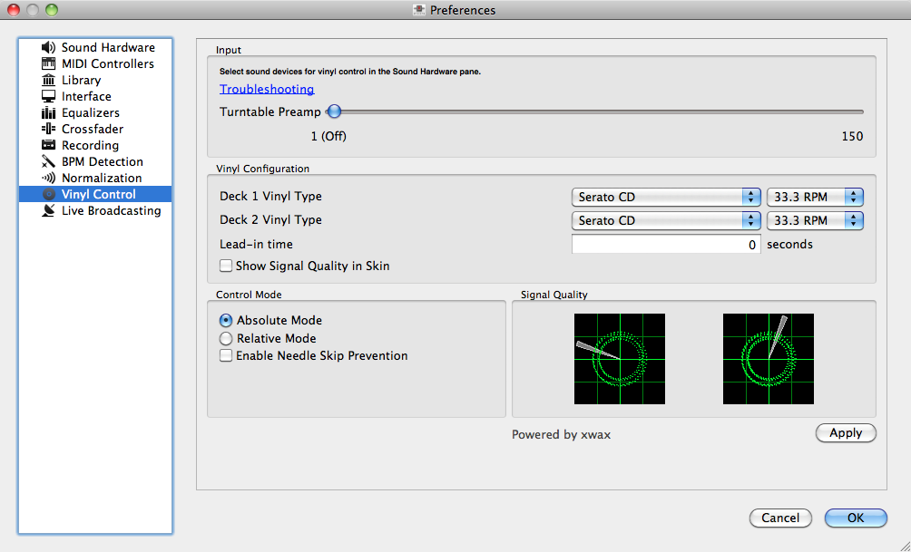

Vinyl Control
*************

Vinyl control allows a user to manipulate the playback of a track in Mixxx using
a real turntable as a controller. In effect, it simulates the sound and feel of
having your digital music collection on vinyl. Many DJs prefer the tactile feel
of vinyl, and vinyl control allows that feel to be preserved while retaining the
benefits of using digital audio.

   Mixxx preferences - Setting up vinyl control

You can configure vinyl control through the Vinyl Control pane in the
preferences. More information about Mixxx's vinyl control and supported hardware
configurations is available on the `vinyl control wiki page
<http://mixxx.org/wiki/doku.php/vinyl_control>`_.

Input Device Selection
======================

Mixxx can be controlled by up to 2 decks with either timecoded vinyl or
timecoded CDs. In the Sound Hardware Input tab in the Mixxx Preferences, select
the soundcard(s) which your decks are plugged into for Vinyl Control 1 and
2. In the channel selection drop-down menu, select the channel pairs
corresponding to the plug on your soundcard that your deck(s) are plugged into.

Mixxx supports vinyl control input through a single soundcard with 4-channels of
input (two stereo line-in jacks), or through two separate soundcards which each
have 2-channels of input (a single stereo line-in jack). Vinyl control requires
the use of stereo line-in jacks - Mono or microphone inputs will not work.

Turntable Input Preamp
======================

Many turntables provide unamplified "phono level" output which must be boosted
to a "line level" signal. Normally, a mixer provides this amplification, but if
you're plugging a turntable's phono output directly into your soundcard, Mixxx
can do the amplification. The "Turntable Input Preamp" slider allows you to
adjust the level of preamplification applied to your decks' signal.

However it is always preferable to use a proper phono preamplifier if you have
one.

Vinyl Configuration
===================

Several different types of timecoded media can be used to control
Mixxx. Configure the "Vinyl Type" drop-down menu to match what type of
timecoded vinyl or CD you are using on your decks.

The "Lead-in Time" setting allows you to set a dead-zone at the start of your
vinyl or CD, where the time code will be ignored. This is useful in situations
where the time code begins very close to the edge of a vinyl which can make
back-cueing over the first beat in a track tricky to do without your turntable's
needle falling off the vinyl. Setting a lead-in time of 20 seconds or more helps
alleviate this by giving you more room on the vinyl to cue with. It's also
useful when you've worn the grooves at the edge of a control record to the point
that it no longer works reliably: you simply set the lead-in so that the start
of the tracks begin in good groove area. You can keep doing this until you run
out of groove area, thereby decreasing your record replacement frequency.

Signal Quality
==============

A successful vinyl control setup hinges on good signal quality. Many factors can
affect signal quality, but the most important one is ensuring the volume level
of your timecode signal is moderate. A signal that is too loud or too quiet will
cause adverse performance, often characterized by a loss of position data
causing absolute mode to behave like relative mode. For more information on
improving signal quality and troubleshooting, please see the vinyl control wiki
page.

Mixxx represents your timecode signal quality as a circular representation of
the vinyl control audio signal itself. The two graphs correspond to your
"Deck 1" and "Deck 2" input devices. If your vinyl signal is working, you should
see a round, green circle drawn with two lines. This vinyl "doughnut" should be
as circular as possible, and the lines should be clear with a minimum amount of
fuzz. As the vinyl signal gets worse, you'll see the color of the doughnut
change from green to red. An otherwise good-looking doughnut that is solid red
indicates an incorrect choice of vinyl control source. For example, maybe you
selected side B of the Serato vinyl, but your record is on side A.
Also, there should be a rotating radar sweep that represents the direction your
record is spinning. If the radar sweep is going backwards, you probably have a
wiring problem in your turntable. Try reversing the left and right inputs on
your turntable. You may also have to rewire the headshell.

The doughnut should be about half the width of the graph. If the volume is too
low or two high, the doughnut will be much smaller or much larger. The
"Turntable Input Preamp" setting can be adjusted to boost the volume.

Control Mode
============

Mixxx has three control modes regardless of which control records you use.

"Absolute Mode" provides Mixxx with both pitch and position information from the
timecode, and allows you to seek by needle dropping on your vinyl or seeking on
your CDJ. Once a track is playing, Mixxx will not allow you to select Absolute
mode. Otherwise, the track would suddenly jump to a new position. Make sure the
record is stopped and then you're free to select Absolute mode.

"Relative Mode" takes the position to be relative to your deck's starting
point, and only controls the pitch in Mixxx. It is not possible to seek using
your deck in relative mode, with one exception. If you drop the needle in the
"Lead-in Time" area (see "Vinyl Configuration" above), Mixxx will seek back to
the beginning of the track.

"Constant Mode" is a special mode that is usually
only activated when Mixxx needs to keep playing a track even if the vinyl
control signal isn't present. Constant mode is automatically enabled when the
needle reaches the end of a vinyl control record, or if "Needle-skip Prevention"
is enabled and a needle skip is detected.

"Needle-skip Prevention" allows Mixxx
to detect and ignore small changes in needle position, such as when you've
accidentally bumped your turntable. When Mixxx detects a needle skip, it will
engage Constant mode and the vinyl indicator (normally a green rectangle) will
become red. Needle-skip prevention can be advantageous in a live
performance environment but the downside is that it can be accidentally enabled
during scratching, causing your track to play forward regardless of the
turntable's pitch. Consequently, disabling needle-skip prevention is recommended
for scratch performances.

Single Deck Control
===================

If you only have one turntable, you can still use Mixxx to play your sets. In
the Input tab of the Sound Hardware preference pane, use the same audio input
for both Vinyl Control decks.

When mixing, you'll have one track playing automatically while the other is
controlled by the turntable. Start by enabling vinyl control on the first deck,
and start mixing. When you're ready to cue up the next record, just disable
vinyl control on the first deck and enable it on the second deck. Playback
will continue on the first deck without interruption. Cue up the second track
and mix it in. When you're ready to cue the first deck again, just toggle the
second deck off and the first deck on again. Future versions of Mixxx will have
a single button to toggle vinyl control between the two decks to make this
transition easier.

End-Of-Record Mode
==================

Sometimes the track you are playing is longer than the timecode area on your
record. If the needle reaches the end of the vinyl timecode, Mixxx will enter
a special "end-of-record" mode. When this happens, the vinyl indicator (usually
a green rectangle) will blink orange as a warning. At the same time, Mixxx
will automatically enable "Constant Mode," and will ignore the turntable's pitch.
At this point the track will simply continue playing until the end. When you
load a new track, End-Of-Record mode will be automatically disabled and Constant
Mode turned off.

When you're in End-Of-Record Mode and you want to still use the turntable for
pitch control, simply lift the needle and place it anywhere in the main timecode
area. Trust me, it's ok, the track won't stop playing. As soon as Mixxx detects
that the needle has settled, it will automatically switch to Relative mode.

Cueing Modes
============

Mixxx has two optional cueing modes for vinyl control which only apply to
"Relative Mode". These modes are useful for quickly seeking to specific
positions in a track without touching the laptop. Turntablists often need to
find a break or a vocal sample, and cueing modes make these easy to find.

The first is just called "Cue". In this mode, when you drop the needle on the
record *after* the Cue point, Mixxx will seek to that cue point. In the second
mode, "Hot Cue," when the needle is dropped Mixxx will seek to the nearest
hotcue point, working backwards. So if you have a hotcue at the one-minute mark,
and another at the two-minute mark, you can drop the needle anywhere between one
and two minutes and Mixxx will seek to the one-minute hotcue.

Control Track
=============

Some vinyl control records have a special portion of grooves near the center
of the record for selecting and loading tracks in the user interface. You can
see these grooves because there is a gap between the main timecode area and the
inner circle. Some control records have not been tested with Mixxx, and their
control areas are not supported. Serato CV02 Vinyl and Traktor Vinyl MK1 are
known to work. Serato CV02 CDs are known not to work.

Just drop the needle in the control area and let the record play forward or
backward. The highlighted row in the library should move up or down. Simply
lift the needle and drop it anywhere in the main timecode area to load the
track.
