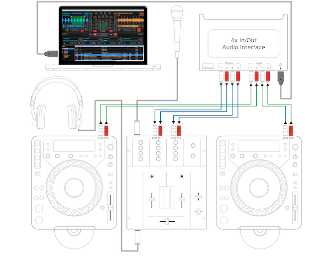
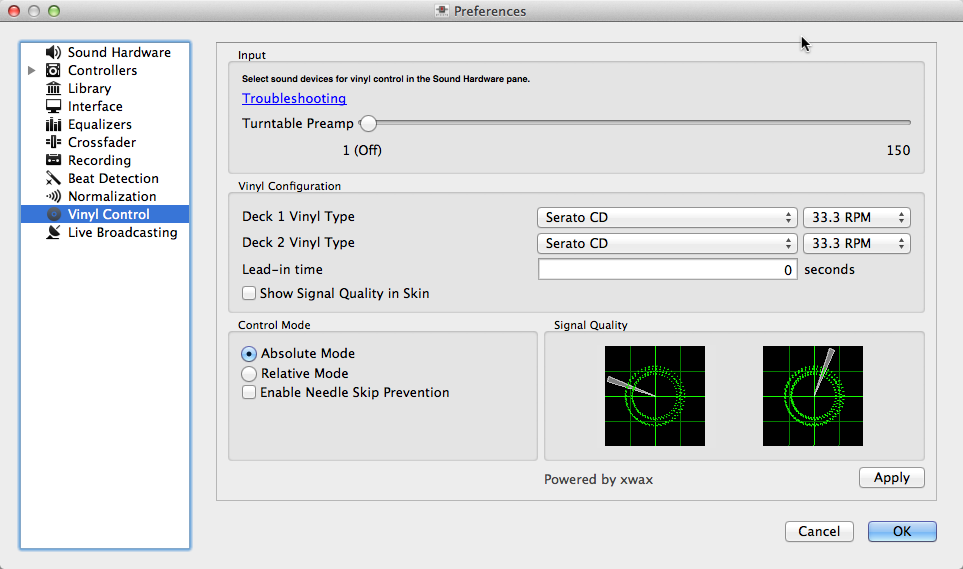
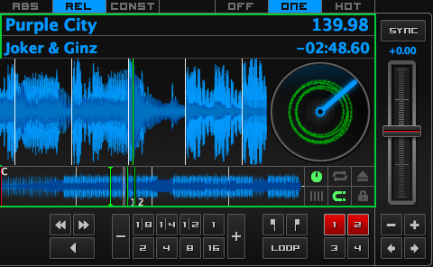

.. include:: /shortcuts.rstext

.. _vinyl-control:

Vinyl Control
*************

.. sectionauthor::
   Owen Williams <owilliams@mixxx.org>
   T.Rafreider <trafreider@mixxx.org>
   S.Brandt <s.brandt@mixxx.org>

Vinyl control allows a user to manipulate the playback of a track in Mixxx using
a real turntable as a controller. In effect, it simulates the sound and feel of
having your digital music collection on vinyl. Many DJs prefer the tactile feel
of vinyl, and vinyl control allows that feel to be preserved while retaining the
benefits of using digital audio.

How does it work?
=================

Vinyl control uses special timecode records or CD's which are placed on real
turntables or :term:`CDJ`. The audio output of the turntables is plugged into a
computer on which Mixxx is running. When a record is played on one of the
attached turntables, Mixxx reads the timecode from the record and uses the
information to manipulate whatever track is loaded.

What do I need to use it?
=========================

It is possible to use Mixxx's vinyl control with several hardware setups, but
the basic ones are:

**Setup 1: Vinyl DJ**

  Two timecode vinyls, two turntables with phono pre-amplifiers (or line-out),
  and two stereo sound inputs.

  You can try skipping the phono pre-amps if you use the software pre-amp in
  Mixxx on the Vinyl Control preferences pane. This may not work for everyone.
  Line-level signals are preferred and recommended.

  For turntables a typical setup is depicted in the figure below.  First,
  connect the RCA cables from the turntables to the inputs on your sound card.
  Second, connect the outputs of your sound card to the inputs on your mixer.

.. figure:: ../_static/mixxx_setup_timecode_vc.png
   :align: center
   :width: 90%
   :figwidth: 100%
   :alt: Using Mixxx together with turntables and external mixer
   :figclass: pretty-figures

   Using Mixxx together with turntables and external mixer

.. note:: You must set the input mode of your sound card to *phono* if you have
          standard turntables. Many modern turntables have a *Line/Phono* select
          switch.  If yours does, make sure it matches the input or switch
          setting on your sound card.

**Setup 2: CDJ**

  Two timecode CDs, two CD decks, and two stereo sound inputs.

  Setting up CDJs for use with time-code CDs is similar to setting up
  turntables. The figure below outlines a typical configuration. First,
  connect the RCA cables of the CDJs to an inputs of your sound card. Second,
  connect the inputs of your mixer to the outputs of your sound card. Make sure
  the input mode of your sound card is set to *Line*.

   Using Mixxx together with CDJs and external mixer

**Sound inputs**

* It is recommended to use a proper DJ sound card that has **multiple** stereo
  line inputs on it.
* Alternatively you can use two sound cards, each with a single stereo line in.

Mixxx supports vinyl control input through a single soundcard with at least
4-channels of input (two stereo line-in jacks), or through two separate
soundcards which each have 2-channels of input (a single stereo line-in jack).
Vinyl control requires the use of stereo line-in jacks - Mono or microphone
inputs will not work.

It is strongly recommended to use a soundcard that comes with native low latency
drivers such as ASIO (Windows) or CoreAudio (Mac). Linux users depend on the
quality of the corresponding open source driver.

.. note:: For best scratch performance with vinyl control, we recommend using a
          system capable of :term:`latencies <latency>` of 10ms. With higher
          latencies the scratch sound will start to become distorted.

Supported Timecode media
------------------------

.. versionchanged:: 1.11
   Added MixVibes DVS V2 Vinyl support

You can use any of the timecode media supported by Mixxx:

+----------------------------------------+---------------------+
| Type                                   | Responsiveness      |
+========================================+=====================+
| Serato CV02 Vinyl                      | Very high           |
+----------------------------------------+---------------------+
| Serato CV02 CD                         | Very high           |
+----------------------------------------+---------------------+
| Traktor Scratch MK1 Vinyl              | Very high           |
+----------------------------------------+---------------------+
| Traktor Scratch MK2 Vinyl              | Not supported       |
+----------------------------------------+---------------------+
| MixVibes DVS V2 Vinyl                  | Very high           |
+----------------------------------------+---------------------+

At the present time, Serato records are recommended if you are looking to buy
vinyl. If you want to use CDs, you can download a free copy for personal use
from `Serato`_.

.. _Serato: http://serato.com/downloads/scratchlive-controlcd/

.. _vinyl-control-config:

Configuring Input and Output devices
====================================

.. todo:: Add screenshot, proofread connection guide below, add note about
          empty MASTER drop-down menu

Mixxx can be controlled by up to 2 decks with either timecoded vinyl or
timecoded CDs.

#. Open :menuselection:`Preferences --> Sound Hardware`
#. Select the :guilabel:`Input` tab
#. From the :guilabel:`Vinyl Control 1` and :guilabel:`Vinyl Control 2`
   drop-down menus, select the soundcard(s) which your decks are plugged into
#. In the channel selection drop-down menu, select the channel pairs
   corresponding to the plug on your soundcard that your deck(s) are plugged
   into, typically :guilabel:`Channels 1-2` and :guilabel:`Channels 3-4`
#. Click :guilabel:`Apply` to save the changes.
#. Select the :guilabel:`Output` tab
#. Specified :guilabel:`Deck 1` and :guilabel:`Deck 2` to route Mixxx's output
   directly to the external mixer
#. Click :guilabel:`Apply` to save the changes.

Configuring Vinyl Control
=========================

   Mixxx preferences - Setting up vinyl control

You can configure vinyl control in
:menuselection:`Preferences --> Vinyl Control`.

Turntable Input Preamp
----------------------

Many turntables provide unamplified “phono level” output which must be boosted
to a “line level” signal. Normally, a mixer provides this amplification, but if
you're plugging a turntable's phono output directly into your soundcard, Mixxx
can do the amplification. The :guilabel:`Turntable Input Preamp` slider allows
you to adjust the level of preamplification applied to your decks' signal.
However it is always preferable to use a proper phono preamplifier if you have
one.

Vinyl Configuration
-------------------

* **Vinyl Type**: Several different types of timecoded media can be used to
  control Mixxx. Configure the drop-down menus to match what type of timecoded
  media you are using on your decks.
* **Deck Vinyl Tempo**: Change this if you prefer to scratch with your
  turntable or CDJ set at 45 RPM, default is 33 RPM.
* **Lead-in Time**: Allows you to set a dead-zone at the start of your vinyl or
  CD, where the time code will be ignored. This is useful in situations where
  the time code begins very close to the edge of a vinyl which can make
  back-cueing over the first beat in a track tricky to do without your turntable's
  needle falling off the vinyl. Setting a lead-in time of 20 seconds or more
  helps alleviate this by giving you more room on the vinyl to cue with. It's
  also useful when you've worn the grooves at the edge of a control record to
  the point that it no longer works reliably: you simply set the lead-in so that
  the start of the tracks begin in good groove area. You can keep doing this
  until you run out of groove area, thereby decreasing your record replacement
  frequency.
* **Show Signal Quality in Skins**: If enabled, a circular representation of the
  incoming time-code signal is displayed in real-time on the
  :ref:`Vinyl Widget <interface-button-grid>` in the Mixxx Interface.

.. hint:: Although not recommended, you can use different kinds of timecode
          media per deck.

.. _vinyl-control-modes:

Control Mode
------------

Mixxx has three control modes regardless of which control records you use.

* **Absolute Mode**: Provides Mixxx with both pitch and position information
  from the timecode, and allows you to seek by needle dropping on your vinyl or
  seeking on your CDJ. Once a track is playing, Mixxx will not allow you to
  select Absolute mode. Otherwise, the track would suddenly jump to a new
  position.  Make sure the record is stopped and then you're free to select
  Absolute mode.
* **Relative Mode**: Takes the position to be relative to your deck's starting
  point, and only controls the pitch in Mixxx. It is not possible to seek using
  your deck in relative mode, with one exception.  If you drop the needle in the
  “Lead-in Time” area (see `Vinyl Configuration`_), Mixxx will seek back to
  the beginning of the track.
* **Constant Mode**: This special mode is usually only activated when Mixxx
  needs to keep playing a track even if the vinyl control signal isn't present.
  Constant mode is automatically enabled when the needle reaches the end of a
  vinyl control record, or if “Needle-skip Prevention” is enabled and a needle
  skip is detected.

Cueing Modes
------------

Mixxx has two optional cueing modes for vinyl control which **only** apply to
**Relative Mode**. These modes are useful for quickly seeking to specific
positions in a track without touching the laptop. Turntablists often need to
find a break or a vocal sample, and cueing modes make these easy to find.

* **Cue**: In this mode, when you drop the needle on the record *after* the
  Cue point, Mixxx will seek to that cue point.
* **Hot Cue**: When the needle is dropped Mixxx will seek to the nearest hotcue
  point, working backwards. So if you have a hotcue at the one-minute mark, and
  another at the two-minute mark, you can drop the needle anywhere between one
  and two minutes and Mixxx will seek to the one-minute hotcue.

.. hint:: You can change the Control and Cueing Modes directly in the Mixxx user
          interface while mixing, go to :ref:`interface-vc-mode`.

Needle-skip Prevention
----------------------
Allows Mixxx to detect and ignore small changes in needle position, such as when
you've accidentally bumped your turntable. When Mixxx detects a needle skip, it
will engage Constant mode and the vinyl indicator (normally a green rectangle)
will become red. Needle-skip prevention can be advantageous in a live
performance environment but the downside is that it can be accidentally enabled
during scratching, causing your track to play forward regardless of the
turntable's pitch. Consequently, **disabling** needle-skip prevention is
recommended for **scratch performances**.

.. _vinyl-control-signal-quality:

Signal Quality
--------------

A successful vinyl control setup hinges on good signal quality. Many factors can
affect signal quality, but the most important one is ensuring the volume level
of your timecode signal is moderate. A signal that is too loud or too quiet will
cause adverse performance, often characterized by a loss of position data
causing absolute mode to behave like relative mode.

Mixxx represents your timecode signal quality as a circular representation of
the vinyl control audio signal itself. The two graphs correspond to your
:guilabel:`Deck 1` and :guilabel:`Deck 2` input devices.

If your vinyl signal is working, you should see a round, green circle drawn with
two lines. This vinyl “doughnut” should be as circular as possible, and the
lines should be clear with a minimum amount of fuzz.

.. hint:: You can display the signal quality in the Mixxx user interface while
          mixing, see :ref:`vinyl-control-config` .

Enabling Vinyl Control
======================

For each deck, select :menuselection:`Options --> Vinyl Control -->
Enable Vinyl Control` or use the :ref:`appendix-shortcuts`.

Vinyl Control Status Display
----------------------------

   The vinyl control status, and signal quality display of the deck

A rectangle provides visual feedback with regards to vinyl control status of a
deck.

* **Off**: Vinyl control disabled on the deck.
* **Green**: Vinyl control is enable on the deck.
* **Yellow**: The needle reaches the end of the record soon.
* **Red**: A needle skip was detected.

Single Deck Control
===================

If you only have one turntable, you can still use Mixxx to play your sets. In
the :menuselection:`Preferences --> Sound Hardware --> Input` tab, use the same
audio input for both :guilabel:`Vinyl Control` decks.

When mixing, you'll have one track playing automatically while the other is
controlled by the turntable. Start by enabling vinyl control on the first deck,
and start mixing. When you're ready to cue up the next record, just disable
vinyl control on the first deck and enable it on the second deck. Playback
will continue on the first deck without interruption. Cue up the second track
and mix it in. When you're ready to cue the first deck again, just toggle the
second deck off and the first deck on again. Future versions of Mixxx will have
a single button to toggle vinyl control between the two decks to make this
transition easier.

End-Of-Record Mode
==================

Sometimes the track you are playing is longer than the timecode area on your
record. If the needle reaches the end of the vinyl timecode, Mixxx will enter
a special *End-Of-Record Mode*. When this happens, the vinyl indicator (usually
a green rectangle) will blink as a warning. At the same time, Mixxx will
automatically enable *Constant Mode* and will ignore the turntable's pitch. At
this point the track will simply continue playing until the end. When you load
a new track, *End-Of-Record Mode* will be automatically disabled and
*Constant Mode* turned off.

When you're in *End-Of-Record Mode* and you want to still use the turntable for
pitch control, simply lift the needle and place it anywhere in the main timecode
area. It's ok, the track won't stop playing. As soon as Mixxx detects that the
needle has settled, it will automatically switch to *Relative Mode*.

Control Track
=============

Some vinyl control records have a special portion of grooves near the center
of the record for selecting and loading tracks in the user interface. You can
see these grooves because there is a gap between the main timecode area and the
inner circle. Some control records have not been tested with Mixxx, and their
control areas are not supported. Serato CV02 Vinyl and Traktor Vinyl MK1 are
known to work. Serato CV02 CDs are known not to work.

Just drop the needle in the control area and let the record play forward or
backward. The highlighted row in the library should move up or down. Simply
lift the needle and drop it anywhere in the main timecode area to load the
track.

Troubleshooting
===============

**Configuration**

To complete your setup you must configure Mixxx properly. Make sure you have:

* specified :guilabel:`Deck 1` and :guilabel:`Deck 2` in
  :menuselection:`Preferences --> Sound Hardware` to
  route Mixxx's output directly to the external mixer
* specified :guilabel:`Vinyl Control 1` and :guilabel:`Vinyl Control 2` under
  :menuselection:`Preferences --> Sound Hardware --> Input`
* selected the correct control type under
  :menuselection:`Preferences --> Vinyl Control --> Vinyl type` in the
  preferences. See :ref:`control-timecode` for the list of supported control
  records/CDs.
* enabled vinyl control via the menu under
  :menuselection:`Options -> Vinyl Control --> Enable Vinyl Control`.

**Signal Quality**

The graph is displayed in :menuselection:`Preferences --> Vinyl Control`, see
:ref:`vinyl-control-signal-quality`.

==============  ====================================  ====================================
Signal          Meaning                               Troubleshooting
==============  ====================================  ====================================
|miss_config|   Vinyl control input channels not      Open Preferences/ Sound Hardware and
                correctly set up. Vinyl control       set up the devices you want to use,
                will not work.                        see `Configuring Input and Output
                                                      devices`_
--------------  ------------------------------------  ------------------------------------
|no_signal|     Vinyl control input channels set up   Start your turntable or CDJ with the
                correctly. Waiting for timecode       selected timecode vinyl or CD.
                input signal.
--------------  ------------------------------------  ------------------------------------
|ok|            Nearly perfect green doughnut about   Everything is OK, nothing to do. Go
                about half the width of the graph.    spin some beats.
                Rotating radar sweeps in the
                direction your record on the
                turntable is spinning .
--------------  ------------------------------------  ------------------------------------
|wrong_type|    Incorrect choice of vinyl control     Select the correct vinyl type in the
                source. Doughnut looks good but has   preferences. E.g. maybe you selected
                a solid red color.                    side B of the Serato Vinyl but your
                                                      record is on side A.
--------------  ------------------------------------  ------------------------------------
|bad_signal|    Input signal is bad. As the vinyl     Check the wiring / grounding on your
                signal gets worse, you'll see the     turntable / CDJ. You timecode record
                color of the doughnut change from     / CD might be worn out or the needle
                green over orange to red.             on your turntable is dirty.
--------------  ------------------------------------  ------------------------------------
|wrong_dir|     Wrong direction. The green doughnut   You probably have a wiring problem.
                looks good but the radar sweeps       Try reversing the left and right
                in the opposite direction of the      inputs on your turntable. You may
                record on your turntable / CDJ.       also have to rewire the headshell.
--------------  ------------------------------------  ------------------------------------
|not_timecode|  Input signal is no timecode signal.   Start your turntable or CDJ with the
                Mixxx receives a normal audio signal  selected timecode vinyl or CD. You
                while it expects a timecode signal.   may want to check if the inputs
                                                      devices are set up correctly in the
                                                      preferences.
--------------  ------------------------------------  ------------------------------------
|unbalanced|    Left or right channel is missing.     Check the wiring on your turntable /
                Mixxx recives only a mono signal but  CDJ and also the headshell and
                needs a stereo timecode signal to     needle on your turntable.
                operate.
--------------  ------------------------------------  ------------------------------------
|too_loud|      Timecode signal too loud.             Lower the amplification, either on
                Mixxx receives a signal which has     your external Mixer, soundcard or
                too much amplification.               with the `Turntable Input Preamp`_
--------------  ------------------------------------  ------------------------------------
|too_quiet|     Timecode signal too quiet.            Boost the amplification, either on
                Mixxx receives a signal which has     your external Mixer, soundcard or
                not enough amplification.             with the `Turntable Input Preamp`_
==============  ====================================  ====================================
